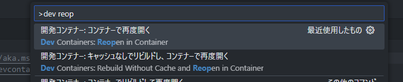

# ocitutorials-geekdocs

OCIチュートリアルの更新プロジェクト用のリポジトリです。

# 環境情報（25/05/15時点）
**Hugo**
```
$ hugo version
hugo v0.147.3-05417512bd001c0b2cc0042dcc584575825b89b3 linux/amd64 BuildDate=2025-05-12T12:25:03Z VendorInfo=gohugoio
```

**go**
```
$ go version
go version go1.23.4 linux/amd64
```


# 環境設定手順 (Dev Containers編)

## 0. 前準備
### ● Dev Containers の準備

拡張機能から検索してインストール


### ● Rancher Desktop を用意する

Rancher Desktopインストール後、起動しておく

## 1. セットアップ

適当なディレクトリで`git clone`して`ocitutorial-geekdocs`ディレクトリを作成

```
git clone https://github.com/oracle-japan/ocitutorial-geekdocs/
```

`ocitutorial-geekdocs`ディレクトリをVS Codeで開いた後、以下のポップアップがでてくるので、「コンテナーで再度開く」を選択


出てこなければ、コマンドパレットから実行


## 2. テストサイトの作成

無事コンテナが作成できたら続くコマンドを実行。
```
hugo server
```
また、目的に応じて以下のオプションも使用する
+ `-D`: ドラフトにマークされたページも含める
+ `--poll 5000`: 5000msごとにファイルシステムに対してポーリングする。数字を小さくするとPCがめちゃ熱くなるので注意。

上記のコマンドはデフォルトでホットリロードされるようになっているが、Windows上のDev Containersで実行するとこの機能は正常に働かないことに留意しておく。（原因：https://github.com/microsoft/WSL/issues/4739）  

その他、`hugo server`コマンドオプションは以下リンクを参照  
+ https://gohugo.io/commands/hugo_server/


コマンドを実行すると以下のリンクにフォワーディングされるので、ブラウザでアクセスしてテストサイトを確認する。
```
http://127.0.0.1:1313/ocitutorials/
```