<a id="anchor0"></a>

# はじめに

この章ではOracle Machine Learning(OML)の製品群の1つである、OML Notebookを利用して、DB内でデータの移動が完結した機械学習を体験して頂きます。 
事前に前提条件にリンクされているサンプルデータのCSVファイルをお手元のPC上にダウンロードください。  
（集合ハンズオンセミナーでは講師の指示に従ってください）

<br>

**前提条件** 

* ADBインスタンスが構成済みであること
    <br>※ADBインタンスを作成方法については、[101:ADBインスタンスを作成してみよう](../adb101-provisioning) を参照ください。  
* 以下にリンクされているファイルをダウンロードしていること
	+ [liquid.csv](../adb208-oml-notebook/ADB-OML-Tutorial/liquid.csv)
	+ [order_items.csv](../adb208-oml-notebook/ADB-OML-Tutorial/order_items.csv)

<br>

**目次**

- [準備編](#anchor1)
    - [OML用のユーザを作成する](#anchor1-1)
    - [データセットをADBにロードする](#anchor1-2)
      - [liquid.csvをDatabase Actionsからロード](#anchor1-2-1)
      - [order_items.csvをObject Storageにアップロード](#anchor1-2-2)
- [機械学習編](#anchor2)
    - [OML Notebookを使い始める](#anchor2-1)
    - [機械学習モデルをビルド・評価する](#anchor2-2)

<br>

**所要時間:** 約40分

<a id="anchor1"></a>
<br>

# 準備編

## OML用のユーザを作成する

1. **Database Actions**から、MLユーザを作成していきましょう。

   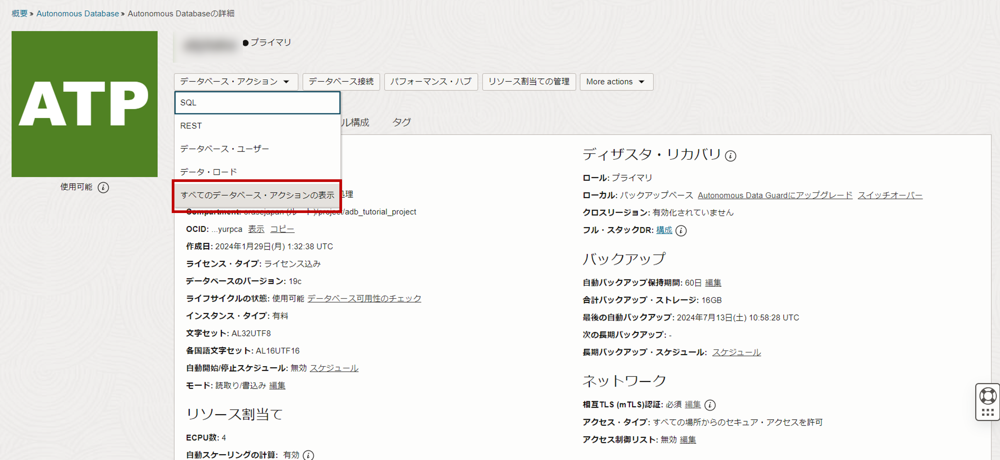

1. ADMINユーザーでDatabase Actionsにサインインできていることが確認できたら、**管理**から**データベース・ユーザー**をクリックします。

   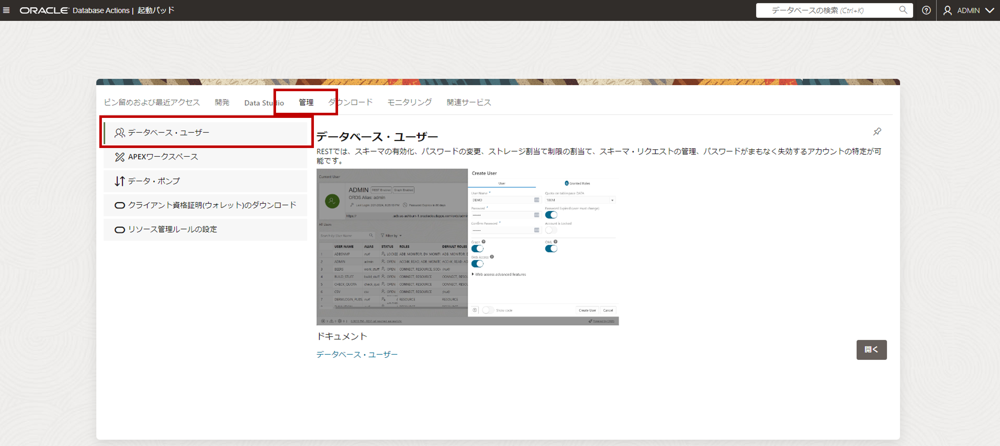

1. 以下のように設定して**ユーザーの作成**をクリックし、機械学習用のユーザを作成します。
   * ユーザー名：**OMLUSER**
   * パスワード：例：**Welcome12345#**
   * 表領域の割り当て制限：**UNLIMITED**
   * OML、Webアクセスのトグルを**ON**
   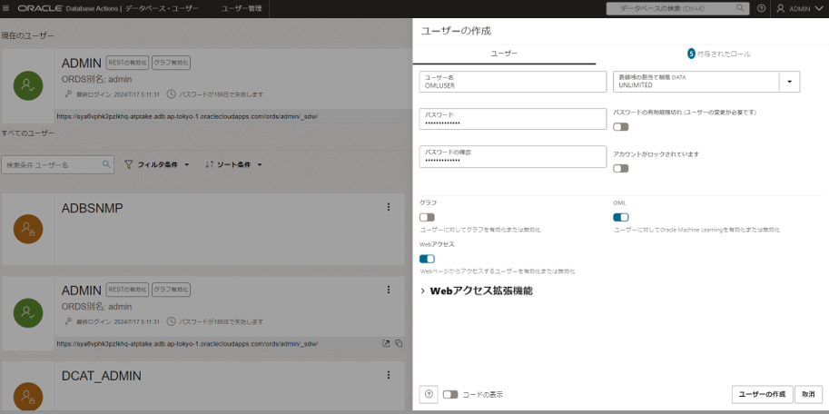

1. ユーザーが作成されました。

   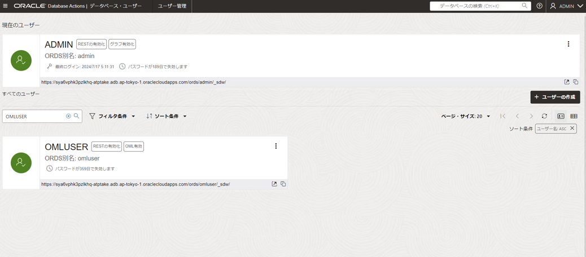

1. Database Actionからサインアウトします。

   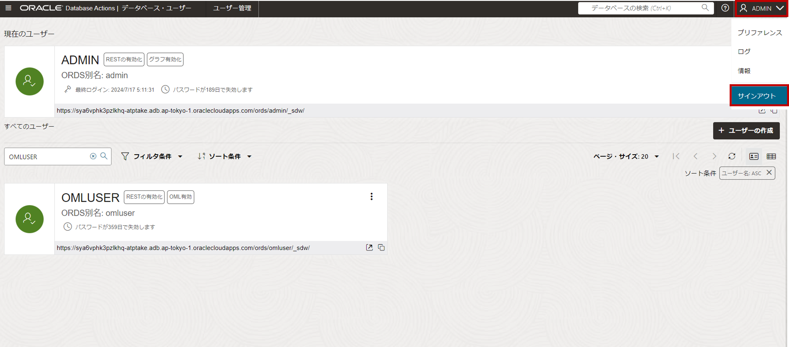


1. 作成済のOMLUSERユーザーで**サインイン**して下さい。

   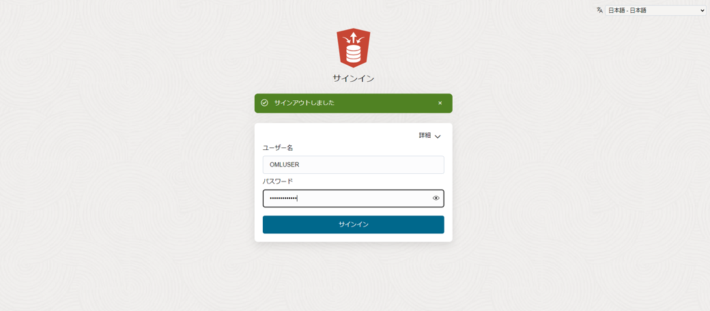

<br>

<a id="anchor1-2"></a>

## データセットをADBにロードする

<a id="anchor1-2-1"></a>

###  liquid.csvをDatabase Actionsからロード

1. Database Actionsの起動パッドの**Data Stusio**から、**データ・ロード** を選択します。

   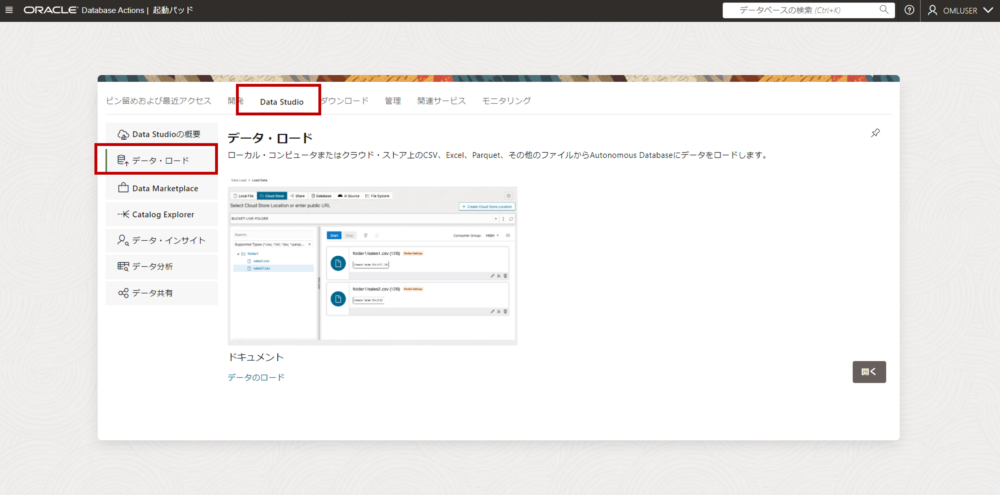

1. **データのロード** > **ローカル・ファイル** を選択します。**ファイルの選択**をクリックし、ダウンロードして解凍した **liquid.csv** を選択します。


   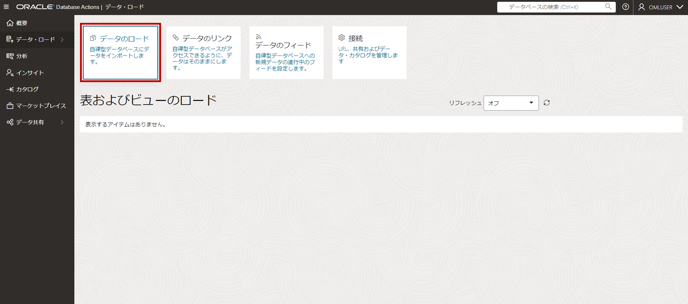
   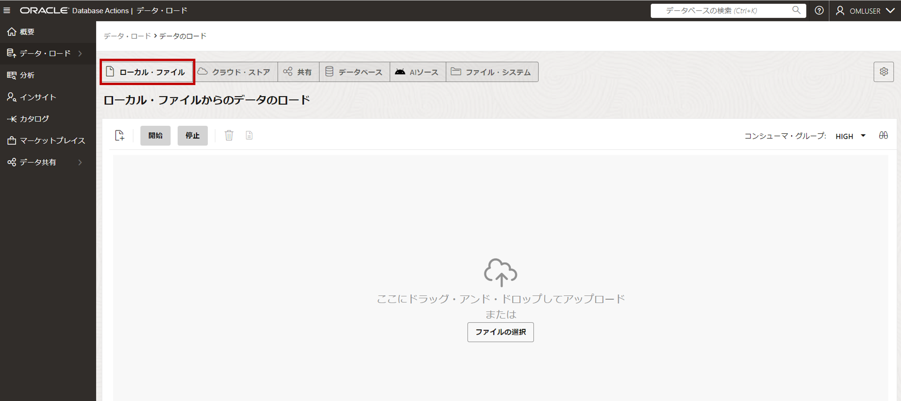


1. liquid.csvがロードできる状態になりました。ロード前に**ペンアイコン**をクリックし、詳細設定を確認・変更できます。

   

1. liquid.csvの表定義等のデータのプレビューを確認したら **閉じる** をクリックします。

   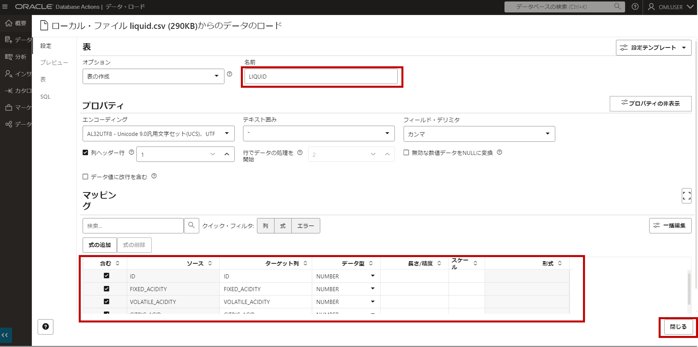

1. **開始**をクリック後、ポップアップの**実行**をクリックし、データのロードを開始します。

   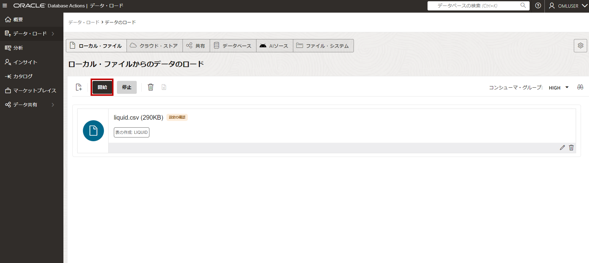

1. データ・ロード・ジョブの実行を確認するポップアップが表示されるので、**実行** をクリックします。

   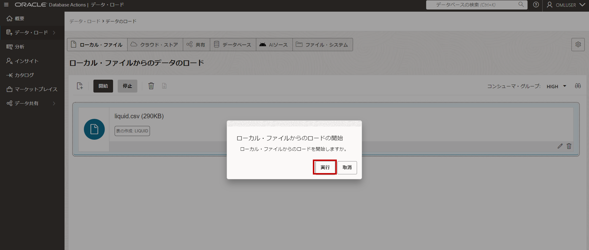

1. liquid.csvのロードが完了しました。

   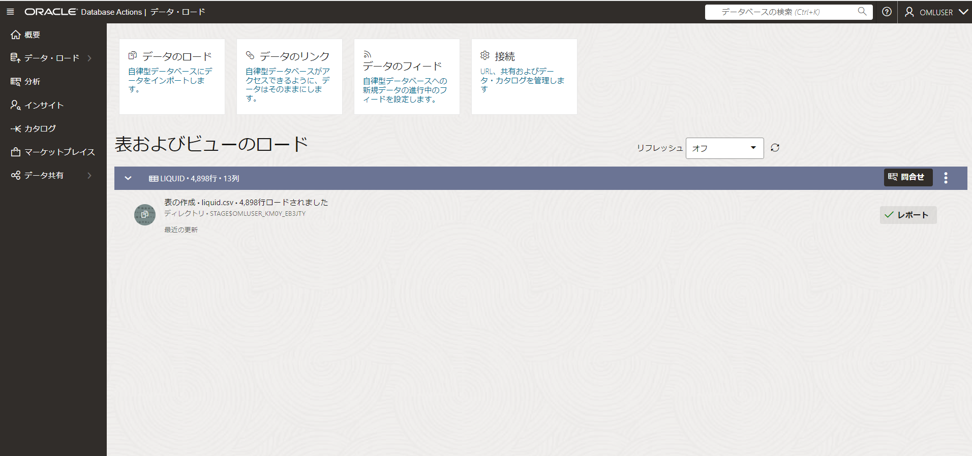

<a id="anchor1-3-2"></a>

### order_items.csvをObject Storageにアップロード

1. [ADBインスタンスを作成しよう](../adb101-provisioning/)で学習した**オブジェクトストレージへのデータアップロード** を参照し、**order_items.csv**を**Object Storage**にアップロードして下さい。

   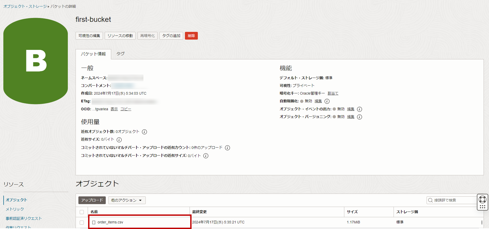

<br>

<a id="anchor2"></a>

# 機械学習編

<a id="anchor2-1"></a>

## OML Notebookを使い始める

1. ADB詳細画面の**ツール構成**タブから、OMLにアクセスするパブリック・アクセスURLをコピーし、別タブで開きます。

   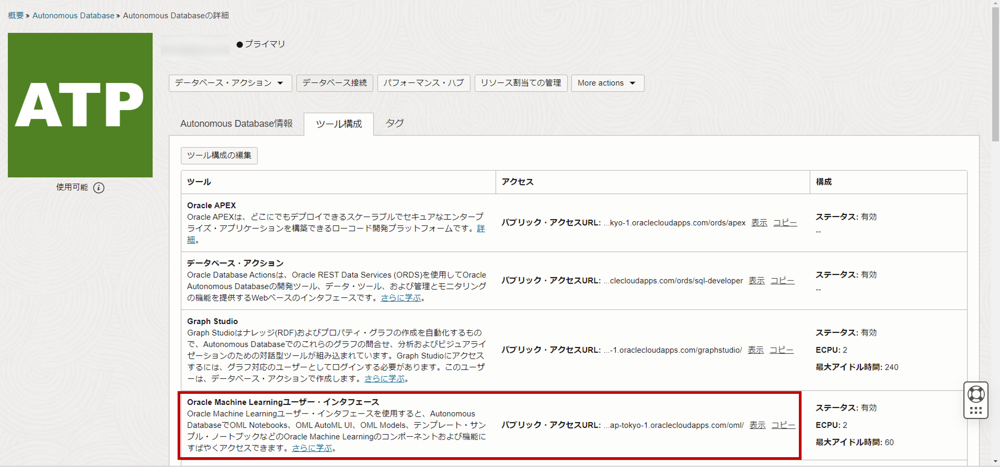

1. 先ほどOMLユーザ管理で新規作成したユーザ(OML)で**サインイン**して下さい。

   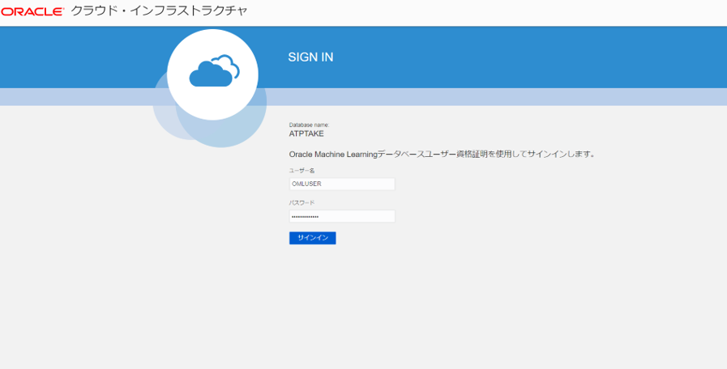

1. クイック・アクションの**ノートブック**をクリックして下さい。

   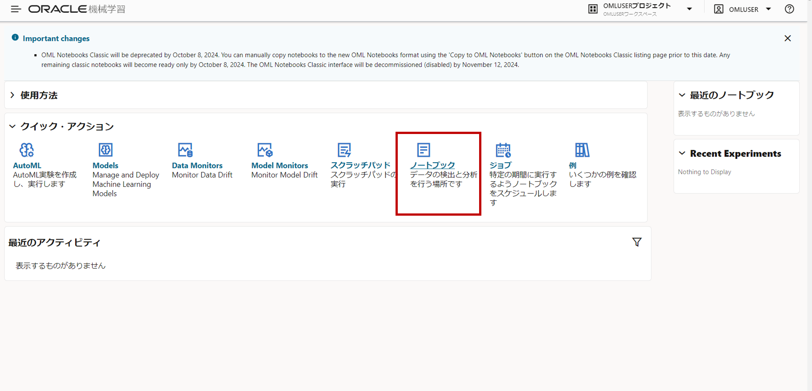

1. 任意のノートブックの名前を入力後、**OK**をクリックして下さい。

   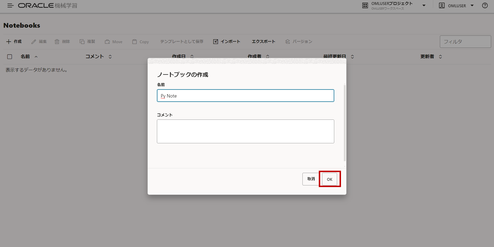

1. ノートブックの画面に遷移します。

   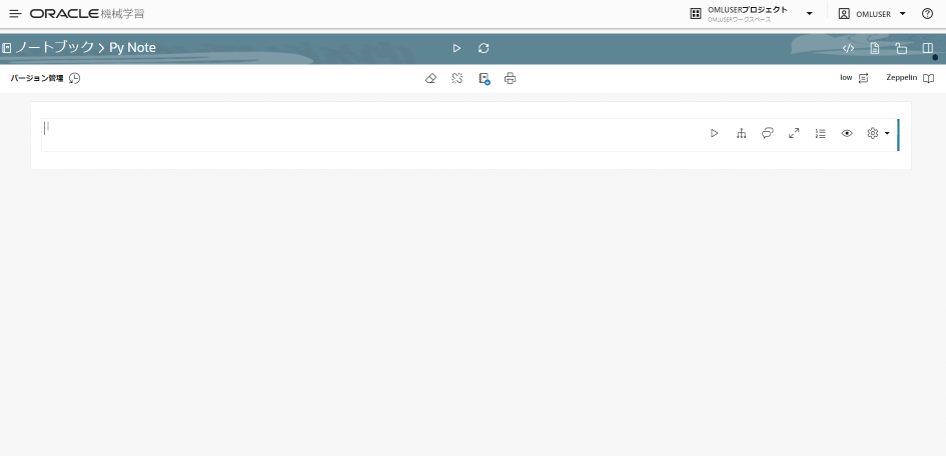

1. 作成したノートブックでスクリプトを書き始めることが可能になりました。

   下記のコマンドでPythonで機械学習を書き始めることが可能です。

   ```
   %python

   import oml
   oml.isconnected()
   ```

   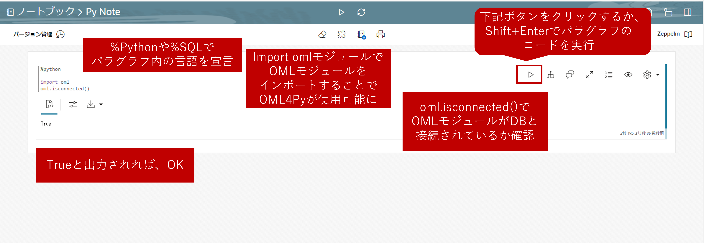

   下記のコマンドで、同じノートブック内でSQLを使用したLiquid表へのクエリを実行してみましょう。

   ```
   %sql

   select * from liquid;
   ```

   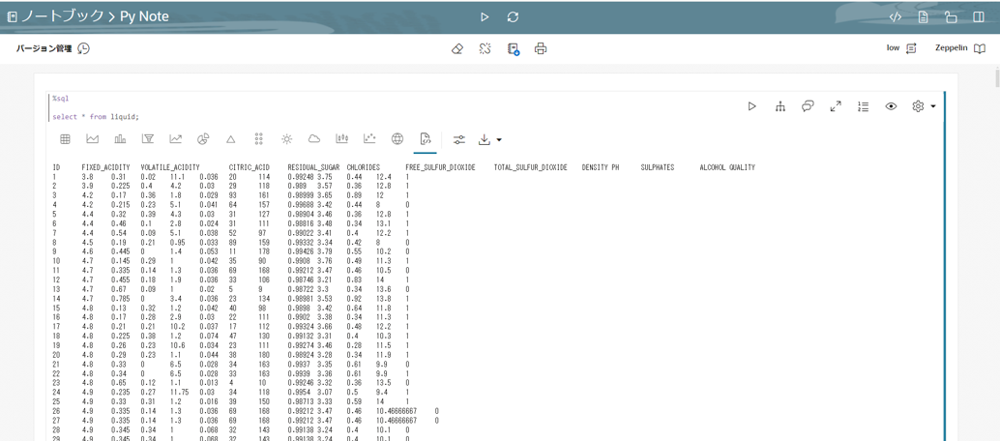

<br>

<a id="anchor2-2"></a>

## 機械学習モデルをビルド・評価する

以降、こちらの資料を見ながら実施していきます。

+ [Autonomous Database MLハンズオン](https://speakerdeck.com/oracle4engineer/adb-ml-hol)

また、以下のリンクから直接資料をダウンロードすることも可能です。

+ [Autonomous Database MLハンズオン資料](../adb208-oml-notebook/ML_HOL_20200325.pdf)

資料内で使用するSQLは、下記の**Handson_SQL.txt**を確認することが可能です。
手入力ではなくコピー＆ペーストして学習を進めていくことができます。

+ [Handson_SQL.txt](../adb208-oml-notebook/ADB-OML-Tutorial/Handson_SQL.txt)

<br>

### **ハンズオンの内容**

   **・液体の品質の予測を行う**

   

   **・アソシエーション分析を行う**

   


<br>
以上で、この章は終了です。  
次の章にお進みください。

<br>
[ページトップへ戻る](#anchor0)


