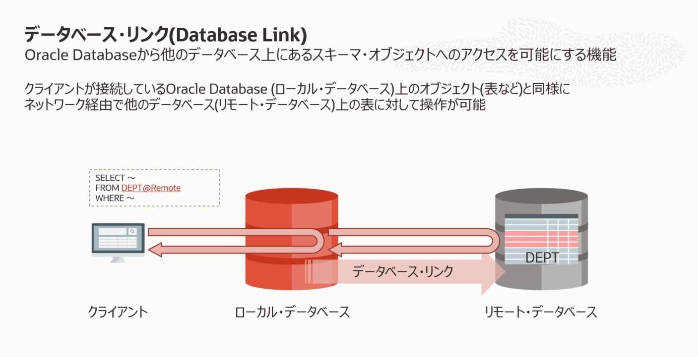
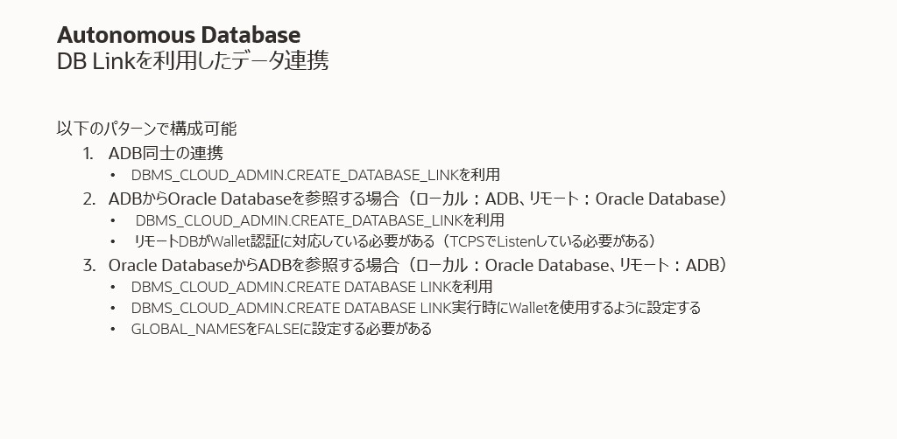
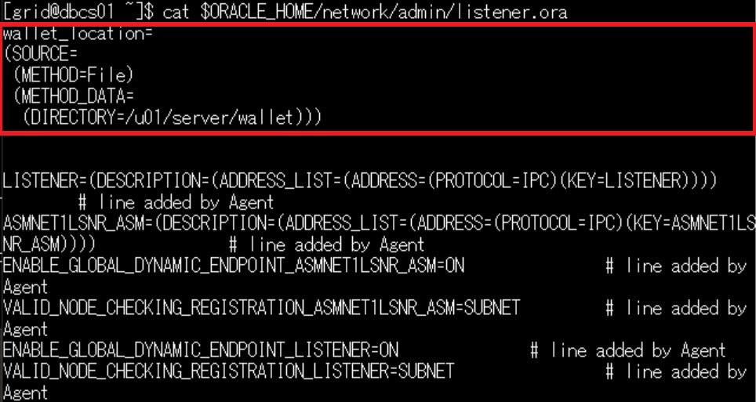
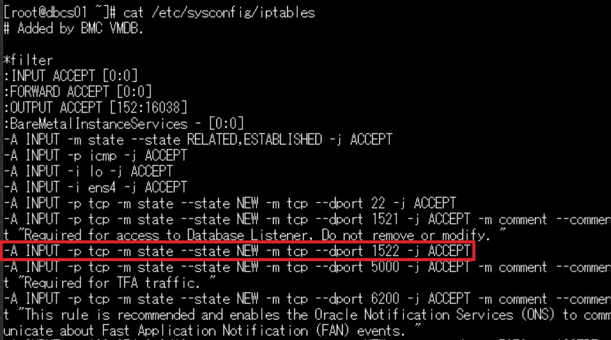
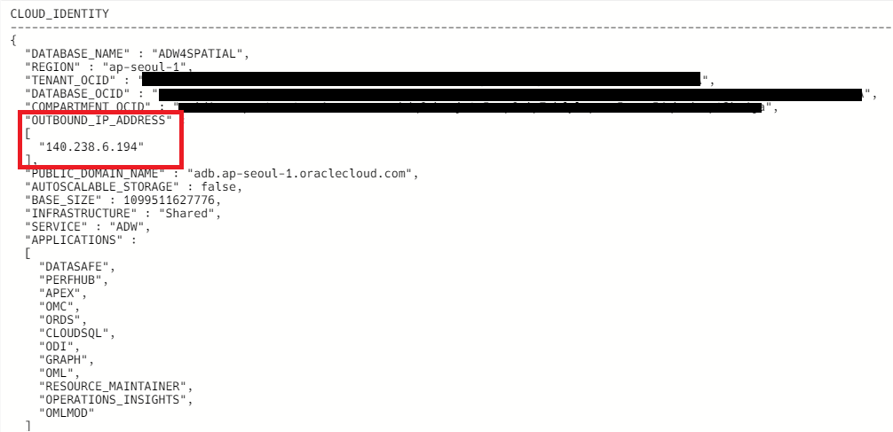

<a id="anchor0"></a>

# はじめに

従来からOracle Databaseをご利用の方にはお馴染みのDatabase Linkですが、Autonomous Database でもこのDatabase Linkをお使いいただくことが可能です。

**Database Link**は、他のOracle Database インスタンスからデータを移行・連携・収集するための便利な機能です。

   

Autonomous Database では以下の4つのパターンでDatabase Linkを作成いただくことができます。

   
  
本チュートリアルでは2のパターンであるAutonomous Database（リンク元）にDatabase Linkを作成し、他のOracle Database（リンク先）にアクセスする手順を記載します。

補足と言う形でパターン1、3、4については、[3.その他のパターン](#anchor3)にて記載しています。
   
本チュートリアルでは、リンク先である他のOracle Databaseとして、OCIのBase Database Serviceを使用します。手順としてはオンプレミスのOracle Databaseも同様になります。またパブリック・アクセスが可能なBaseDBと、プライベート・アクセスのみ可能なBaseDBへのDatabase Linkのそれぞれの手順を記載しています。


**目次 :**
  + [1.パブリック・アクセス可能なOracle DatabaseへのDatabase Link](#anchor1)
    + [1-1.BaseDBにてTCPS認証（SSL認証）を有効化](#anchor1-1)
    + [1-2.BaseDBのウォレットファイルをADBに渡す](#anchor1-2)
    + [1-3.VCNのイングレス・ルールを更新](#anchor1-3)
    + [1-4.ADBにてDatabase Linkを作成](#anchor1-4)
    + [1-5.エラーへの対応例](#anchor1-5)
  + [2.プライベート・アクセスのみ可能なOracle DatabaseへのDatabase Link](#anchor2)
  + [3.その他のパターン](#anchor3)
  + [4.おわりに](#anchor4)

**前提条件**
+ ADBインスタンスが構成済みであること
    <br>※ADBインタンスの作成方法については、
    [101:ADBインスタンスを作成してみよう](../adb101-provisioning) を参照ください。

+ BaseDBインスタンスを構成済み、かつサンプルスキーマをインストール済みであること
    <br>※手順については、
    [301 : 移行元となるデータベースを作成しよう](../adb301-create-source-db/) を参考に、BaseDBインスタンスを作成し、HRスキーマを作成してください。

<br>

ADBからのDatabase Linkは大きく分けて2種類の接続方法があります。

+ TCPS接続(SSL認証): ADBではデフォルトでウォレットを使ったTCPS接続を使用しているため、ターゲット・データベース(リンク先)もTCPS接続を使用するよう設定する必要があります。パブリック・アクセス可能なOracle Database へのDatabase Linkではこの方式を利用します。
+ TCP接続: こちらはウォレットを使用しない接続方式です。この接続方式を使用する場合、ターゲット・データベース(リンク先)がTCPS接続を使用するよう設定する必要はありません。プライベート・アクセス可能なOracle DatabaseへのDatabase Linkでは、TCPS接続に加え、この接続方式を利用できます。[2.プライベート・アクセスのみ可能なOracle DatabaseへのDatabase Link](#anchor2)ではこの方式を利用します。

本チュートリアルでは上記2つの接続方式のそれぞれの手順を記載します。


<br>

**所要時間 :** 約60分（BaseDBのインスタンスの作成時間を含む）

<BR>

<a id="anchor1"></a>

# 1. TCPS接続（SSL認証）を使用したDatabase Link
ここではADBのウォレットを使用して、ソースをADBとして、リンク先がBaseDBのTCPS接続のDatabase Linkを作成します。

なおここではBaseDBはパブリックIPアドレスを持つインスタンスとして作成しています。プライベートなBaseDBへのDatabase Linkは[2.プライベート環境のBaseDBへのDatabase Link](#anchor2)に手順を記載しています。

<BR>

<a id="anchor1-1"></a>

## 1-1. BaseDBにてTCPS認証（SSL認証）を有効化
サーバーとクライアントの両サイドの認証を交換したウォレットをADBに渡すことで、これを実現します。

### 1-1-1. ウォレット用のディレクトリの作成
1. Tera Term等のターミナルソフトを利用してBaseDBインスタンスに接続します。

1. opcユーザーからrootユーザーにスイッチします。
  ```sh
  sudo su - root
  ```
サーバーとクライアントの自己署名証明書を含むウォレットを作成します。

1. ウォレット用のディレクトリを作成します。
```sh
mkdir -p /u01/server/wallet
mkdir -p /u01/client/wallet
mkdir /u01/certificate
chown -R oracle:oinstall /u01/server
chown -R oracle:oinstall /u01/client
chown -R oracle:oinstall /u01/certificate
```

<br>

### 1-1-2. サーバーのウォレットの作成
1. oracleユーザーにスイッチします。
```sh
sudo su - oracle
```

1. ウォレットを作成します。
```sh
cd /u01/server/wallet/
orapki wallet create -wallet ./ -pwd Oracle123456 -auto_login
```
以降『1-1-4. 証明書の交換』まで、"Operation is successfully completed."となれば、OKです。エラーが発生する場合は、『1-1-2. サーバーのウォレットの作成』からやり直します。


1. 自己署名証明書をウォレットに追加します。
```sh
orapki wallet add -wallet ./ -pwd Oracle123456 -dn "CN=dbcs" -keysize 1024 -self_signed -validity 3650 -sign_alg sha256
```
<br>

### 1-1-3. クライアントのウォレットの作成
1. ウォレットを作成します。
```sh
cd /u01/client/wallet/
orapki wallet create -wallet ./ -pwd Oracle123456 -auto_login
```

1. 自己署名証明書をウォレットに追加します。
```sh
orapki wallet add -wallet ./ -pwd Oracle123456 -dn "CN=client" -keysize 1024 -self_signed -validity 3650 -sign_alg sha256
```

<br>

### 1-1-4. 証明書の交換
サーバーとクライアントで証明書を交換します。

1. サーバー証明書をエクスポートします。
```sh
cd /u01/server/wallet/
orapki wallet export -wallet ./ -pwd Oracle123456 -dn "CN=dbcs" -cert /tmp/server.crt
```

1. クライアント証明書をエクスポートします。
```sh
cd /u01/client/wallet/
orapki wallet export -wallet ./ -pwd Oracle123456 -dn "CN=client" -cert /tmp/client.crt
```

1. サーバーのウォレットにクライアント証明書をインポートします。
```sh
cd /u01/server/wallet/
orapki wallet add -wallet ./ -pwd Oracle123456 -trusted_cert -cert /tmp/client.crt
```

1. クライアントのウォレットにサーバー証明書をインポートします。
```sh
cd /u01/client/wallet/
orapki wallet add -wallet ./ -pwd Oracle123456 -trusted_cert -cert /tmp/server.crt
```

1. 証明書が正しくインポートされているか確認します。
```sh
orapki wallet display -wallet .
```
以下のように表示されていればOKです。


1. サーバーのウォレットの権限を変更します。
```sh
cd /u01/server/wallet
chmod 640 cwallet.sso
```

<br>

### 1-1-5. ウォレット用のディレクトリの追加
サーバーのネットワークファイルに、ウォレットのディレクトリを追加します。

1. gridユーザーにスイッチします。
```sh
sudo su - grid
```

1. viでlistner.oraを開いて編集します。   
```sh
vi $ORACLE_HOME/network/admin/listener.ora
```
ウォレットのディレクトリを追加するため、以下を追記します。
```sh
wallet_location =
  (SOURCE=
    (METHOD=File)
    (METHOD_DATA=
      (DIRECTORY=/u01/server/wallet)))
```

1. 編集した内容を確認します。
```sh
cat $ORACLE_HOME/network/admin/listener.ora
```


1. oracleユーザーにスイッチします。    
```sh
sudo su - oracle
```

1. viでsqlnet.oraを編集します。   
```sh
vi $ORACLE_HOME/network/admin/sqlnet.ora
```
ウォレットのディレクトリを追加するため、以下を追記します。 
```sh
wallet_location =
  (SOURCE=
    (METHOD=File)
    (METHOD_DATA=
      (DIRECTORY=/u01/server/wallet)))
```
また、ネットワーク暗号化に関するパラメータをコメントアウトします。   
ADBインスタンスはTCPS(SSL)による接続を前提としており、BaseDB側も暗号化設定されていますが、双方で暗号化を施すことはできないために、BaseDBについては暗号化関連のパラメータを無効化する必要があるためです。

1. 編集した内容を確認します。
```sh
cat $ORACLE_HOME/network/admin/sqlnet.ora
```


<br>

### 1-1-6. TCPS接続に使用する1522番ポートを解放
今回は、1522番ポートでTCPS接続をします。しかしBaseDBインスタンスでは、デフォルトで1522番ポートは開いていないため、開ける必要があります。
1. rootユーザーにスイッチします。
```sh
sudo su - root
```

1. iptablesの設定ファイルを修正します。
```sh
vi /etc/sysconfig/iptables
```
1522番ポートを開けるため、以下を追記します。
```
-A INPUT -p tcp -m state --state NEW -m tcp --dport 1522 -j ACCEPT
```

1. 編集した内容を確認します。
```sh
cat /etc/sysconfig/iptables
```


1. 設定を反映させるため再起動します。
```sh
service iptables restart
```

<br>

### 1-1-7. リスナーにTCPSエンドポイントを追加
1. gridユーザーにスイッチします。
```sh
sudo su - grid
```

1. データベースの構成を変更します。
```sh
srvctl modify listener -p "TCPS:1522/TCP:1521"
srvctl stop listener
srvctl start listener
```

1. oracleユーザーにスイッチします。   
```sh
sudo su - oracle
```

1. データベースを再起動します。   
```sh
srvctl stop database -database dbcs01_xxxxxx
srvctl start database -database dbcs01_xxxxxx
```
データベース名(dbcs01_xxxxxx)の確認の仕方
+ OCIコンソールのBaseDBの詳細画面より、一意のデータベース名を確認

+ 次の手順のlsnrctl statusコマンドから確認

1. gridユーザーにスイッチします。   
```sh
sudo su - grid
```

1. リスナーのステータスを確認します。   
```sh
lsnrctl status
```
以下のように表示されていれば、OKです。

```sh
LSNRCTL for Linux: Version 19.0.0.0.0 - Production on 30-AUG-2021 07:54:11

Copyright (c) 1991, 2021, Oracle.  All rights reserved.

Connecting to (DESCRIPTION=(ADDRESS=(PROTOCOL=IPC)(KEY=LISTENER)))
STATUS of the LISTENER
------------------------
Alias                     LISTENER
Version                   TNSLSNR for Linux: Version 19.0.0.0.0 - Production
Start Date                30-AUG-2021 07:51:41
Uptime                    0 days 0 hr. 2 min. 29 sec
Trace Level               off
Security                  ON: Local OS Authentication
SNMP                      OFF
Listener Parameter File   /u01/app/19.0.0.0/grid/network/admin/listener.ora
Listener Log File         /u01/app/grid/diag/tnslsnr/dbcs01/listener/alert/log.xml
Listening Endpoints Summary...
(DESCRIPTION=(ADDRESS=(PROTOCOL=ipc)(KEY=LISTENER)))
(DESCRIPTION=(ADDRESS=(PROTOCOL=tcps)(HOST=10.0.0.245)(PORT=1522)))
(DESCRIPTION=(ADDRESS=(PROTOCOL=tcp)(HOST=10.0.0.245)(PORT=1521)))
Services Summary...
Service "+APX" has 1 instance(s).
Instance "+APX1", status READY, has 1 handler(s) for this service...
Service "+ASM" has 1 instance(s).
Instance "+ASM1", status READY, has 1 handler(s) for this service...
Service "+ASM_DATA" has 1 instance(s).
Instance "+ASM1", status READY, has 1 handler(s) for this service...
Service "+ASM_RECO" has 1 instance(s).
Instance "+ASM1", status READY, has 1 handler(s) for this service...
Service "c179c0f9cc256c64e053be08640af527.subnet.vcn.oraclevcn.com" has 1 instance(s).
Instance "dbcs01", status READY, has 2 handler(s) for this service...
Service "cabf7fdf10f1362be053f500000ab09c.subnet.vcn.oraclevcn.com" has 1 instance(s).
Instance "dbcs01", status READY, has 2 handler(s) for this service...
Service "dbcs01XDB.subnet.vcn.oraclevcn.com" has 1 instance(s).
Instance "dbcs01", status READY, has 1 handler(s) for this service...
Service "dbcs01_nrt18s.subnet.vcn.oraclevcn.com" has 1 instance(s).
Instance "dbcs01", status READY, has 2 handler(s) for this service...
Service "pdb1.subnet.vcn.oraclevcn.com" has 1 instance(s).
Instance "dbcs01", status READY, has 2 handler(s) for this service...
The command completed successfully
```    

<br>

<a id="anchor1-2"></a>

## 1-2. BaseDBのウォレットファイルをADBに渡す

### 1-2-1. ウォレットのダウンロード
/u01/client/walletにあるクライアントのウォレットcwallet.ssoを、ローカルにダウンロードします。

1. oracleユーザーにスイッチします。
```sh
sudo su - oracle
```

1. ウォレットを/tmpにコピーし、その他のユーザーに読み取りの権限を付与します。   
```sh
cp /u01/client/wallet/cwallet.sso /tmp/.
chmod 604 /tmp/cwallet.sso
```

1. WinSCPといった任意のファイル転送ツールを利用し、ウォレットをローカルにダウンロードします。

<br>

### 1-2-2. Object Storageへのウォレットのアップロード

[102:ADBにデータをロードしよう(Database Actions)](../adb102-dataload/)の「2.OCIオブジェクトストレージへのデータアップロード」を参考に、ダウンロードしたウォレットをObject Storageにアップロードします。

<br>

### 1-2-3. ADBへのウォレットの配置
1. ADMINユーザーでADBに接続し、ウォレット配置用のディレクトリ・オブジェクトを作成します。
```sql
CREATE DIRECTORY dblink_wallet_dir_dbcs AS 'walletdir';
```

1. クレデンシャル情報を登録します。
```sql
BEGIN
  DBMS_CLOUD.CREATE_CREDENTIAL(
  credential_name => 'WORKSHOP_CREDENTIAL',
  username => 'xxx@xxxx.com',
  password => 'xxxxxx');
END;
/
```
* credential_name: データベースに保存した認証情報を識別するための名前、任意
* username: Oracle Object Storageにアクセスするためのユーザー名
* password: 認証トークン
ユーザー名、認証トークンの生成については、[102:ADBにデータをロードしよう(Database Actions)](../adb102-dataload/)の「1.OCIオブジェクトストレージへのアクセス情報を取得」を参考にしてください。

1. Object Storageにアップロードしたウォレットをディレクトリ・オブジェクトに配置します。
```sql
BEGIN
  DBMS_CLOUD.GET_OBJECT(
  credential_name => 'WORKSHOP_CREDENTIAL',
  object_uri => 'https://objectstorage.<region>.oraclecloud.com/n/<namespace>/b/<bucket>/o/cwallet.sso',
  directory_name => 'dblink_wallet_dir_dbcs');
END;
/
```
object_uri: Object StorageにアップロードしたファイルのURL(< region >、< namespace >、< bucket >は実際の値に置き換えて下さい)
>  （補足）
> - オブジェクトが見つからないエラー（ORA-20404: Object not found）が出る場合、オブジェクトストレージ上のバケットを一時的にPublic にして試してください。
> - 作成済みのクレデンシャル情報を削除する場合は以下を実行ください。
```sql
BEGIN  
  DBMS_CLOUD.DROP_CREDENTIAL(credential_name => 'WORKSHOP_CREDENTIAL');
END;
/
```

1. 配置したウォレットを確認します。
```sql
SELECT * FROM table(dbms_cloud.list_files('dblink_wallet_dir_dbcs')) WHERE object_name LIKE '%.sso';
```


<BR>

<a id="anchor1-3"></a>

## 1-3. VCNのイングレス・ルールの追加
1522番ポートを使用するようにしましたが、デフォルトでは許可されていません。そのためイングレス・ルールを追加する必要があります。  
ADBには、Database Linkで連携する際やAPIを実行する際に利用されるパブリックIPアドレスである、OUTBOUND_IP_ADDRESSが割り当てられています。このIPアドレスをイングレス・ルールに設定することで、そのADBインスタンスからのアクセスに制限することができます。v$pdbsのCLOUD_IDENTITY列で確認可能です。

ADBに接続して、以下を実行します。
```sql
select CLOUD_IDENTITY from v$pdbs;
```



BaseDBを配置したパブリック・サブネットのセキュリティ・リストのイングレス・ルールに以下を追加します。

+ ソース：(ADBのOUTBOUND_IP_ADDRESS)/32
+ IPプロトコル：TCP
+ ソース・ポート範囲：All
+ 宛先ポート範囲：1522

<BR>

<a id="anchor1-4"></a>

## 1-4. ADBにてDatabase Linkを作成

1. BaseDBへ接続するためのクレデンシャルを作成します。
```sql
BEGIN
 DBMS_CLOUD.CREATE_CREDENTIAL(
 credential_name => 'DBCS_DB_LINK_CRED',
 username => 'HR',
 password => 'WelCome123#123#'
 );
END;
/
```
**※ usernameは大文字'HR'で指定してください。**

1. 新規 Database Linkを作成します。ADMINユーザーで実行していますが、ADMIN以外のユーザーで以下を実行する場合、`DBMS_CLOUD_ADMIN.CREATE_DATABASE_LINK`の実行権限が必要です。
```sql
BEGIN
 DBMS_CLOUD_ADMIN.CREATE_DATABASE_LINK(
 db_link_name => 'HR_LINK',
 hostname => 'dbcs.xxxx.vcn1.oraclevcn.com',
 port => '1522',
 service_name => '<pdb1>.<subnet>.<vcn>.oraclevcn.com',
 ssl_server_cert_dn => 'CN=dbcs',
 credential_name => 'DBCS_DB_LINK_CRED',
 directory_name => 'dblink_wallet_dir_dbcs');
END;
/
```
   * hostname: BaseDBインスタンスのホスト名もしくはパブリックIPアドレス
   * service_name: tnsnames.oraに記載されているPDB1のサービス名
   * ssl_server_cert_dn: 『1-1-2. サーバーのウォレットの作成』で作成した自己署名証明書のCN(Common Name)

   > ターゲット・データベース(リンク先)がRAC構成の場合
   > 
   > hostnameパラメータの代わりに、rac_hostnamesパラメータで一つ以上のホスト名を指定することが可能です。これにより、Oracle RACの高可用性機能を活用できます。ただし、rac_hostnamesの値にIPアドレス、SCAN IP、またはSCANホスト名を使用することはサポートされていません。
   > そのため、以下のようにRACの各ノードのホスト名を設定します。

   ```sql
   BEGIN
       DBMS_CLOUD_ADMIN.CREATE_DATABASE_LINK(
           db_link_name => 'HR_LINK', 
           rac_hostnames => '["sales1-svr1.example.adb.us-ashburn-1.oraclecloud.com", "sales1-svr2.example.adb.us-ashburn-1.oraclecloud.com", "sales1-svr3.example.adb.us-ashburn-1.oraclecloud.com"]', 
           port => '1522',
           service_name => '<pdb1>.<subnet>.<vcn>.oraclevcn.com',
           ssl_server_cert_dn => 'CN=dbcs',
           credential_name => 'DBCS_DB_LINK_CRED',
           directory_name => 'dblink_wallet_dir_dbcs');
   END;
   /
   ```

1. Database Linkを使用して、BaseDBのテーブルを参照します。
```sql
SELECT * FROM COUNTRIES@HR_LINK;
```
正しく実行されると、以下のような結果が表示されます。
HRスキーマのCOUNTRIES表にアクセスできていることがわかります。

※ Database Linkを誤って作成した場合は、こちらのコマンドを実行します。

```sql
execute DBMS_CLOUD_ADMIN.DROP_DATABASE_LINK(db_link_name => 'HR_LINK');
```
<br>
<a id="anchor1-5"></a>

## 1-5. エラーへの対応例
* 『ORA-12545: Connect failed because target host or object does not exist』が発生する場合

  DBMS_CLOUD_ADMIN.CREATE_DATABASE_LINKにて指定するオプションに誤りがないか確認します。

* 『ORA-28860: Fatal SSL error』が発生する場合

  ウォレットの再作成を行います。

* 『ORA-28864: SSL connection closed gracefully』が発生する場合

  gridユーザーのlistener.oraに、オプション「wallet_location」があることを確認します。

* 『ORA-28865: SSL connection closed』が発生する場合

  oracleユーザーのsqlnet.oraに、オプション「wallet_location」があることを確認します。  
  また、オプション「SQLNET.ENCRYPTION_SERVER=REQUIRED」「SQLNET.ENCRYPTION_CLIENT=REQUIRED」がコメントアウトされていることを確認します。

* 『ORA-01017: invalid username/password; logon denied ORA-02063: preceding line from HR_LINK』が発生する場合

  BaseDBへ接続するためのクレデンシャル作成の際に指定するオプション、usernameが大文字'HR'になっていることを確認します。

※ 上記は代表的なもののみを記載しており、全てのエラーを網羅しているものではありません。必要に応じてサポート・サービスもご活用ください。

<br>
<a id="anchor2"></a>

# 2. プライベート・アクセスのみ可能なOracle DatabaseへのDatabase Link
ここではプライベート・アクセスのみ可能なBaseDBへのDatabase Linkを作成します。こちらでは上記のTCPS接続に加え、ウォレットを使用しないTCP接続が可能なので、そちらの手順を確認します。

まずは以下の前提条件を確認してください。

ターゲットDBは、ソースDBのOCI 仮想クラウドネットワーク(VCN)からアクセス可能でなければなりません。具体的には、以下の場合にターゲットDBに接続できます：

+ ソースDB(ここではADB)とターゲットDB(ここではBaseDB)が同じOCI VCN内にある
+ ソースDBとターゲットDBがペアリングされた異なるOCI VCNにある
+ ターゲットDBがオンプレミスで、FastConnectまたはVPNを使用してソースDBのOCI VCNに接続されている

どの場合でも、ADBが配置されているVCNからターゲットDBへ疎通が可能であることが条件になります。またセキュリティリストの設定を以下のように許可する必要があります。

+ ソースDB(ADB)のサブネット・セキュリティ・リスト(SL)またはネットワーク・セキュリティ・グループ(NSG)内に、TCP上のトラフィックがターゲットDB(BaseDB)のIPアドレスとポート番号に対して許可されるような、Egress ruleを定義する。 
+ ターゲットDBのサブネット・セキュリティ・リストまたはネットワーク・セキュリティ・グループ内に、TCP上のトラフィックがソースDBのIPアドレスから宛先ポートに対して許可されるような、Ingress ruleを定義する。
  
それでは実際の手順を確認します。

1. BaseDBへ接続するためのクレデンシャルを作成します。
```sql
BEGIN
 DBMS_CLOUD.CREATE_CREDENTIAL(
 credential_name => 'DBCS_DB_LINK_CRED',
 username => 'HR',
 password => 'WelCome123#123#'
 );
END;
/
```
**※ usernameは大文字'HR'で指定してください。**

1. Database Linkを作成します。ADMINユーザーで実行していますが、ADMIN以外のユーザーで以下を実行する場合、`DBMS_CLOUD_ADMIN.CREATE_DATABASE_LINK`の実行権限が必要です。
```sql
BEGIN
 DBMS_CLOUD_ADMIN.CREATE_DATABASE_LINK(
 db_link_name => 'HR_LINK',
 hostname => 'dbcs.xxxx.vcn1.oraclevcn.com',
 port => '1522',
 service_name => '<pdb1>.<subnet>.<vcn>.oraclevcn.com',
 ssl_server_cert_dn => NULL,
 credential_name => 'DBCS_DB_LINK_CRED',
 directory_name => NULL,
 private_target => TRUE);
END;
/
```

   * hostname: BaseDBインスタンスのホスト名。ターゲットDBがプライベート・エンドポイントにある場合、IPアドレス、SCAN IP、またはSCANホスト名の使用はサポートされていないため、必ずFQDNで指定します。ターゲットDBがRAC構成の場合、rac_hostnamesパラメータを使用することも可能です。指定の仕方および注意事項は[1-4. ADBにてDatabase Linkを作成](#anchor1-4)をご参照ください。
   * service_name: PDB1のサービス名
   * ssl_server_cert_dn: NULLを指定
   * directory_name: NULLを指定
   * private_target: TRUEを指定

   > プライベート・エンドポイントで構成されているADBでは、すべてのDatabase Linkの発信トラフィックをプライベート・エンドポイントVCNのEgress ruleに従うように指定することが可能です。
   >
   > この設定を以下のように有効化している場合、CREATE_DATABASE_LINKのprivate_targetをTRUEに指定する必要はありません。
   >
   > こちらの設定について、詳細は[こちら](https://docs.oracle.com/cd/E83857_01/paas/autonomous-database/serverless/adbsb/private-endpoints-autonomous.html#GUID-9F76DD5E-85A3-4F5E-A88D-3D4D131FC2CA)をご参照ください。
   ```sql
   ALTER DATABASE PROPERTY SET ROUTE_OUTBOUND_CONNECTIONS = 'PRIVATE_ENDPOINT';
   ```

1. Database Linkを使用して、BaseDBのテーブルを参照します。
```sql
SELECT * FROM COUNTRIES@HR_LINK;
```

<br>
<a id="anchor3"></a>

# 3. その他のパターン
ここまで、ADBからBaseDBインスタンスへのDatabase Link作成方法についてご説明しました。  
『はじめに』でも記載した通り、その他にもADBでDatabase Linkを使用できるパターンがあります。

* 2つのADB間のDatabase Linkによる連携

  リンク元：ADB1、リンク先：ADB2とした場合、以下の手順で連携させることができます。

1. ADB2のCredential.zipをダウンロード

1. ADB1のバケットにcwallet.sso（ウォレット・ファイル）をアップロード

    ここからは、[1-2. BaseDBのウォレットファイルをADBに渡す](#anchor1-2)の『手順3:Object StorageにアップロードしたWalletをADBのディレクトリ・オブジェクトに配置します。』以降の操作と同様になります。

    詳細は『Autonomous Database Cloud 技術詳細』の「Database Linkによるデータ連携」の章でご確認ください。

<br>

* Oracle Database(非ADB)からADBへのDatabase Linkによる連携

  別のOracle Databaseをソースとして、ターゲットをAutonomous DatabaseにしたDatabase Linkを作成できます。詳細な手順については、[こちら](https://docs.oracle.com/cd/E83857_01/paas/autonomous-database/serverless/adbsb/database-links-inbound.html#GUID-EB369724-29CE-452E-8EC1-2E0B33AE0A49) をご参照ください。

<br>

* ADBから非Oracle DatabaseへのDatabase Linkによる連携

  ADBではOracle Database以外のデータベースへDatabase Linkを作成できます。ここでは以下の2つの構成が可能です。
  + Oracle管理の異機種間接続
  
    この構成ではOracle Database Gatewayを作成する必要はありません。2024/8現在、[Amazon Redshift](https://qiita.com/500InternalServerError/items/d6faad7bbadf3697ee76)、[MySQL](https://qiita.com/500InternalServerError/items/d5dc1268f0c8259146df)、[PostgreSQL](https://qiita.com/500InternalServerError/items/c6a85703c3e6454de2c0)、Snowflake、Google Bigquery、MongoDB等がサポートされています。またNW構成については、Oracle DatabaseとのDatabase Linkと同様に、パブリックもプライベート構成でも可能です。
    
    ターゲットDBのタイプによって、必須ポートやパラメータ設定が異なります。詳細の手順や制限事項については[こちら](https://docs.oracle.com/cd/E83857_01/paas/autonomous-database/serverless/adbsb/database-links-other-databases-oracle-managed.html#GUID-51E46547-E6A3-4D12-8392-31723B37896B)をご参照ください。
  + 顧客管理の異機種間接続

    顧客管理の異機種間接続では、顧客がOracle Database Gatewayを作成する必要があります。2024/8現在、SQL Server等のデータベースへのDatabase Linkはこちらを利用する必要があります。詳細は[こちら](https://docs.oracle.com/cd/E83857_01/paas/autonomous-database/serverless/adbsb/database-links-other-databases-customer-managed.html#GUID-DE1B1E26-0AB8-44CF-8A9E-D42E7628ADF2)をご参照ください。

<br>

<a id="anchor4"></a>

# 4. おわりに
ここではAutonomous DatabaseにDatabase Linkを作成して、別のBaseDBインスタンスからデータを収集する方法を紹介しました。  
複数の異なるデータベースにアクセスする際には非常に便利ですので、ぜひ活用してみてください。

<br>

# 参考資料

* [Autonomous Database Cloud 技術詳細](https://speakerdeck.com/oracle4engineer/autonomous-database-cloud-ji-shu-xiang-xi)

<br>
以上でこの章は終了です。次の章にお進みください。

<br>

[ページトップへ戻る](#anchor0)