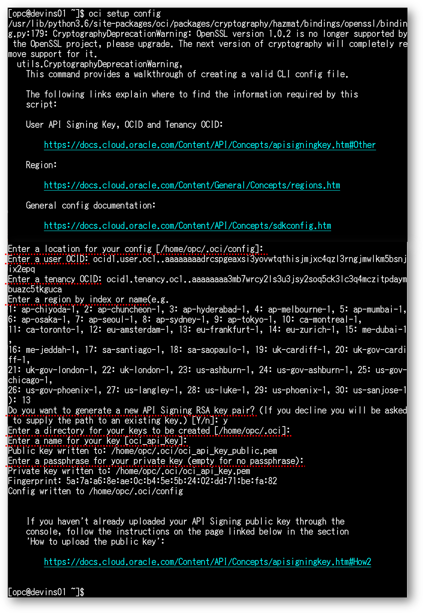
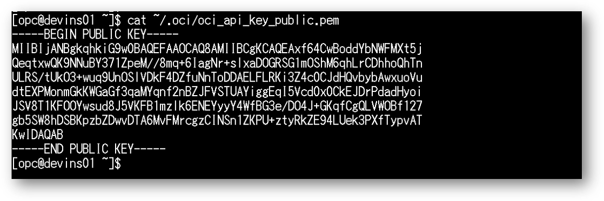
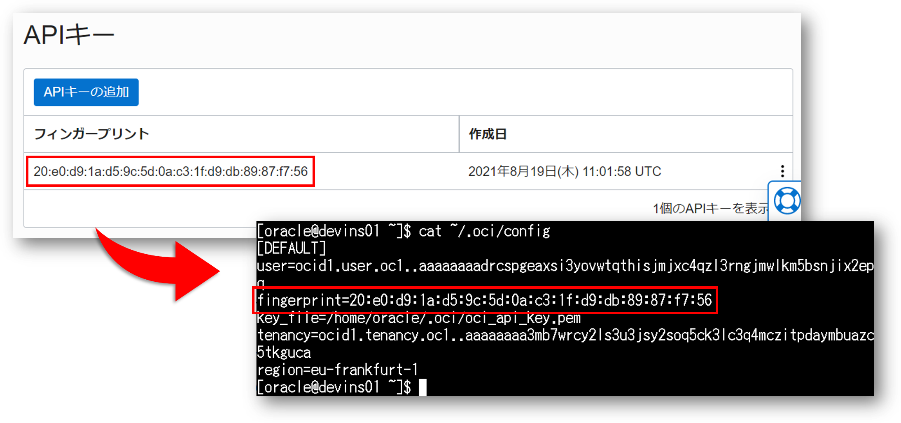
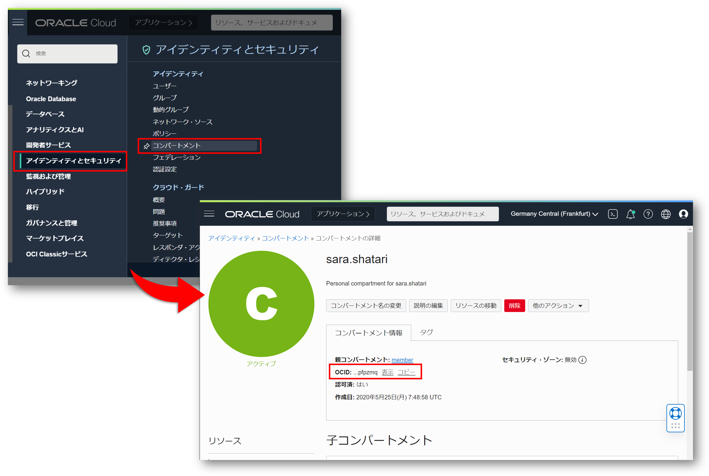
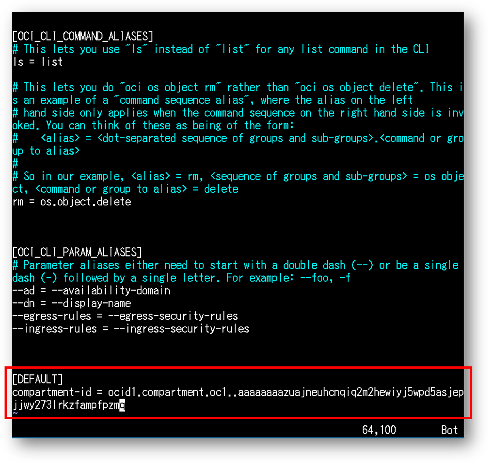
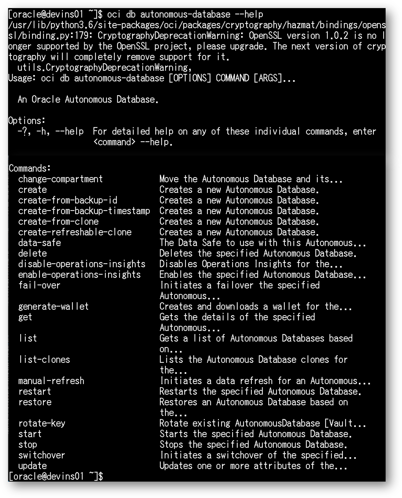

ここまでの章で、ADBインスタンスの作成やECPU数の変更等、様々な操作を実施いただきましたが、これら一連の操作を自動化するにはどうしたら良いでしょうか？

ADBはOracle Cloud Infrastructure(OCI)の他のサービスと同様、REST APIを介した各種操作が可能であり、それらを呼び出すコマンド・ライン・インタフェース（OCI CLI）を利用した操作も可能です。

この章ではOCI CLIを利用してADBインスタンスの作成や起動・停止、およびスケールアップ、ダウンといった構成変更の方法について確認します。

これらコマンドを利用しスクリプトを組めば、例えば夜間はあまり使わないからECPUをスケールダウンさせておき、朝になったらスケールアップしよう。といった自動化が可能となります。

尚、本ガイドではOCI CLIがインストールされたOCI Developer Image を利用することを前提に記載しています。

OCI CLIのインストール方法を含め、OCI CLIの詳細についてはを参照ください。


**所要時間 :** 約30分

**前提条件 :**

* ADBインスタンスが構成済みであること
   <br>※ADBインタンスを作成方法については、本ハンズオンガイドの [101:ADBインスタンスを作成してみよう](../adb101-provisioning) を参照ください。

* ADBインスタンスに接続可能な仮想マシンを構成済みであること
   <br>※仮想マシンの作成方法については、本ハンズオンガイドの [204:マーケットプレイスからの仮想マシンのセットアップ方法](../adb204-setup-VM) を参照ください。

**目次：**

- [1. OCI CLIをセットアップしよう](#1-oci-cliをセットアップしよう)
- [2. OCI CLIを使ってみよう](#2-oci-cliを使ってみよう)
- [3. OCI CLIでインスタンスを操作しよう](#3-oci-cliでインスタンスを操作しよう)

<br>


<a id="anchor1"></a>

# 1. OCI CLIをセットアップしよう

まずはOCI CLIにクラウド環境の情報を登録します。

1. Tera Termを起動し、仮想マシンにログインします。

2. oracleユーザに切り替えます。

    ```sh
    sudo su - oracle
    ```

    

3. OCI CLIがセットアップされていることを確認するために、バージョンを確認します。（ バージョン情報が出力されればOKです。）

    ```sh
    oci -v
    ```

    


4. クラウド環境の情報（OCID）を確認します。
<br>後続のconfigファイルの作成で利用しますので、お手元のメモ帳に一旦保存します。
<br>ここでは、ユーザのOCIDとテナンシOCIDをそれぞれ確認しましょう。

    > **補足**
    > 
    > OCIDとは、Oracle Cloud識別子のことで、OCIの各リソースに付与されている一意のIDです。REST APIやOCI CLIを利用する際はこのIDを利用して、各リソースにアクセスします。
    > OCIDについての詳細な情報は [こちら](https://docs.oracle.com/ja-jp/iaas/Content/General/Concepts/identifiers.htm) を参照ください。

    4-1. ユーザのOCIDを確認します。
    <br>ユーザー設定をクリックします。**OCID** はユーザ情報の最上部に表示されています。
    <br>**コピー**をクリックすると、OCIDがクリップボードに保存されますので、お手元のメモ帳にペーストしてください。

    


    4-2. 次に、テナンシのOCIDを確認します。
    右上のメニューをクリックし、「ガバナンスと管理」から「テナンシ詳細」をクリックします。
    <br>**OCID** はテナンシ情報の最上部に表示されています。
    <br>**コピー**をクリックすると、OCIDがクリップボードに保存されますので、お手元のメモ帳にペーストしてください。


    

5. OCIに接続するユーザの情報を設定する**configファイル**を作成します。こちらの設定は２回目以降は省略が可能です。

    ```sh
    oci setup config
    ```
    設定は対話形式で生成されます。次の入力例を参考に各項目を入力ください。

    <table>
    <tr>
    <td>Location for your config</td>
    <td>（そのままでENTER）</td>
    </tr>
    <tr>
    <td>User OCID</td>
    <td>＜上記のステップで取得した値＞</td>
    </tr>
    <tr>
    <td>Tenancy OCID</td>
    <td>＜上記のステップで取得した値＞</td>
    </tr>
    <tr>
    <td>region</td>
    <td>
    ADBを作成したリージョンの識別子を選択します。
    <br>識別子または各識別子に割り振られた番号を入力します。（コマンドラインに表示されます）
    <br>リージョン識別子の一覧は <a href="https://docs.oracle.com/ja-jp/iaas/Content/General/Concepts/regions.htm">こちら</a>
    </td>
    </tr>
    <tr>
    <td>Generate a new RSA Key Pair</td>
    <td>Y
    <br>※新しいRSAキーペアを作成します。
    </td>
    </tr>
    <tr>
    <td>directory for your keys to be created</td>
    <td>（そのままでENTER）</td>
    </tr>
    <tr>
    <td>name for your key</td>
    <td>（そのままでENTER）</td>
    </tr>
    <tr>
    <td>passphrase for your private key</td>
    <td>（任意のパスフレーズを入力）</td>
    </tr>
    <tr>
    <td>write your passphrase to the config file</td>
    <td>Y</td>
    </tr>
    </table>

    

6. API公開キーを確認します。
    後ほどユーザ設定でこちらの公開キーを登録するので、お手元のメモ帳にペーストしてください。

    ```sh
    cat ~/.oci/oci_api_key_public.pem
    ```
    

7. コンソール画面より、OCIユーザーのプロファイルに作成したAPI公開キーを追加します。
    <br>右上のユーザー設定をクリックします。
    <br>APIキーから、公開キーの追加をクリックします。

    

    先程取得したAPI公開キーをペーストし、追加をクリックします。

    <div style="text-align: center">
    
    </div>

    APIキーを追加すると、ユーザー設定の画面上に新たにフィンガープリントが表示されます。

    

    以下のファイルに記載されているfingerprintの値と一致していることを確認ください。一致していればOKです。

    ```sh
    cat ~/.oci/config
    ```

    


8. デフォルトのコンパートメントを設定します。設定することで、毎回のコマンド発行時にコンパートメントを指定しないで済みます。

    8-1. メニューからアイデンティティ、コンパートメントをクリックします。
    コンパートメント（adb-hol-01）を選択し、コンパートメントのOCIDをコピーしてメモ帳に保存しておきます。

    

    8-2. 仮想マシン上にて以下を実行し、~/.oci/oci_cli_rc というファイルを作成します。

    ```sh
    oci setup oci-cli-rc
    ```

    8-3. vi で **oci_cli_rc ファイル** を編集し、コンパートメントIDを追記します。

    ```sh
    vi .oci/oci_cli_rc
    ```

    ```sh
    [DEFAULT]

    compartment-id = <コンパートメントのOCID>
    ```

    次の操作方法を参考に、上記のフレーズをファイルの最後に追加します。

    

    >**viの操作方法**
      >
      ><table>
      ><tr>
      ><th>キー入力</th>
      ><th>動作</th>
      ></tr>
      ><tr>
      ><td>上下左右キー</td>
      ><td>カーソルの場所を移動する</td>
      ></tr>
      ><tr>
      ><td>i</td>
      ><td>カーソルの場所から編集する（InsertModeに入る）</td>
      ></tr>
      ><tr>
      ><td>ESCキー</td>
      ><td>InsertModeを抜ける</td>
      ></tr>
      ><tr>
      ><td>x</td>
      ><td>カーソルの場所を一文字消す</td>
      ></tr>
      ><tr>
      ><td>:wq</td>
      ><td>ファイルを保存して閉じる</td>
      ></tr>
      ><tr>
      ><td>:q</td>
      ><td>ファイルを閉じる（それまでの編集は破棄される）</td>
      ></tr>
      ><tr>
      ><td>:q!</td>
      ><td>強制的に終了する</td>
      ></tr>
      ></table>

<br>

<a id="anchor2"></a>

# 2. OCI CLIを使ってみよう

まずはOCI CLIの操作感をみてみましょう。

OCI CLIの基本的なコマンド構成は、サービスの後にリソース・タイプとアクションを指定する構成となっています。

```sh
oci <service> <type> <action> <options>
```

```sh
oci compute instance launch --availability-domain "EMIr:PHX-AD-1" -c ocid1.compartment.oc1..aaaaaaaal3gzijdlieqeyg35nz5zxil26astxxhqol2pgeyqdrggnx7jnhwa --shape "VM.Standard1.1"   --display-name "Instance 1 for sandbox" --image-id ocid1.image.oc1.phx.aaaaaaaaqutj4qjxihpl4mboabsa27mrpusygv6gurp47kat5z7vljmq3puq --subnet-id  ocid1.subnet.oc1.phx.aaaaaaaaypsr25bzjmjyn6xwgkcrgxd3dbhiha6lodzus3gafscirbhj5bpa
```

例えば、上記のようなインスタンスを起動するためのコマンドライン構文では、
* \<service>：compute
* \<type>：instance
* \<action>：launch
* \<options>：以降のコマンド文字列

<br>という構成になります。


1. Autonomous Databaseに対してOCI CLIで操作できる内容を確認するために、一覧を表示します。

    ```sh
    oci db autonomous-database --help
    ```

    このコマンドはdbサービスのautonomous-databaseというリソース・タイプで使用できる内容を一覧表示するものです。

    インスタンスの**作成**から**複製**、**削除**、**リストアの実行**、インスタンスの**停止**、**起動**など、GUIツール（WEB画面）で出来ることは基本的にOCI CLIで実施可能です。
    尚、上記のようにociコマンドは各コマンドに続けて "--help" を入力することで、その都度オプションを確認することができます。（$ oci --help 等）

    autonomous-databaseで実行可能なコマンドの一覧は [こちら](https://docs.oracle.com/en-us/iaas/tools/oci-cli/3.0.1/oci_cli_docs/cmdref/db/autonomous-database.html?highlight=autonomous%20database)

    


2. 現在作成されているインスタンスの情報を確認するために、一覧を表示します。JSON形式で出力されます。

    ```sh
    oci db autonomous-database list
    ```

    次のように、作成されたADBインスタンスの情報が一覧表示されます。
    さらにオプションを指定することにより、絞り込んで表示することも可能です。

    

    autonomous-databaseのlistコマンドの詳細は[こちら](https://docs.oracle.com/en-us/iaas/tools/oci-cli/3.0.1/oci_cli_docs/cmdref/db/autonomous-database/list.html)


<br>

<a id="anchor3"></a>

# 3. OCI CLIでインスタンスを操作しよう

では実際に操作してみましょう。

ここでは、**ECPU数の変更**、**インスタンスの停止**、**起動**、および**インスタンスを新規に作成**します。

1. インスタンスのスケールアップ・ダウン（ECPU数の変更）

    ここでは前の章でスケールアップしたインスタンスのECPUを2に戻してみましょう。
    <br>（OCI CLIであってもオンラインで実施可能です。**アプリケーションの停止は不要**です。）

    1-1. 対象となるADBインスタンスのOCIDを確認するため、以下のlistコマンドを実行しOCIDを取得します。

    ```sh
    oci db autonomous-database list
    ```

    id列の値がADBインスタンスのOCIDです。    

    

    合わせて、現在のECPU数 (compute-count) を確認します。

    


    1-2. 下記のコマンドを実行し、ECPUを2に変更します。（＜取得したADBインスタンスのOCID＞を1-1で取得したOCIDに置き換えてください）

    ```sh
    oci db autonomous-database update --autonomous-database-id "＜取得したADBインスタンスのOCID＞" --compute-count 2
    ```

    lifecycle-state 列が **SCALE_IN_PROGRESS** になっていればOKです。

    

    しばらく経ってから、GUIツール（WEB画面）、もしくはlistコマンドにてECPU=2(compute-count=2)にスケールダウンしたことをご確認ください。

    


2. 次にこのインスタンスを**停止・起動**してみましょう

    2-1. 次のコマンドを実行し、インスタンスの現在のステータスを確認します。

    ```sh
    oci db autonomous-database get --autonomous-database-id "＜取得したADBインスタンスのOCID＞"
    ```

    lifecycle-state が **AVAILABLE** になっていることを確認します。

    


    2-2. 以下を実行し、対象のインスタンスを停止します。（＜取得したADBインスタンスのOCID＞を1-1で取得したOCIDに置き換えてください）

    ```sh
    oci db autonomous-database stop --autonomous-database-id "＜取得したADBインスタンスのOCID＞"
    ```

    しばらく経ってから、GUIツール（WEB画面）、もしくはlistコマンドおよびgetコマンドでインスタンスが停止したかご確認ください。
    <br>停止した場合、lifecycle-state のステータスは **STOPPED** になります。

    

    2-3. 以下を実行し、対象のインスタンスを起動します。（＜取得したADBインスタンスのOCID＞を1-1で取得したOCIDに置き換えてください）

    ```sh
    oci db autonomous-database start --autonomous-database-id "＜取得したADBインスタンスのOCID＞" 
    ```

    しばらく経ってから、GUIツール（WEB画面）、もしくはlistコマンドおよびgetコマンドでインスタンスが停止したかご確認ください。
    コマンドで確認する場合、lifecycle-state が **AVAILABLE** に切り替わっていることを確認します。

3. 新たにADBインスタンスを作成してみましょう。

    3-1. 以下の記載例を参考にインスタンスを作成します。

    ```sh
    oci db autonomous-database create --display-name=atpXXb --db-name=atp01b --db-workload=OLTP --compute-count=2 --compute-model=ECPU --data-storage-size-in-tbs=1 --admin-password=
    "Welcome12345#" --license-model=LICENSE_INCLUDED
    ```

    どのようなインスタンスを作成するかはオプションで指定することができます。今回作成するインスタンスの詳細は次の通りです。

    <table>
    <tr>
    <th>指定したオプション
    </th>
    <th>詳細
    </th>
    </tr>
    <tr>
    <td>--display-name=atpXXb</td>
    <td>データベースの表示名を"atpXXb"で作成する</td>
    </tr>
    <tr>
    <td>--db-name=atp01b</td>
    <td>データベース名を"atp01b"で作成する
    <br>テナンシ内で一意である必要がある</td>
    </tr>
    <tr>
    <td>--db-workload=OLTP</td>
    <td>ADBのワークロードタイプ（AJD/APEX/DW/OLTPの中から指定）をOLTPに指定</td>
    </tr>
    <tr>
    <td>--compute-count=2</td>
    <td>使用するECPU数を2に指定</td>
    </tr>
    <tr>
    <td>--compute-model=ECPU</td>
    <td>コンピュート・モデルをECPUに指定</td>
    </tr>
    <tr>
    <td>--data-storage-size-in-tbs=1</td>
    <td>作成されたADBに接続されるデータボリュームのサイズを1TBに指定</td>
    </tr>
    <tr>
    <td>--admin-password="Welcome12345#"</td>
    <td>adminユーザのパスワードを"Welcome12345#"に指定</td>
    </tr>
    <tr>
    <td>--license-model=LICENSE_INCLUDED</td>
    <td>適用するライセンスモデルを、ライセンスを含んで作成する形を指定
    <br>BRING_YOUR_OWN_LICENSEおよびLICENSE_INCLUDEDのいずれかを指定可能</td>
    </tr>
    </table>

    > **補足**
    >
    > インスタンスを作成する際に、データベース名と配置するコンパートメントの指定は必須のパラメータです。今回はデフォルトのコンパートメントを指定済みなので必要ありません。

    コマンドが問題なく通ると、インスタンス作成時に指定した情報がJSON形式で出力されます。

    次のようにlifecycle-stateの値が **PROVISIONING** と表示されていればOKです。

    

    その他、インスタンス作成時のオプションについてはマニュアルを参照ください。
    コマンドリファレンスは[こちら](https://docs.oracle.com/en-us/iaas/tools/oci-cli/2.26.3/oci_cli_docs/cmdref/db/autonomous-database/create.html)
    <br>もしくは次のコマンドでも確認できます。

    ```sh
    oci db autonomous-database create --help
    ```

    しばらく経ってから、インスタンスが問題なく構成されたかをご確認ください。

    GUIツール（WEB画面）にてatp01bという名前のインスタンスが使用可能と表示されているか、もしくは上記2のlistコマンドを実行し、atp01bという名前のインスタンスのlifecycle-state の値が**AVAILABLE**になっていればOKです。


    以上で、この章の作業は終了です。