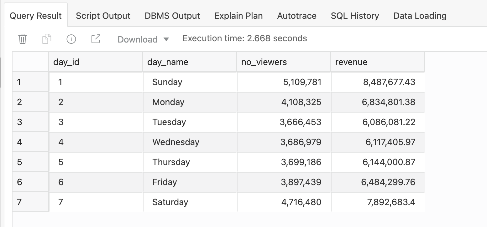
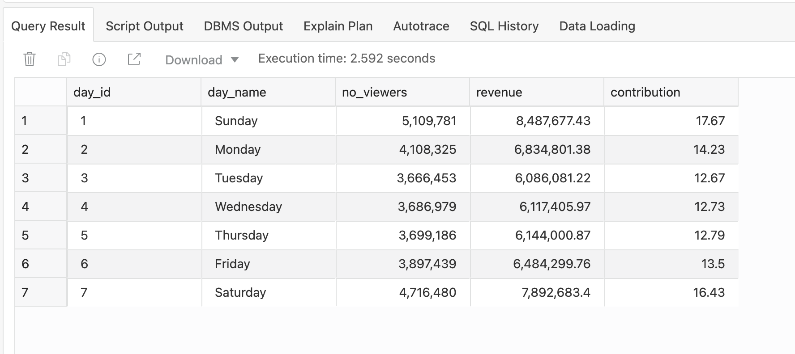
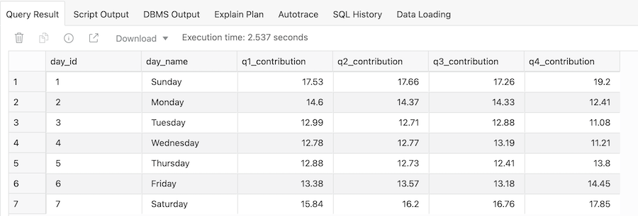
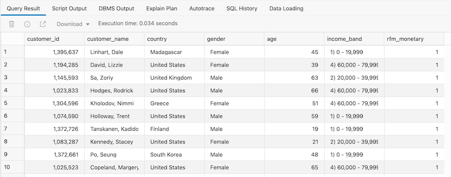
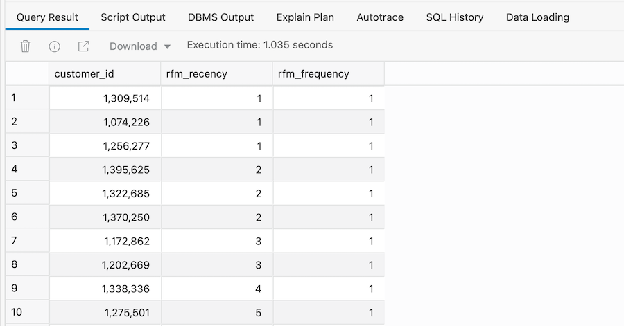
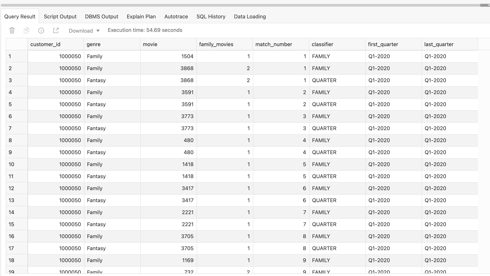
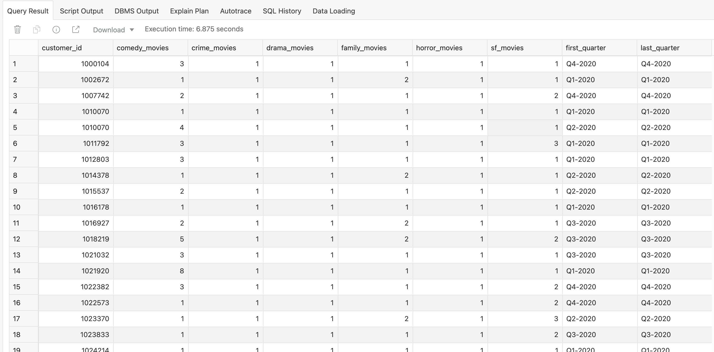
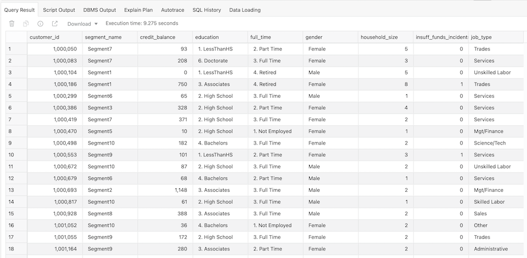
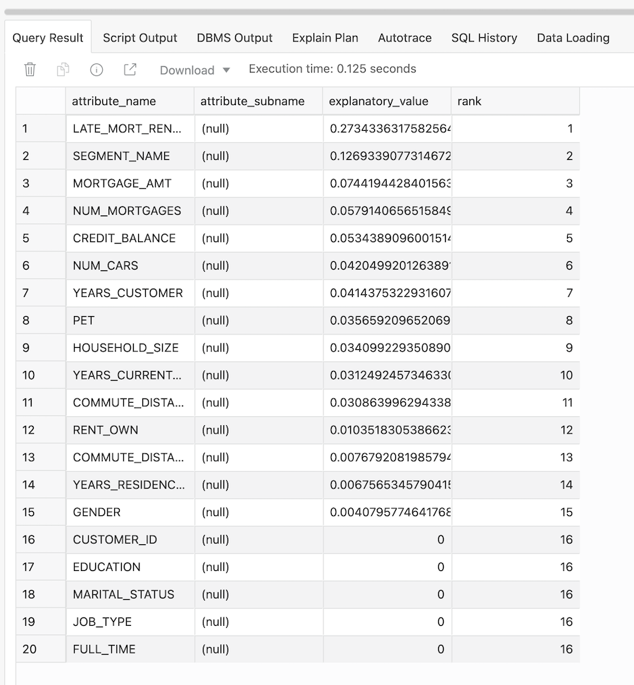

<a id="anchor0"></a>

# はじめに

データのロード、変換、管理、そして分析まで、全てを1つのデータベースで行うことができるのが、Autonomous Data Warehouseです。このチュートリアルを参考に、ぜひ一度"**完全自律型データベース**"を体験してみてください。

本記事では、MovieStreamデータを使い、データの分析方法を実際のビジネスシナリオに近い形でご紹介します。

<br>

**想定シナリオ：**

Oracle MovieStreamは、架空の映画ストリーミングサービスです。
MovieStreamはビジネスを成長させるため、顧客の視聴傾向や適切な提供価格などのデータ分析を行いたいと考えています。

<br>

**前提条件：**
+ ADBインスタンスが構成済みであること
    <br>※ADBインタンスを作成方法については、[101:ADBインスタンスを作成してみよう](../adb101-provisioning) を参照ください。  

+ [601: ADWでMovieStreamデータのロード・更新をしよう](../adb601-moviestream-load)のチュートリアルを完了していること

<br>

**目次：**

- [1. Movie Salesデータの分析](#anchor1)
- [2. 半構造化データの処理](#anchor2)
- [3. テキスト文字列の処理](#anchor3)
- [4. 最も重要な顧客の発掘](#anchor4)
- [5. パターンマッチング機能の利用](#anchor5)
- [6. 機械学習モデルのご紹介](#anchor6)
- [おわりに](#おわりに)

<br>

**所要時間 :** 約1.5時間

<a id="anchor1"></a>
<br>

# 1. Movie Salesデータの分析
## 1-1. 結果キャッシュによる実行時間の短縮
1. まずは、年と四半期ごとの映画の総売上高を調べるシンプルなクエリを実行してみましょう。
```sql
SELECT
 year,
 quarter_name,
 SUM(quantity_sold * actual_price)
FROM movie_sales_fact
WHERE YEAR = 2020
GROUP BY year, quarter_name
ORDER BY 1,2;
```

1. 結果は以下のように返されます。


1. クエリの実行にかかった時間をメモします。上記の例では、実行に**1.315秒**かかりました。再度同じクエリを実行します。

1. 今回のクエリでは、**0.004秒**しかかかりませんでした。では、何が起こったのでしょうか？
最初にクエリを実行したとき、ADWは、MOVIE_SALES_FACT表に対してクエリを実行し、すべての行をスキャンしました。クエリの結果をワークシートに返し、**結果キャッシュ**と呼ばれるものに結果を保存しました。同じクエリを再度実行すると、ADWは結果キャッシュから結果を取得します。すべての行を再度スキャンする必要はありません。これにより、時間が大幅に短縮され、リソースをほとんど使用しないで済みます。

## 1-2. 顧客の視聴習慣の分析
1. MovieStreamの顧客の視聴習慣を調べるために、曜日ごとに何人の顧客が映画を購入しているか、また、何か特定のパターンがあるかどうかを調べてみましょう。
```sql
SELECT
TO_CHAR(day, 'D') AS day_id,
TO_CHAR(day, 'Day') AS day_name,
COUNT(customer_id) AS no_viewers,
SUM(actual_price * quantity_sold) AS revenue
FROM movie_sales_fact
WHERE YEAR = 2020
GROUP BY to_CHAR(day, 'D'), TO_CHAR(day, 'Day')
ORDER BY TO_CHAR(day, 'D');
```

1. 結果は以下のように返されます。

これは、金曜日、土曜日、日曜日、月曜日の収益が最も高いことから、これらの曜日に映画を購入する顧客が多いことを示しています。週の真ん中の曜日の収益はこれらと比較すると、明らかに低くなっています。しかし、販売数を見ただけでは、明確なパターンを見出すことはできません。

## 1-3. それぞれの曜日の割合の算出
各曜日の売上全体に対する割合を計算することができれば、分析に役立ちます。そのためには、クエリの中で特殊な集計処理を行う必要があります。今回の例では、7日間の合計収益を計算し、各曜日の合計をその合計で割った値を算出します。

まず、各日の合計を定義します。 **SUM(actual_price * quantity_sold)**

次に、SUM関数を拡張したウィンドウ関数を使用して、すべての曜日の収益合計を加算します。次のようにキーワード OVER を追加します。

**SUM(actual_price * quantity_sold) OVER ()**で、すべての行の総計を計算します。

> （参考）
> ウィンドウ関数についてさらに詳しく知りたい場合は、[こちら](https://docs.oracle.com/cd/E82638_01/dwhsg/sql-analysis-reporting-data-warehouses.html#GUID-20EFBF1E-F79D-4E4A-906C-6E496EECA684)をご参照ください。

では、これらの2つの計算を組み合わせて、各曜日の割合を計算します。

**SUM(actual_price * quantity_sold) / SUM(actual_price * quantity_sold) OVER ()**

しかし、この計算はまだ少し複雑に思えます。

実は、この計算を行うことができるSQL関数があります。RATIO_TO_REPORTと呼ばれるもので、SQLは次のようになります。

**RATIO_TO_REPORT(SUM(actual_price * quantity_sold)) OVER()**

この方法は、はるかにシンプルに見えます。
以下のコードでは、結果を100倍してパーセント値を返しています。

1. それでは元のクエリを拡張した以下のクエリを実行してみます。
```sql
SELECT
TO_CHAR(day, 'D') AS day_id,
TO_CHAR(day, 'Day') AS day_name,
COUNT(customer_id) AS no_viewers,
SUM(actual_price * quantity_sold) AS revenue,
ROUND(RATIO_TO_REPORT(SUM(actual_price * quantity_sold)) OVER()*100, 2) AS contribution
FROM movie_sales_fact
WHERE YEAR = 2020
GROUP BY TO_CHAR(day, 'D'), TO_CHAR(day, 'Day')
ORDER BY TO_CHAR(day, 'D');
```

1. 結果は以下のようになります。

平日では月曜日が最も大きい割合を占めており、週全体では土曜日・日曜日が大きな割合を占めていることが、数字としてはっきりと分かるようになりました。

## 1-4. 売上データのジャンルごとの集計
続いて顧客が毎日見ている映画のジャンルを考えてみましょう。SQLのCASE関数を使って、各曜日のジャンルごとの視聴人数の比率を調べます。

1. 先ほどのクエリを応用して、割合計算の中にCASE関数を組み込みます。ここでは、クライム/ドキュメンタリー/ニュース/リアリティ番組で分けてみます。
```sql
SELECT
TO_CHAR(day, 'D') AS day_id,
TO_CHAR(day, 'Day') AS day_name,
COUNT(customer_id) AS no_viewers,
SUM(actual_price * quantity_sold) as revenue,
ROUND(RATIO_TO_REPORT(SUM(actual_price * quantity_sold)) OVER() * 100, 2) AS contribution,
ROUND(RATIO_TO_REPORT(SUM(CASE genre WHEN 'Crime' THEN 1 ELSE 0 END)) OVER() * 100, 2) AS crime,
ROUND(RATIO_TO_REPORT(SUM(CASE genre WHEN 'Documentary' THEN 1 ELSE 0 END)) OVER() * 100, 2) AS documentary,
ROUND(RATIO_TO_REPORT(SUM(CASE genre WHEN 'News' THEN 1 ELSE 0 END)) OVER() * 100, 2) AS news,
ROUND(RATIO_TO_REPORT(SUM(CASE genre WHEN 'Reality-TV' THEN 1 ELSE 0 END)) OVER() * 100, 2) AS realitytv
FROM movie_sales_fact
WHERE YEAR = 2020
GROUP BY TO_CHAR(day, 'D'), TO_CHAR(day, 'Day')
ORDER BY TO_CHAR(day, 'D');
```

1. 結果は以下のようになります。

これを見ると、リアリティTV関連の映画は、他の曜日に比べて日曜日に人気があることがわかります。ニュースは月曜日に人気があり、土曜日はクライム映画を楽しむ人が多いことがわかります。
このように、顧客の一週間の視聴傾向について、興味深い情報が得られます。

## 1-5. 売上データの四半期ごとの集計
続いて上記の曜日ごとの分析をさらに掘り下げ、四半期ごとではこの曜日ごとの割合がどのように変化するのか調べてみます。

1. 以下のクエリを実行します。
```sql
SELECT
quarter_name,
TO_CHAR(day, 'D') AS day_id,
TO_CHAR(day, 'Day') AS day_name,
COUNT(customer_id) AS no_viewers,
SUM(actual_price * quantity_sold) AS revenue,
ROUND(RATIO_TO_REPORT(SUM(actual_price * quantity_sold)) OVER()*100, 2) AS contribution
FROM movie_sales_fact
WHERE YEAR = 2020
GROUP BY quarter_name, TO_CHAR(day, 'D'), TO_CHAR(day, 'Day')
ORDER BY quarter_name, TO_CHAR(day, 'D');
```

1. 結果は以下のようになります。


1. contribution列を見てみると、値が非常に小さくなっています。これは、各曜日の売上割合を四半期全体の収益の総計に対して算出しているからです。実際に行う必要があるのは、各四半期内の割合を計算することなので、ウィンドウ関数にPARTITION BY句を追加し算出します。
```sql
SELECT
quarter_name,
TO_CHAR(day, 'D') AS day_id,
TO_CHAR(day, 'Day') AS day_name,
COUNT(customer_id) AS no_viewers,
SUM(actual_price * quantity_sold) as revenue,
ROUND(RATIO_TO_REPORT(SUM(actual_price * quantity_sold)) OVER(PARTITION BY quarter_name)*100, 2) AS contribution
FROM movie_sales_fact
WHERE YEAR = 2020
GROUP BY quarter_name, TO_CHAR(day, 'D'), TO_CHAR(day, 'Day')
ORDER BY quarter_name, TO_CHAR(day, 'D');
```

1. 結果は以下のようになり、各四半期内の割合が正しく算出されていることがわかります。


## 1-6. ピボット表の作成
四半期ごとの割合を表示することができましたが、行ごとに表示されているためやや見にくく感じます。そこで、PIVOT関数を使って四半期ごとの列を表示させるようにします。

1. 先ほどのクエリにPIVOT関数を追加すると、各四半期の行を列に入れ替えることができます。
```sql
SELECT * FROM
(SELECT
quarter_name,
TO_CHAR(day, 'D') AS day_id,
TO_CHAR(day, 'Day') AS day_name,
ROUND(RATIO_TO_REPORT(SUM(actual_price * quantity_sold)) OVER(PARTITION BY quarter_name)*100, 2) AS contribution
FROM movie_sales_fact
WHERE YEAR = 2020
GROUP BY quarter_name, TO_CHAR(day, 'D'), TO_CHAR(day, 'Day')
ORDER BY quarter_name, TO_CHAR(day, 'D'))
PIVOT
(
SUM(CONTRIBUTION) contribution
FOR QUARTER_NAME IN('Q1-2020' as "Q1", 'Q2-2020' as "Q2", 'Q3-2020' as "Q3", 'Q4-2020' as "Q4")
)
ORDER BY 1;
```

1. これにより、2つの時間軸でデータを視覚的に分析することが簡単になりました。


これらの結果から、月曜日の割合が時間の経過とともに減少し、金曜日、土曜日、日曜日の割合が増加していることが容易にわかります。ストリーミングサービスとしては、この3日間はネットワークやサーバーに重要な影響を受ける可能性があるため、この傾向がどのように変化するかを注意深く観察する必要があります。

<br>
<a id="anchor2"></a>

# 2. 半構造化データの処理
これまでは、あらかじめ定義されている構造化データを扱ってきました。しかし実際には、半構造化されたデータや、非構造化データを扱わなければいけないことがほとんどです。

<br>
<a id="anchor3"></a>

# 3. テキスト文字列の処理
ここでは、ADWにテキスト文字列データをカンマ区切りのフォーマットに変換してロードする、という作業を行います。シナリオとしては、顧客の電子メールアドレスを教育レベル別に分類するレポートを作成します。


<br>
<a id="anchor4"></a>

# 4. 最も重要な顧客の発掘
ここでは、売上データを分析するためのRFM（Recency Frequency Monetary）クエリを作成します。この一般的に使用されている顧客指標では、以前のクエリで使用したSQL分析関数のいくつかを組み合わせ、WITH句を使用してより複雑なクエリを作成します。

> （補足）
> RFMの詳細については、Wikipediaのこの[ページ](https://en.wikipedia.org/wiki/RFM_(market_research))を参照してください。

RFM分析を利用して、顧客の行動に関する理解を深めます。RFMは、顧客価値の分析に非常によく使われる手法です。一般的な顧客マーケティング、ダイレクトマーケティング、小売業などでよく使われています。

今回は、以下の情報を得るためのSQLクエリを作成します。
+ Recency：顧客が最後にサービスにアクセスした時間
+ Frequency：その顧客の活動レベル
+ Monetary：顧客が使用した金額

顧客は、NTILE関数を使用して重要度の高い5つのカテゴリーに分類されます。例えば、RFMの複合スコアが551の場合、その顧客は、最近の訪問回数（R=5）とサイト上での活動回数（F=5）では最高レベルの顧客ですが、消費額（M=1）では最低レベルの顧客であることを示しています。この顧客は、サイトでリサーチをした後、他の手段で映画を購入する可能性が高いということです。

## 4-1. 顧客の購入金額別分類
1. 次のクエリを実行し、顧客を購入金額に基づいて5つに分類します。
```sql
SELECT customer_id, customer_name, country, gender, age, income_band,
NTILE (5) over (order by sum(actual_price)) AS rfm_monetary
FROM movie_sales_fact
GROUP BY customer_id, customer_name, country, gender, age, income_band;
```

1. 3~4秒で実行され、以下のような結果が返されます。

RFM_MONETARY列は、カテゴリーの番号を示しています。この列の値が1であれば、その顧客が低支出の顧客であることを示し、5であれば高支出の顧客であることを示します。SQLドキュメントでNTILE関数の使用に関する詳細を見るには、[こちら](https://docs.oracle.com/cd/F19136_01/sqlrf/NTILE.html)をクリックしてください。

## 4-2. 顧客の頻度別分類
1. 顧客がどのくらいの頻度で映画を視聴しているかを調べます。各顧客が視聴した映画の数を計算し、その計算結果を5つに分けます。
```sql
SELECT customer_id,
NTILE (5) over (order by max(day)) AS rfm_recency,
NTILE (5) over (order by count(1)) AS rfm_frequency
FROM movie_sales_fact
GROUP BY customer_id;
```

1. これは1~2秒で実行され、以下のような結果が返されます。

これで、最後に映画を見た時期に基づいて、映画をほとんど見ない顧客（rfm_frequencyが1）と、映画を最も多く見る顧客（rfm_frequencyが5）を識別することができます。

## 4-3. RFMクエリの作成
1. WITH句を使ってこれら2つのクエリを組み合わせ、RFMクエリを作成します。
```sql
WITH customer_sales2 AS (
-- Sales and customer attributes
SELECT m.customer_id, m.customer_name, m.country, m.gender, m.age, m.income_band,
NTILE (5) over (order by sum(actual_price)) AS rfm_monetary
FROM movie_sales_fact m
GROUP BY m.customer_id, m.customer_name, m.country, m.gender, m.age, m.income_band),
click_data2 AS (
-- clicks from application log
SELECT customer_id,
NTILE (5) over (order by max(day)) AS rfm_recency,
NTILE (5) over (order by count(1)) AS rfm_frequency
FROM movie_sales_fact
GROUP BY customer_id
)
SELECT c.customer_id, c.customer_name, cd.rfm_recency, cd.rfm_frequency, c.rfm_monetary,
cd.rfm_recency*100 + cd.rfm_frequency*10 + c.rfm_monetary AS rfm_combined,
c.country, c.gender, c.age, c.income_band
FROM customer_sales2 c, click_data2 cd
WHERE c.customer_id = cd.customer_id
AND c.rfm_monetary >= 4
AND cd.rfm_recency <= 2
ORDER BY c.rfm_monetary desc, cd.rfm_recency desc;
```

1. 以下の結果は、かなりの金額を使っている（>= 4）が、最近サイトを訪れていない（<= 2）顧客のみを表示します。


<br>
<a id="anchor5"></a>

# 5. パターンマッチング機能の利用
パターンとはビジネスのあらゆる場面で発生するものです。データセット内の個々のパターンやグループのパターンを見つけ、分析し、定量化する能力は、今やビジネスにおける重要な要件になっています。これにより、顧客の行動や関連する業務活動をより深く理解することができ、新たな収益源となる機会を模索することができるからです。

ADWは、ネイティブなパターンマッチング機能を備えています。データセット内のパターンを特定するプロセスを、シンプルかつ効率的に行うことができます。ADWは従来のパターンマッチング機能と比較して、パフォーマンス、保守性、スケーラビリティの面で大きなメリットがあります。

今回は以下の項目について、ADWで分析します。
+ 2020年の四半期中にファミリージャンルの映画を1本以上見たことがあるお客様を検索する。
+ 2020年の四半期中に、少なくともいくつかの家族向けジャンルの映画を追加で見たことがある顧客で、顧客をフィルタリングする。
+ マーケティングチームのために、2020年の各四半期に各顧客がそれぞれの種類の映画を何本見たかを示すレポートを作成する。

とても複雑に見えますが、SQLのパターンマッチングを使えば、これらの分析はとても簡単に行えます。

## 5-1. ファミリージャンルの映画を見る顧客の特定
SQLのパターン・マッチング関数MATCH_RECOGNIZEを使用して、四半期中にファミリージャンルの映画を1本以上視聴した顧客を見つけることができます。
1. まず最初に、MOVIE_SALES_FACT表にビューを作成し、2020年の顧客データのみを表示するように結果をフィルタリングします。
```sql
CREATE VIEW movie_sales_fact_2020 AS
SELECT * FROM movie_sales_fact
WHERE year = 2020;
```

1. 以下の通り、四半期中に少なくとも2つのファミリージャンルの映画を見た顧客の数をカウントします。
```sql
SELECT count(*)
FROM movie_sales_fact_2020
MATCH_RECOGNIZE
(PARTITION BY customer_id ORDER BY day, genre
ONE ROW PER MATCH
PATTERN (family+ quarter)
DEFINE
family AS genre = 'Family',
quarter AS first(family.quarter_num_of_year) = last(family.quarter_num_of_year)
);
```

1. 結果は以下のようになります。


## 5-2. パターンに関する情報の取得
パターンマッチング処理では、発見したパターンに関する情報が返されます。必要な情報の定義は、MEASURESの中で行います。今回は各顧客が視聴したファミリー映画の数であるmovie_idを知りたいのですが、パターンマッチングプロセスが機能しているかどうかを確認するために、最初にマッチした行の四半期名とパターンの四半期名を返します。
1. まずは以下のクエリを実行します。
```sql
SELECT
customer_id, genre, movie, family_movies, match_number classifier, first_quarter, last_quarter
FROM movie_sales_fact_2020
MATCH_RECOGNIZE
(PARTITION BY customer_id ORDER BY day, genre
MEASURES
match_number() as match_number,
classifier() as classifier,
first(family.quarter_name) AS first_quarter,
last(family.quarter_name) AS last_quarter,
family.movie_id AS movie,
count(family.movie_id) AS family_movies
ALL ROWS PER MATCH
PATTERN (family+ quarter)
DEFINE
family AS genre = 'Family',
quarter AS first(family.quarter_num_of_year) = last(family.quarter_num_of_year)
) mr
order by mr.customer_id, match_number;
```

1. 以下のようにファミリー映画を見ている顧客の出現回数ごとに行が表示され、映画も表示されています。


## 5-3. ファミリー関連のジャンルの調査
パターンの定義を拡張するだけで、パターンの検索条件をファミリー関連の他のジャンルにも広げることができます。
1. 上記を以下のようにパターンマッチングクエリに追加します。
```sql
SELECT COUNT(*)
FROM movie_sales_fact_2020
MATCH_RECOGNIZE
(PARTITION BY customer_id ORDER BY day, genre
MEASURES
match_number() as match_number,
classifier() as classifier,
first(comedy.quarter_name) AS first_quarter,
last(family.quarter_name) AS last_quarter,
count(movie_id) AS count_movies
ALL ROWS PER MATCH
PATTERN (comedy+ crime drama family+ quarter)
DEFINE
comedy as genre = 'Comedy',
crime as genre = 'Crime',
drama as genre = 'Drama',
family as genre = 'Family',
quarter AS first(family.quarter_num_of_year) = last(family.quarter_num_of_year)
) mr
order by mr.customer_id, match_number;
```

1. 以下のような結果が返されます。


## 5-4. 要件の変更
先ほどのパターン文を微調整して、次はファミリー映画やSF映画が好きな顧客をピックアップしてみます。
1. 次のクエリを実行して、この新しいパターンに一致する顧客の数を確認します。
```sql
SELECT count(*)
FROM movie_sales_fact_2020
MATCH_RECOGNIZE
(PARTITION BY customer_id ORDER BY day, genre
ONE ROW PER MATCH
PATTERN (comedy+ crime drama family+ horror scifi+ quarter)
DEFINE
comedy AS genre = 'Comedy',
crime AS genre = 'Crime',
drama AS genre = 'Drama',
family AS genre = 'Family',
horror AS genre = 'Horror',
scifi AS genre = 'Sci-Fi',
quarter AS last(scifi.quarter_num_of_year) = FIRST(comedy.quarter_num_of_year)
);
```

1. 以下のように278という値が返されます。


1. 続いてこの結果をより具体的に示すために、列を追加したクエリを実行します。
```sql
SELECT
customer_id,
comedy_movies,
crime_movies,
drama_movies,
family_movies,
horror_movies,
sf_movies,
first_quarter,
last_quarter
FROM movie_sales_fact_2020
MATCH_RECOGNIZE
(PARTITION BY customer_id ORDER BY day, genre
MEASURES
first(family.quarter_name) AS first_quarter,
last(scifi.quarter_name) AS last_quarter,
count(comedy.movie_id) AS comedy_movies,
count(crime.movie_id) AS crime_movies,
count(drama.movie_id) AS drama_movies,
count(family.movie_id) AS family_movies,
count(horror.movie_id) AS horror_movies,
count(scifi.movie_id) AS sf_movies
ONE ROW PER MATCH
PATTERN (comedy+ crime drama family+ horror scifi+ quarter)
DEFINE
comedy as genre = 'Comedy',
crime as genre = 'Crime',
drama as genre = 'Drama',
family as genre = 'Family',
horror as genre = 'Horror',
scifi as genre = 'Sci-Fi',
quarter as scifi.quarter_num_of_year = comedy.quarter_num_of_year
) mr
order by mr.customer_id, first_quarter, family_movies, sf_movies;
```

1. 結果は以下のようになります。


## 5-5. 結果の共有
1. この結果をマーケティングチームに共有するため、Query Resultパネルのダウンロード機能を使いファイルにすることができます。


<br>
<a id="anchor6"></a>

# 6. 機械学習モデルの適用
Autonomous Data Warehouseには、機械学習アルゴリズムが組み込まれています。ここでは、ビジネス上の問題を解決するための機械学習モデルの使用について簡単にご紹介します。ADWでの機械学習については、[こちら](../adb107-machine-learning/)もご参照ください。

本記事では、自分のアカウントに対して「残高不足」になる可能性の高い顧客を人口統計学的に特定します。これが特定できれば、顧客がアカウントをよりよく管理できるようになります。

この分析を行うために、DBMS_PREDICTIVE_ANALYTICSというパッケージを使用します。このパッケージには、予測分析として知られる機械学習の自動化された処理が含まれています。すべての機械学習アクティビティは、プロシージャによって内部的に処理されるため、モデル構築やモデルのスコアリングといった典型的な機械学習のステップをユーザーが意識する必要はありません。そのため、ADWでは誰もが簡単に機械学習を用いたデータ分析を行うことができます。

## 6-1. データセットの用意
1. まずは顧客の属性をまとめたビューを作成します。ここでは、時間列、トランザクション列、映画列を除きます。
```sql
CREATE OR REPLACE VIEW vw_cust_funds AS
SELECT DISTINCT
customer_id, segment_name, credit_balance, education, full_time, gender, household_size, insuff_funds_incidents, job_type, late_mort_rent_pmts, marital_status, mortgage_amt, num_cars, num_mortgages, pet, rent_own, years_current_employer_band, years_customer, years_residence_band, commute_distance, commute_distance_band
FROM movie_sales_fact;
```

1. ビューが作成されたら、次のクエリを実行します。
```sql
SELECT COUNT(*) FROM vw_cust_funds;
```

1. 以下のように4,845人の顧客がいることがわかります。


1. ビュー全体を見るため以下のクエリを実行します。
```sql
SELECT *
FROM vw_cust_funds
ORDER BY 1;
```

1. 以下のような結果が返されます。なおinsufficient_funds_incidents列には、顧客が残高不足の状態であるかどうかを示すフラグが立てられています。


## 6-2. モデルの構築
ここでは、顧客のどの属性が残高不足が発生するか予測するのに役立つか調べるため、EXPLAINプロシージャを使用します。EXPLAINプロシージャは、ターゲット列の値を予測する上での各属性の相対的な重要性を識別します。この分析を行うため、今回は以下のパラメータを使用します。
+ **data_table_name:** vm_cust_fundsビュー
+ **explain_column_name:** insufficient_funds_incidents列
+ **result_table_name:** customer_explain_result表（これはプロシージャによって自動作成されるため、存在しない表の名前を入力します。）

1. 以下でモデルを実行します。
```sql
EXEC DBMS_PREDICTIVE_ANALYTICS.EXPLAIN('vw_cust_funds', 'insuff_funds_incidents', 'customer_explain_result');
```

1. 20秒ほどで以下のようにログが出力されます。


## 6-3. 出力の確認
1. 以下のクエリでモデルの結果を確認します。
```sql
SELECT * FROM customer_explain_result;
```

1. 以下のような結果が返されます。


+ Explanatory Value列：この列には、残高不足が発生する確率を決定するために、その列がどの程度有効であるかを示す値が含まれています。値の範囲は0～1で、大きいほど有効になります。値が0の場合、各列の値とターゲット列（insufficient_funds_incidents列）の値の間に有効な相関がないことを意味します。値が1の場合は、完全な相関があることを意味し、そのような列は予測対象から除外すべきです。

+ Rank列：上記Explanatory Value列の値のランキングを表示しています。値が等しい行は、同じランクになります。

## 6-4. 結果の分析
1. 先ほどの出力を少し分かりやすくするため、以下のクエリを実行します。
```sql
SELECT
attribute_name,
round(explanatory_value, 6) explanatory_value,
round(sum(explanatory_value) over (order BY rank), 4) running_total,
rank
FROM customer_explain_result
ORDER BY RANK;
```

1. 以下のようになります。


この結果から残高不足が発生する顧客を特定するには、住宅ローンの滞納の発生状況、セグメント名、住宅ローンの金額を調べる必要があることがわかります。また、上位4つの属性を使用することで、残高不足の可能性を予測する能力が平均以上（53%）に達することもわかります。

逆に、job_type、marital_status、educationなどの人口統計学的属性は、残高不足になる可能性に影響しない、とうことがわかります。

<br>

# おわりに
本記事では、[601: ADWでMovieStreamデータのロード・更新をしよう](../adb601-moviestream-load)に続く内容として、MOVIE_SALESデータの分析の手法をいくつかご紹介しました。今回ご紹介した方法以外にも、Autonomous Data Warehouseにはデータ分析に有用な機能が多数備わっています。データのロード、変換、管理、そして分析まで、全てを1つのデータベースで行うことができるのはAutonomous Data Warehouseならでは、と言えます。このチュートリアルを参考に、ぜひ一度"**完全自律型データベース**"を体験してみてください。

<br>

# 参考資料
+ LiveLabs [Analyze MovieStream data in Oracle Autonomous Database using SQL Workshop](https://apexapps.oracle.com/pls/apex/r/dbpm/livelabs/view-workshop?wid=852)
+ Oracle Big Data Blog [Structured vs. Unstructured Data](https://blogs.oracle.com/bigdata/post/structured-vs-unstructured-data)


以上で、この章は終了です。  
次の章にお進みください。

<br>
[ページトップへ戻る](#anchor0)


