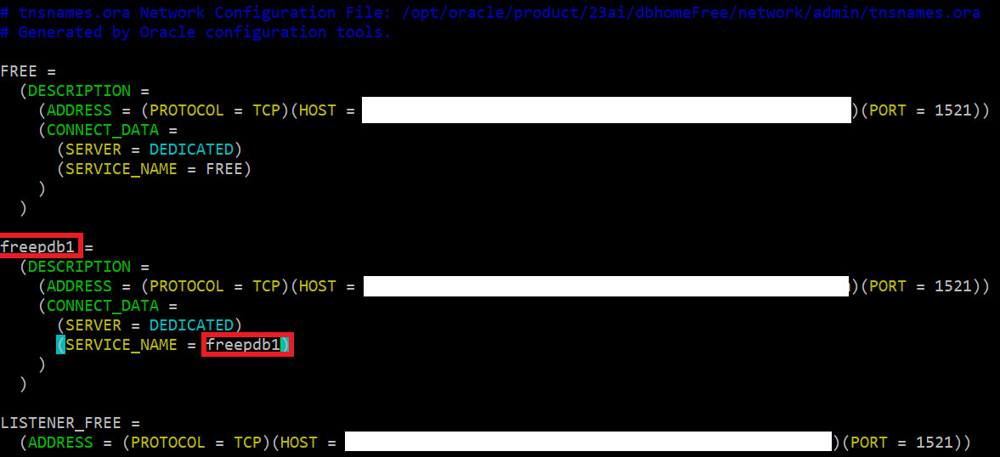
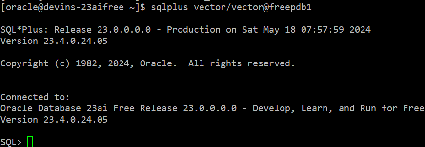

<a id="anchor0"></a>

# はじめに

Oracle Database 23ai Freeは、Oracle Database 23aiを使いやすく、簡単にダウンロードできるようにパッケージ化され、無料で提供されています。Oracle Database 23ai Freeの概要は[こちら](https://www.oracle.com/jp/database/free/)をご参照ください。

Oracle Database 23ai Freeでは、一部リソース制限がありますが、AI Vector Searchの基本的な使い方を体験することができます。

本チュートリアルでは、Oracle Database 23ai Freeを仮想マシンインスタンスへインストールする方法をご紹介します。

<br>

**前提条件 :**  
+ Oracle Database 23ai Freeをインストールする仮想マシンインスタンスがプロビジョニング済みであること
    <br>※Oracle Cloud Infrastructure上でプロビジョニングする場合は、[入門編-その3 - インスタンスを作成する](/ocitutorials/beginners/creating-compute-instance)を参照ください。
    <br>[システム要件](https://docs.oracle.com/en/database/oracle/oracle-database/23/xeinl/requirements.html#GUID-427FACD2-F623-4BFA-AB3E-4FE283396547)を満たしていることをご確認ください。
    <br>**本チュートリアルはOracle Linux 8を前提にしています。**


**目次**

- [はじめに](#はじめに)
- [1. Oracle Database 23ai Freeのインストール](#1-oracle-database-23ai-freeのインストール)
- [2. Oracle Database 23ai Freeへの接続](#2-oracle-database-23ai-freeへの接続)

<br>

**所要時間 :** 約40分

<a id="anchor1"></a>
<br>

# 1. Oracle Database 23ai Freeのインストール

Oracle Database 23ai Free は、RPM パッケージを使用してインストールできます。

RPM ベースのインストールでは、インストール前のチェック、DBソフトウェアの抽出、抽出したソフトウェアの所有権の事前設定済みユーザーおよびグループへの再割り当て、Oracleイ ンベントリの維持、Oracle Databaseソフトウェアの構成に必要なすべてのroot操作の実行が行われ、シングルインスタンスのOracle Databaseの作成および構成が行われます。

RPM ベースのインストールでは、インストールの最小要件が満たされていない場合、それを検出し、これらの最小プレインストール要件を完了するよう促します。

1. rootでログインします。
   ```sh
   sudo -s
   ```

1. Oracle Database Preinstallation RPMをインストールします。
   ```sh
   dnf -y install oracle-database-preinstall-23ai
   ```

   Oracle Database Preinstallation RPM は、Oracleインストールの所有者とグループを自動的に作成します。また、Oracle Databaseのインストールに必要なその他のカーネル構成設定も行います。
   

1. 以下を実行してOracle Database 23ai FreeのRPM(Oracle Linux 8版)をダウンロードします。
   ```sh
   wget https://download.oracle.com/otn-pub/otn_software/db-free/oracle-database-free-23ai-1.0-1.el8.x86_64.rpm
   ```
   
1. DBソフトウェアをインストールします。
   ```sh
   dnf -y install oracle-database-free-23ai-1.0-1.el8.x86_64.rpm
   ```

   

   これでOracle Databaseのインストールは完了です。
   
   続いてOracle Databaseの作成と構成を行っていきます。

3. 以下の構成スクリプトを実行して、プラガブル・データベース（FREEPDB1）を1つ持つコンテナ・データベース（FREE）を作成し、デフォルトのポート（1521）でリスナーを構成します。ここの手順は
   ```sh
   /etc/init.d/oracle-free-23ai configure
   ```

   SYS、SYSTEM、PDBADMIN管理ユーザーのパスワードの設定を求められます。Oracleではパスワードは少なくとも8文字以上で、少なくとも1つの大文字、1つの小文字、1桁の数字[0-9]を含むことを推奨しています。

   例: Welcome12345#

   

1. Oracleユーザーにスイッチし、環境変数を設定します。
   ```sh
   sudo su - oracle
   export ORACLE_SID=FREE
   export ORAENV_ASK=NO
   . /opt/oracle/product/23ai/dbhomeFree/bin/oraenv
   ```

   

<a id="anchor1"></a>
<br>

# 2. Oracle Database 23ai Freeへの接続

1. 以下を実行し、SQL\*Plusでデータベースに接続します。
   ```sh
   sqlplus sys@localhost:1521/freepdb1 as sysdba
   ```

   先ほど設定したSYSのパスワードを入力します。

   

1. 表領域を作成します。
   ```sql
   Create bigfile tablespace tbs2 Datafile 'bigtbs_f2.dbf' SIZE 1G AUTOEXTEND ON next 32m maxsize unlimited extent management local segment space management auto;
   ```

   ```sql
   CREATE UNDO TABLESPACE undots2 DATAFILE 'undotbs_2a.dbf' SIZE 1G AUTOEXTEND ON RETENTION GUARANTEE;
   ```

   ```sql
   CREATE TEMPORARY TABLESPACE temp_demo TEMPFILE 'temp02.dbf' SIZE 1G reuse AUTOEXTEND ON next 32m maxsize unlimited extent management local uniform size 1m;
   ```

1. AI Vector Search用のユーザー`VECTOR`を作成します。
   ```sql
   create user vector identified by vector default tablespace tbs2 quota unlimited on tbs2;
   ```

1. `Vector`に開発者用のロール`DB_DEVELOPER_ROLE`を付与します。
   ```sql
   grant DB_DEVELOPER_ROLE to vector;
   ```

   一度OSに戻ります。
   ```
   exit
   ```

1. tnsnames.oraにPDB(freepdb1)のサービス名を追加します。
   ```sh
   vi $ORACLE_HOME/network/admin/tnsnames.ora
   ```

   サービス`FREE`のエントリをコピーし、`SERVICE_NAME`を**freepdb1**に修正します。

   

1. 以下のように`VECTOR`ユーザーでfreepdb1に接続できるようになります。
   ```sh
   sqlplus vector/vector@freepdb1
   ```

   

<br>
以上で、この章は終了です。  
次の章にお進みください。
