

# はじめに
Oracle Database Autonomous Recovery Service（以下、リカバリ・サービス）は、Oracle Cloud Infrastructure (OCI) で実行するOracle Database向けのフル・マネージド型データ保護サービスです。

BaseDBでは長期保管バックアップ機能（LTR）を利用してリカバリ・サービスをバックアップ保存先として、最大10年間バックアップを保存できます。
法規制や社内のビジネス・ルールにより、多くの組織では、特定の、通常は毎月のバックアップを何年にもわたって保持することが義務付けられていますが、LTRを利用することでコンプライアンス・バックアップが利用できるようになります。

このチュートリアルではBase Database Service (BaseDB) でOracle Database Autonomous Recovery Service（RCV/ZRCV）の長期保管バックアップ（LTR）を作成する方法を紹介します。

**前提条件 :**
+ [107: BaseDBにAutonomous Recovery Service (RCV/ZRCV) をセットアップしよう ](../dbcs107-zrcv) を通じてリカバリ・サービスのセットアップが完了していること
 

**注意** チュートリアル内の画面ショットについては現在の画面と異なっている場合があります。

**目次**
- [1. 長期保存バックアップ（LTR）を作成してみよう](#1-長期保存バックアップltrを作成してみよう)
- [2. 長期バックアップ保持期間を変更してみよう](#2-長期バックアップ保持期間を変更してみよう)
- [3. LTRを使用して新規データベースを作成してみよう](#3-ltrを使用して新規データベースを作成してみよう)

 
**所要時間 :** 約90分
 

# 1. 長期保存バックアップ　（LTR）を作成してみよう
ナビゲーション・メニューから、「Oracle Database」>「Oracleベースデータベース・サービス」をクリックします。

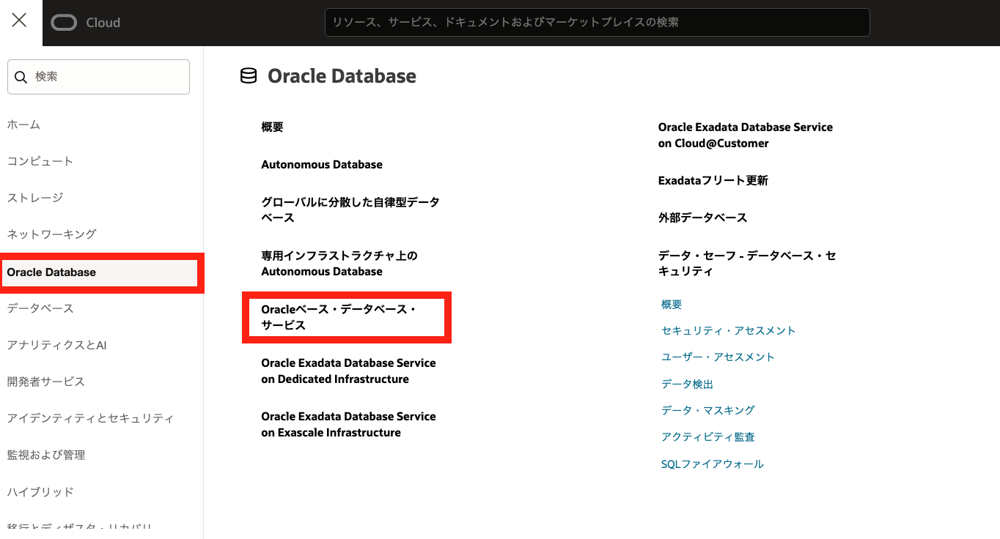

次にLTRを作成したいDBシステムの名前をクリックします。

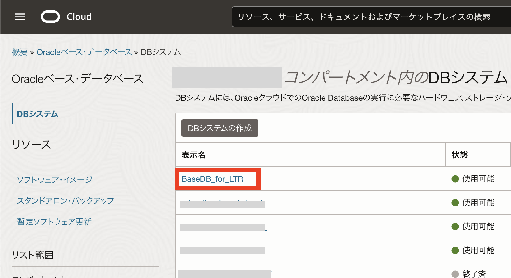

次にLTRを作成したいデータベースを選択します。

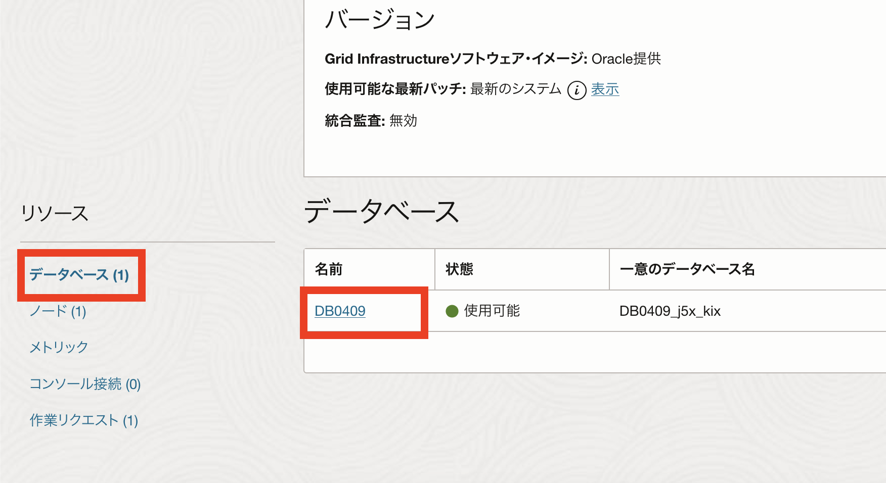

「データベースの詳細」ページを下にスクロールし、「リソース」>「バックアップ」を選択し、「バックアップの作成」をクリックします。

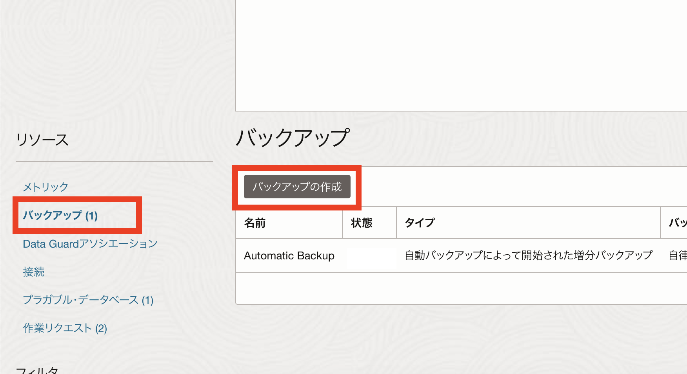

「バックアップの作成」で次の情報を入力します。

**入力項目と入力内容**
- **名前**：任意のバックアップの名前を入力します。
- **バックアップ保存期間**：LTRを作成するには「長期バックアップ保存期間の指定」を選択します。
- **バックアップ保持期間**：バックアップの保存期間を入力します。保持期間は、日数(90-3,650)または年数(1-10)で入力する必要があります。

**Data Guard構成について**
Data Guard構成ではプライマリ、スタンバイ、どちらからもLTRはを作成することが可能です。
{: .notice--info}

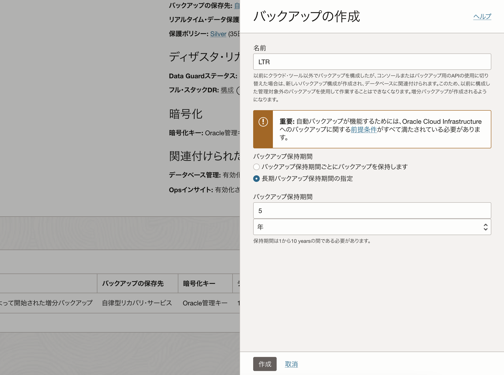

入力項目を入力し終わったら「作成」をクリックします。
長期バックアップの作成状況は「作業リクエスト」から確認できます。

**LTRの取得について**
 LTRはリカバリ・サービスから作成されるので、LTR作成中は保護されたデータベースのステータスは「使用可能」になります。
 LTRは本番環境に負荷をかけることなく、長期保管用のフルバックアップを作成します。
{: .notice--info}

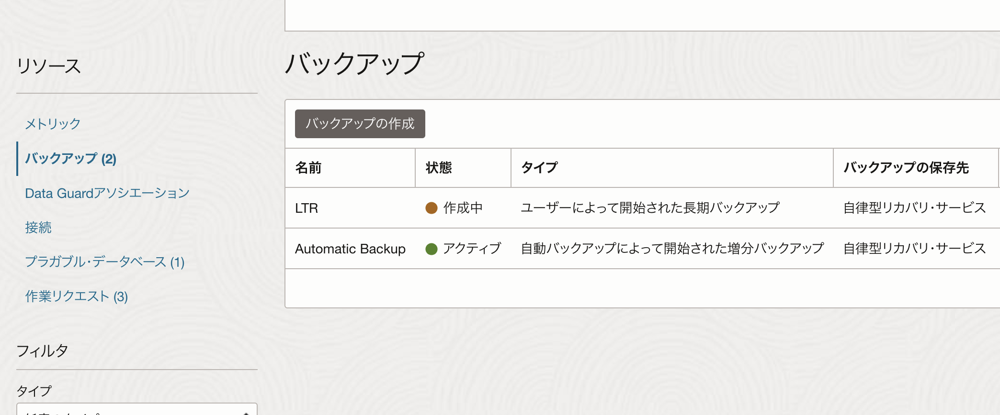

長期バックアップが作成されると、その詳細は「バックアップ」セクションに表示されます。
 

# 2. 長期バックアップ保持期間を変更してみよう
次に、作成したLTRの保持期間を変更してみましょう。

「データベースの詳細」ページを下にスクロールし、「リソース」>「バックアップ」から保持期間を変更したいバックアップを選択します。

「バックアップ」セクションで、「タイプ」が「ユーザーによって開始された長期バックアップ」のバックアップの右端にある3つのドットをクリックし、「保存期間の変更」を選択します。

**保持期間の変更について**
保持期間は、長期バックアップ作成時点から計算されます。保持期間は、日数(90 - 3,650)または年数(1 - 10)で入力する必要があります。保存期間は短縮・延長どちらも可能です。
{: .notice--info}

「保存期間の変更」で新しい保存期間を入力し、「変更の保存」をクリックします。

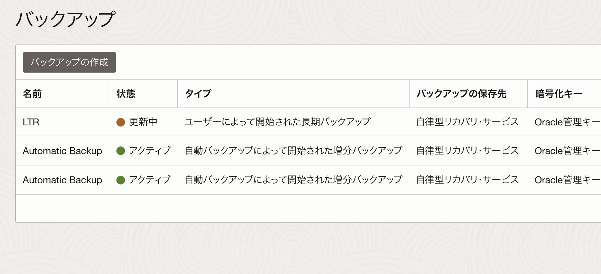

バックアップの保存期間が変更されます。
 

# 3. LTRを使用して新規データベースを作成してみよう
今度は、LTRを使用して新規データベースを作成してみましょう。

「データベースの詳細」ページを下にスクロールし、「リソース」>「バックアップ」を選択します。

「タイプ」が「ユーザーによって開始された長期バックアップ」と表示されているバックアップの右端にある3つのドットをクリックし、「データベースの作成」を選択します。

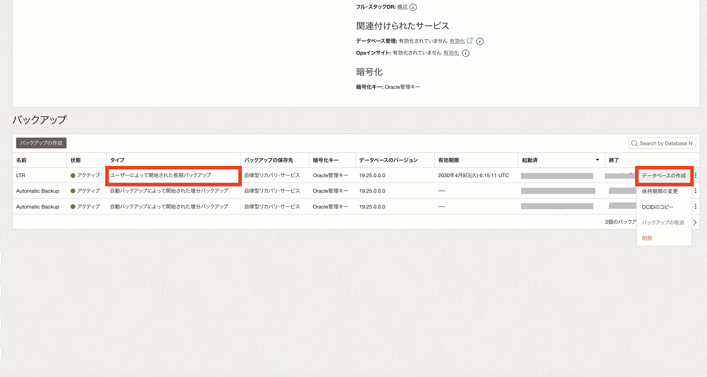

「バックアップからのデータベースの作成」ウィンドウで必要項目を入力します。　　　　  
※設定方法は新規作成時と同様です。入力項目は[101: Oracle Cloud で Oracle Database を使おう(BaseDB)](../dbcs101-create-db)をご参照下さい。

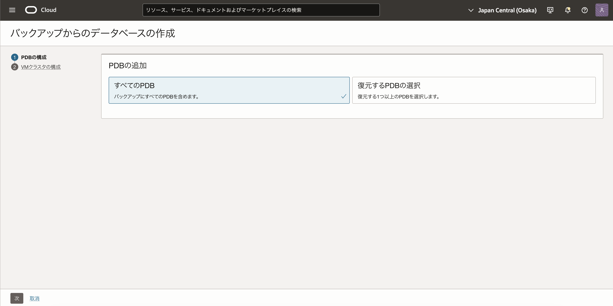

情報を入力し終わったら「**データベースの作成**」をクリックします。

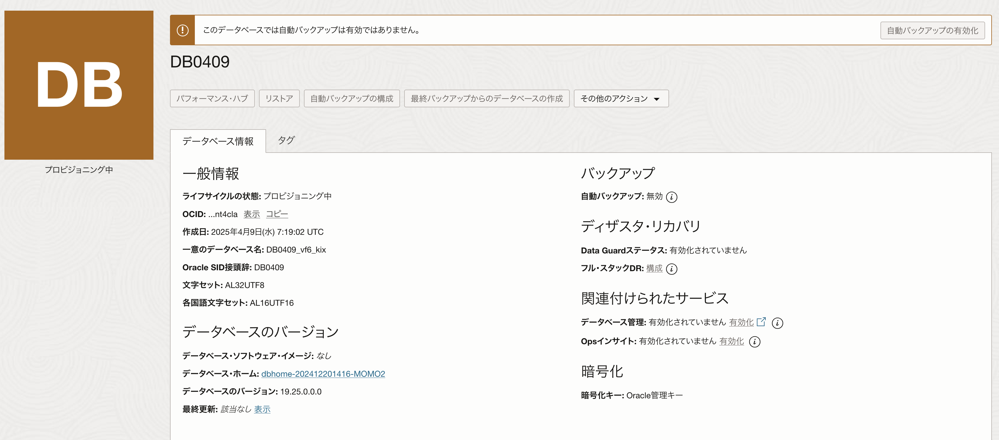

データベースの作成が開始されます。
新規データベース作成中はLTRに「リストア中」と表示されます。

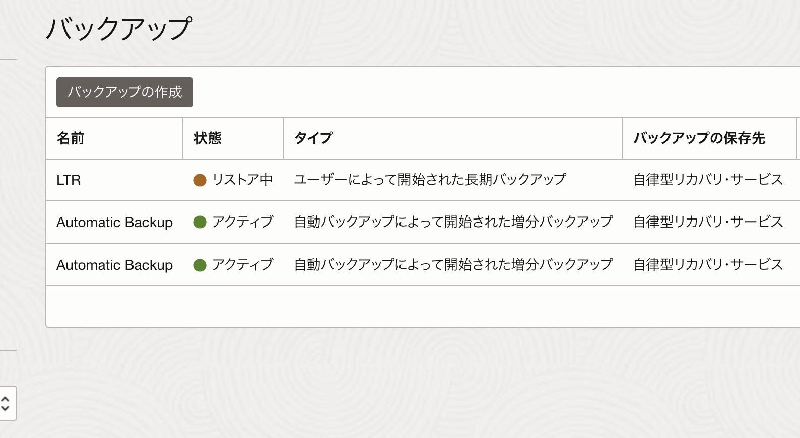

作業が完了するとデータベースのステータスが**PROVISIONING...** から **AVAILABLE** に変わります。

以上で、この章の作業は完了です。

 

# 参考資料

* [製品サイト] [Oracle Database Autonomous Recovery Service](https://www.oracle.com/jp/database/zero-data-loss-autonomous-recovery-service/) 

* [マニュアル] [Oracle Database Autonomous Recovery Service](https://docs.oracle.com/cd/E83857_01/paas/recovery-service/index.html) 

* [Blog] [Autonomous Recovery ServiceでOracle Database Servicesの長期保存バックアップにワンクリックで対応可能に](https://blogs.oracle.com/oracle4engineer/post/ja-recovery-service-ltr) 

* [Blog] [Autonomous Recovery Service で長期保存バックアップのコストを半減 ](https://blogs.oracle.com/oracle4engineer/post/ja-zrcv-ltr-half-the-cost) 

* [チュートリアル] [Create Long-Term Backups with Oracle Database Autonomous Recovery Service on Oracle Base Database Service](https://docs.oracle.com/en/learn/basedb-ltr-backup/index.html#introduction) 
 

 
[ページトップへ戻る](#anchor0)