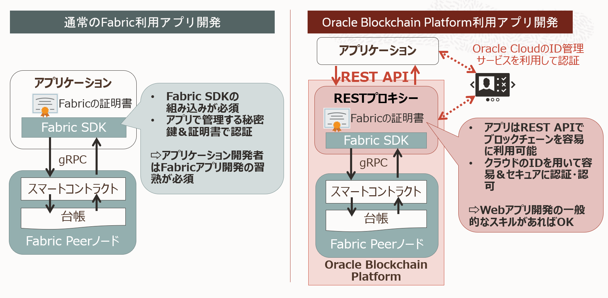
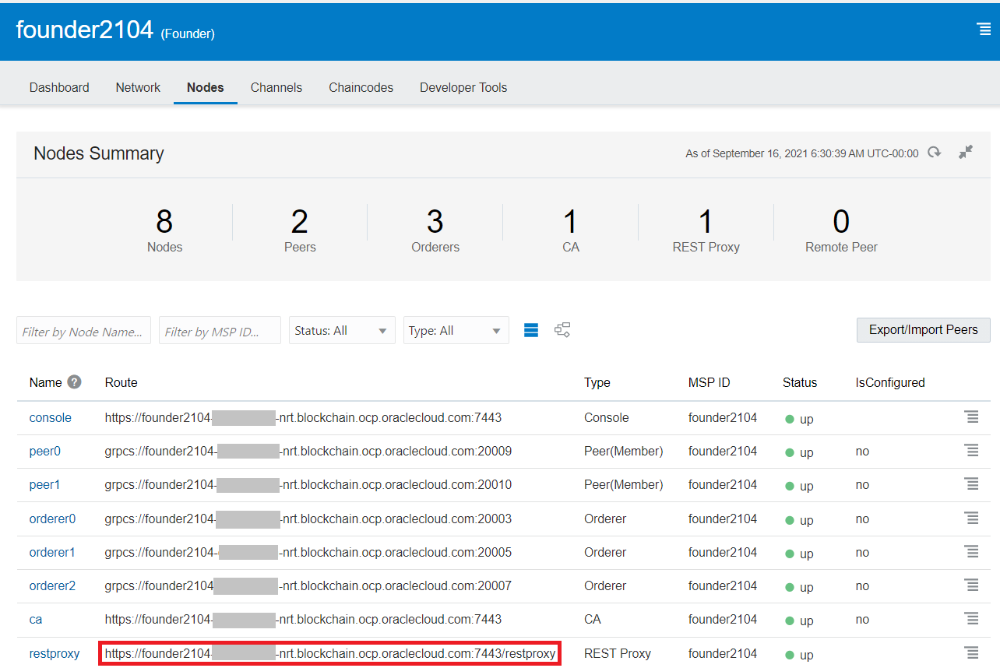

この文書ではOracle Blockchain Platform（OBP）でREST APIからChaincodeを実行する方法を説明します。

```
この文書は、2021年8月時点での最新バージョン(21.2.1)を元に作成されています。
```

- **前提 :**

  - [Oracle Blockchain Platform のインスタンス作成](../01_1_create_instance/)を完了
  - [Channelの作成](../02_1_create_channel/)を完了
  - [Chaincodeのデプロイ](../03_1_deploy_chaincode/)を完了


<br>
<br>

# 0. 前提の理解

## 0.1 Oracle Blockchain PlatformのREST Proxy

OBPはパーミッション型のブロックチェーンプロトコルであるHyperledger Fabricをベースとしたブロックチェーンプラットフォームです。

Hyperledger FabricにおけるChaincodeは、いわゆるスマートコントラクトとして位置づけられ、ブロックチェーン台帳に対して実行されるビジネスロジックです。アプリケーションからChaincodeを実行する場合は通常、Fabric SDKをアプリケーションに組み込んだうえで、SDKの機能を利用して実行します。この際にHyperledger Fabricネットワークのユーザーアイデンティティが認証・認可に使用され、そのため、アプリケーション側に秘密鍵と証明書を保持しておく必要があります。

OBPでは、アプリケーションとChaincodeを中継する役割を持つREST Proxyというコンポーネントを独自に備えています。REST ProxyにはFabric SDKが組み込まれており、また、Hyperledger Fabricネットワークのユーザーアイデンティティを保持しています。**これにより、アプリケーションはREST APIを呼び出すことで、REST Proxyを介してChaincodeを実行できます。**この際、アプリケーションはREST Proxyに対して、Oracle Cloudのユーザーアカウント（**IDCSユーザー**）を用いて認証、認可されます。



## 0.2 このチュートリアルでの構成

このチュートリアルの例では、 _Founder2104_ というFounderインスタンス（=Organization）と、 _Member2104_ というParticipantインスタンス（=Organization）から成るブロックチェーン・ネットワークとなっています。

また、 _ch1_ という名前のChannelに、OBPに付随するサンプルのひとつであるBalance TransferのChaincodeが、 _BT-Sample_ という名前でデプロイされています。

任意のChannelで任意のChaincodeを基本的には同一の手順で実行できます。

## 0.3 使用するクラウドユーザーアカウント

前述の通り、REST Proxyを経由してREST APIでChaincodeを実行する際、REST Proxyは実行者をIDCSユーザーとして認証、認可の検証を行います。リクエストを行うユーザーは以下の条件を満たす必要があります。

- IDCSユーザーとして存在している（IDCSとフェデレーションされていないOCI IAMアカウントは利用不可）
- IDCSユーザーあるいは所属するIDCSグループに、当該OBPインスタンスに対する`REST_CLIENT`のIDCS権限が付与されている

また、認証にはBASIC認証方式およびトークン認証方式が使用できます。チュートリアルの例ではBASIC認証方式を用います。トークン認証方式の利用方法については、[公式ドキュメントのトークン認証の説明箇所](https://docs.oracle.com/en/cloud/paas/blockchain-cloud/restoci/UseOAuth.html)を確認ください。

## 0.4 使用されるHyperledger Fabricのトランザクション実行者アイデンティティ

REST Proxyを経由してChaincodeを実行した場合、トランザクション実行者となるHyperledger Fabric（HLF）のアイデンティティはデフォルトでは _{インスタンス名=Organization名}\_defaultuser_ というIDのものが用いられます。

別のHLFアイデンティティを用いたい場合、また、REST APIを呼び出すクラウドユーザーアカウントによってHLFアイデンティティを使い分けたい場合は、[こちらのチュートリアル](../05_1_fabric_identity/)を参照ください。

## 0.5 QueryとTransactionのAPIエンドポイントの違い

OBPにはChaincodeの実行のための2種類のREST APIエンドポイントが存在します。ひとつは**Queryエンドポイント**で、もうひとつが**Transactionエンドポイント**です。

Hyperledger Fabricのトランザクションは①クライアントアプリケーションからPeerにTransaction Proposalメッセージ（Chaincodeの実行依頼）を送り、Peerが指定されたChaincodeを実行したうえでその結果に署名をつけて返却する（Endorsement）、②クライアントアプリケーションがトランザクション成立に必要なEndorsementを集めたのち、Ordering ServiceにTransactionメッセージを送り、Ordering Serviceが受け取ったTransactionを格納したブロックを生成する、③Ordering ServiceからPeerノードにブロックが配布され、PeerノードはTransactionを検証したのちに台帳に反映する、という3フェーズのフローになっています。

REST APIのQueryエンドポイントでは、このうち①に含まれるTransaction ProposalメッセージのPeerへの送付と、Peerから返却されたChaincode実行結果のアプリケーションへの返却のみが行われます。従って、**Queryエンドポイントでは台帳の更新は行われず、Chaincodeの実行結果のみを取得できます。**そのため、主に台帳内容のクエリに利用することが想定されています。

REST APIのTransactionエンドポイントでは、①のTransaction Proposalの送付およびEndorsementの収集、②のTransactionの送付、および（同期実行オプションを指定した場合）③のPeerノードでの検証・反映結果の取得を含めた一連の処理が行われます。従って、**TransactionエンドポイントではChaincodeの実行結果に基づいて台帳の更新が行われ、また、トランザクションの実行記録も残ります。**

このチュートリアルではQueryエンドポイントとTransactionエンドポイントそれぞれについて説明していきます。

# 1. REST ProxyのURLの特定

REST APIのリクエストを送る際に必要になる、OBPインスタンスのREST ProxyのURLを確認しておきます。

1. Oracle Blockchain Platformのサービス・コンソールを開きます。

1. **Nodes**のページを開くと、インスタンスのノードとコンポーネントの一覧が表示されます。REST Proxyの行に記載されているURLをコピーし、どこかに保存しておきましょう。

    

# 2. Queryエンドポイントの実行

以下では必須あるいは主要なパラメータと、ごく基本的な使い方の例を示します。詳細は[公式ドキュメント](https://docs.oracle.com/en/cloud/paas/blockchain-cloud/restoci/op-restproxy-api-v2-channels-channelid-chaincode-queries-post.html)を参照ください。

## 2.1 主要パラメータ等

- エンドポイント： `{REST ProxyのURL}/api/v2/channels/{CHANNEL名}/chaincode-queries`
    - _CHANNEL名_ …対象のChaincodeを実行するChannel名
- リクエストヘッダ：
    - `'Content-Type: application/json'`
    - _Authorisationヘッダ_
- リクエストボディ：
    - _chaincode_ :string　…対象のChaincode名
    - _args_ :string　…Chaincodeに渡す引数

## 2.2 実行例

cURLでの実行例を示します。

- **リクエストの例**
    ```cURL
    curl --request POST 'https://hoge.blockchain.ocp.oraclecloud.com:7443/restproxy/api/v2/channels/ch1/chaincode-queries' /
    --header 'Content-Type: application/json' /
    --user foo.bar@fuga.com:password1234
    --data-raw '{
        "chaincode":"BT-Sample",
        "args":["query","a"]
    }'
    ```
- **レスポンスボディの例**
    ```JSON
    {
        "returnCode": "Success",
        "error": "",
        "result": {
            "payload": 100,
            "encode": "JSON"
        }
    }
    ```

# 3. Transactionエンドポイントの実行

以下では必須あるいは主要なパラメータと、ごく基本的な使い方の例を示します。詳細は[公式ドキュメント](https://docs.oracle.com/en/cloud/paas/blockchain-cloud/restoci/op-restproxy-api-v2-channels-channelid-transactions-post.html)を参照ください。

## 3.1 主要パラメータ等

- エンドポイント： `{REST ProxyのURL}/api/v2/channels/{CHANNEL名}/transactions`
    - _CHANNEL名_ …対象のChaincodeを実行するChannel名
- リクエストヘッダ：
    - `'Content-Type: application/json'`
    - _Authorisationヘッダ_
- リクエストボディ：
    - _chaincode_ :string　…対象のChaincode名
    - _args_ :string　…Chaincodeに渡す引数
    - _sync_ :boolean（オプショナル） …デフォルトはfalse。trueを指定した場合トランザクションを同期で、falseを指定した場合トランザクションを非同期で実行する。

## 3.2 実行例

cURLでの実行例を示します。

- **リクエストの例**
    ```cURL
    curl --request POST 'https://hoge.blockchain.ocp.oraclecloud.com:7443/restproxy/api/v2/channels/ch1/chaincode-queries' /
    --header 'Content-Type: application/json' /
    --user foo.bar@fuga.com:password1234
    --data-raw '{
        "chaincode":"BT-Sample",
        "args":["invoke","a", "b", "10"],
        "sync": true
    }'
    ```
- **レスポンスボディの例**
    ```JSON
    {
        "returnCode": "Success",
        "error": "",
        "result": {
            "txid": "56925cfd08b645754230910c86f09031753db48282a60a8ddf0d756266caedad",
            "payload": "move succeed",
            "encode": "UTF-8"
        }
    }
    ```

# 4. 参考リンク

- [Oracle Blockchain Platform公式ドキュメントのREST APIの箇所](https://docs.oracle.com/en/cloud/paas/blockchain-cloud/restoci/index.html)