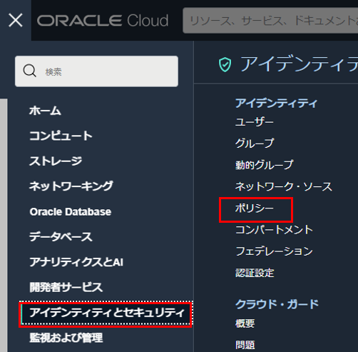
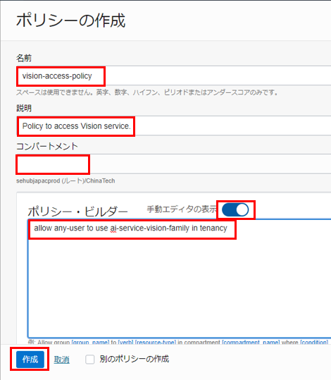
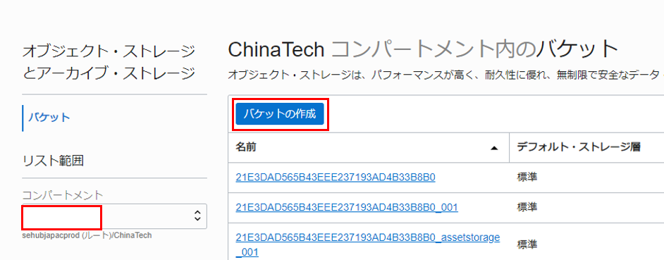
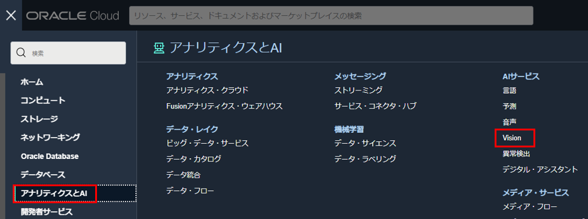
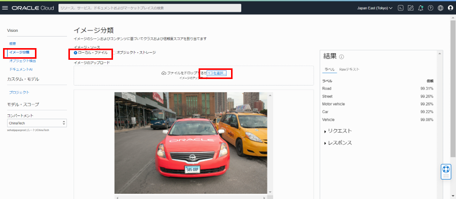
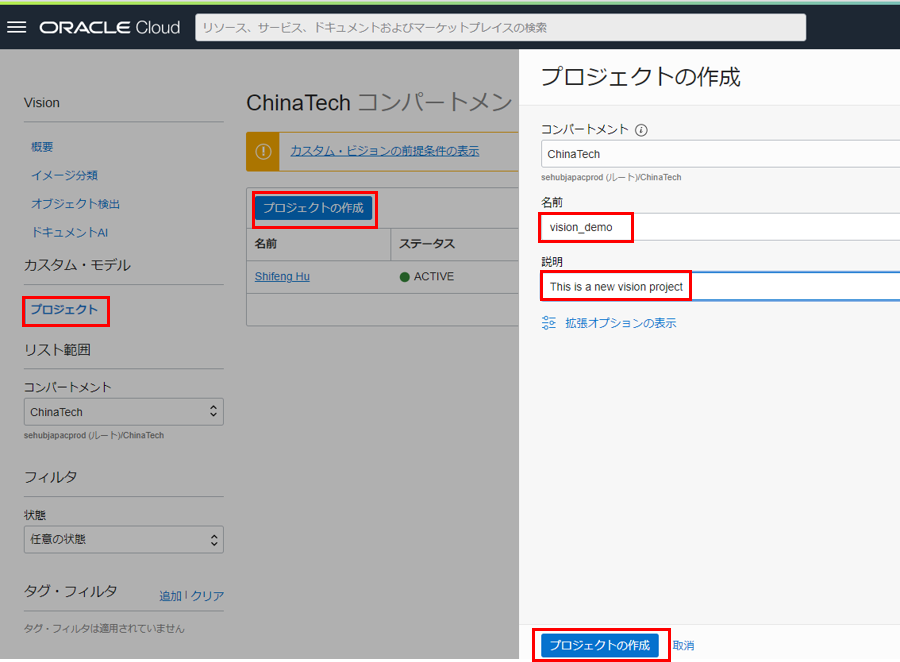
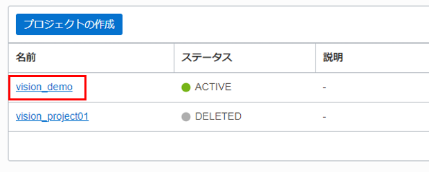
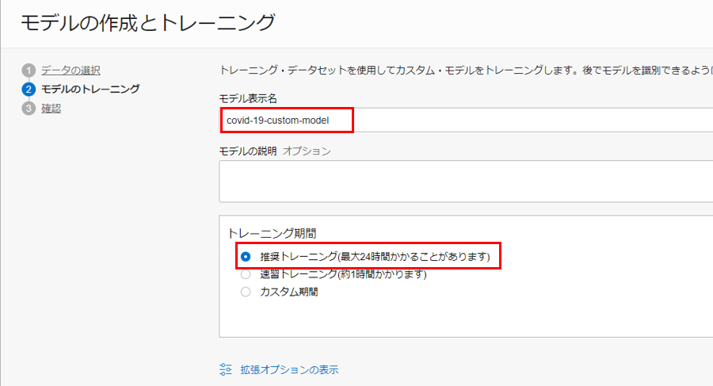
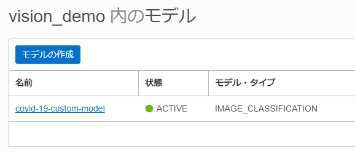
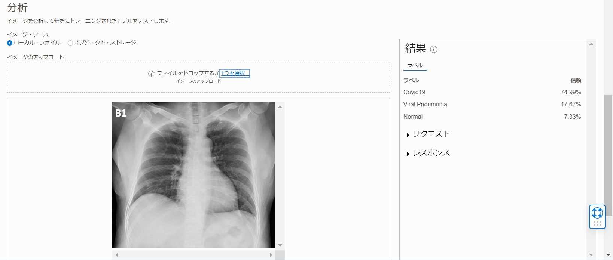

# Visionサービスについて

[Vision](https://docs.oracle.com/ja-jp/iaas/vision/vision/using/home.htm)は、サーバーレスのマルチ・テナント・サービスであり、コンソールまたは REST API を使用してアクセスできます。 画像をアップロードして、画像内のオブジェクトを検出および分類できます。大量の画像がある場合は、非同期 API エンドポイントを利用してバッチ処理できます。
Vision サービスの機能は、オブジェクトおよびシーンベースの画像分析と、ドキュメント中心の画像の Document AI に分割されています。

## 画像解析

物体検出は、基本的な画像分析機能です。 画像内の物体を検出して特定できます。 たとえば、画像がリビングルームの場合、Vision は椅子、ソファ、テレビなどの物体を見つけます。 次に、物体の周囲に境界ボックスを描画し、それらを識別します。 また、視覚的な異常検出にも使用できます。
画像分類も、基本的な画像分析機能です。 画像をオブジェクト・ストレージ にアップロードすると、その中のオブジェクトに基づいて、あらかじめ決められたクラスに配置できます。

## ドキュメント AI

テキスト認識は、光学式文字認識とも呼ばれ、ドキュメント内のテキストを検出して認識することです。 Vision は、画像内で見つけた印刷または手書きのテキストの周りに境界ボックスを描画し、テキストをデジタル化します。

* 文書の分類: OCI Visionは、文書が納税申告書、請求書、領収書のいずれであるかなど、文書を分類できます。
* 言語の分類: OCI Vision は、視覚的特徴に基づいて、ドキュメントの言語を検出します。
* 表の抽出: OCI Vision は、セルの行と列の関係を維持しながら、コンテンツを表形式で抽出します。
* キー値抽出: OCI Visionは、入金の共通フィールドの値を識別します。
  
ドキュメント AI は、ビジネス・プロセスの自動化 (ロボティック・プロセス・オートメーション RPA)、自動化された領収書の処理、セマンティック検索、スキャンされたドキュメントなどの非構造化コンテンツから情報の自動抽出などのシナリオでの重要な構成要素です。カスタム・モデル・トレーニングを使用すると、 転移学習アプローチを通じてベース・モデルを調整し、ディープ・ラーニング・モデルをデータに合わせて調整できます。 モデルの選択、リソースの計画、デプロイメントはすべて Vision によって管理されます。

# OCIコンソールからVisionサービスを使う

## 前提条件

* Oracle Cloud のアカウントを取得済みであること

## ポリシーの設定

OCI Visionを利用するために、テナンシ管理者は次の手順に従って、ポリシーを設定する必要があります。
OCI コンソール画面左上のハンバーガーメニューを展開し、「アイデンティティとセキュリティ」 > 「ポリシー」を選択します。

「ポリシーの作成」をクリックします。

ポリシーの作成情報を入力します。

* 名前：任意の名前
* 説明：ポリシーの説明
* コンパートメント：利用するコンパートメントを選択
* 手動エディタの表示：選択
* ポリシー・ステートメント：
  + テナント内のすべてのユーザーがVisionを使用できるようにする場合：
    - `allow any-user to use ai-service-vision-family in tenancy`
  + ユーザー・グループへのアクセスを制限する場合：
    - `allow group <group-name> to use ai-service-vision-family in tenancy`

「作成」をクリックします。

## データ要件の理解

Vision サービスは、オブジェクトの検出、画像へのラベルの割り当て、テキストの抽出などを行うために、複数の形式の画像データを処理します。
画像を分析するための同期および非同期 API を提供します。それぞれのデータ要件については、以下で詳しく説明します。

|API|説明|サポートされている入力形式|
|---|---|---|
|同期API   analyzeImage   analyzeDocument|個々の画像の分析|   JPG, PNG (~8MB)   PDF, Tiff (~8MB)|
|非同期API   createImageJob   createDocumentJob |複数の画像または複数ページのPDFの分析|   JPG, PNG (~2000枚)   PDF, Tiff(複数ページのサポート)|

## Object Storageへのアップロード

Visionサービスは、オブジェクト・ストレージ およびローカルに保存された画像からデータを受け入れます。
オブジェクト・ストレージのバケットを作成します (バケットが既に作成されている場合、ここをスキップします)。
OCI コンソール画面左上のハンバーガーメニューを展開し、「ストレージ」 > 「バケット」を選択します。

コンパートメントを選択し、「パケットの作成」をクリックします。

任意のバケット名を入力し、「作成」をクリックします。

イメージ・ファイルをアップロードします。
「アップロード」をクリックします。
「ファイルを選択」リンクをクリックし、イメージ・ファイルを選択します。
「アップロード」をクリックします。

## OCIコンソールからVisionを扱う

ここで、サンプル・イメージで OCI Vision を使用します。
OCI コンソール画面左上のハンバーガーメニューを展開し、「アナリティクスとAI」 > 「Vision」を選択します。

### ドキュメント AIの使用

左側のナビゲーション・メニューの「ドキュメントAI」を選択します。ローカル・ストレージまたは OCI オブジェクト・ストレージからドキュメントまたは画像を選択します。
画像が提供された後にanalyzeDocument APIが呼び出されます。 事前トレーニング済みのマルチテナント・モデルによって抽出された生のテキストが右側に表示されます。

機能 | 説明 | コンソールの詳細
-- | -- | --
OCR (光学式文字認識) | 画像からテキスト情報を抽出します。 | テキストは、コンソールの「結果」ペインの「Rawテキスト」ヘッダーの下に表示されます。「[参考](https://oracle-livelabs.github.io/oci/ai-vision/analyze-vision/images/ocr.png)」
ドキュメント画像の分類 | 外観、高レベルの機能、および抽出されたキーワードに基づいて、ドキュメントを分類します。 | レベルと信頼スコアは、「結果」ペインの下に表示されます。「[参考](https://oracle-livelabs.github.io/oci/ai-vision/analyze-vision/images/dic.png)」
言語分類 | 視覚的特徴に基づいてドキュメントの言語を分類します。 | 分類と信頼スコアは、ドキュメント分類の「結果」ペインに表示されます。「[参考](https://oracle-livelabs.github.io/oci/ai-vision/analyze-vision/images/language-classification.png)」
テーブルの抽出 | セルの行列の関係を維持しながら、コンテンツを表形式で抽出します。 | 「テーブル」   タブに切り替えて、テーブル情報を取得します。「[参考](https://oracle-livelabs.github.io/oci/ai-vision/analyze-vision/images/table-extraction.png)」
検索可能な   PDF 出力 | PDF形式のドキュメント画像の上に透明なレイヤーを埋め込み、キーワードで検索できるようにします。 | この機能を使用するには、PDF   ドキュメントでテストする必要があります。 PDF を選択すると、検索可能な PDF ボタンをクリックできるようになります。 それをクリックすると、OCR   PDF がコンピュータにダウンロードされます。「[参考](https://oracle-livelabs.github.io/oci/ai-vision/analyze-vision/images/searchable-pdf-output.png)」

### 画像解析の使用

左側のナビゲーション・メニューから 「イメージ分類」 または 「オブジェクト検出」 を選択し、「ローカル・ファイル」または 「オブジェクト・ストレージ」から画像を選択します。画像が提供された後にanalyzeImage APIが呼び出されます。

機能 | 説明 | コンソールの詳細
-- | -- | --
イメージ分類 | 画像内のオブジェクトを分類します | ラベルと信頼スコアが   「結果」 ペインの下に表示されます。「[参考](https://oracle-livelabs.github.io/oci/ai-vision/analyze-vision/images/image-classification.png)」
オブジェクト検出 | 画像内のオブジェクトを見つけて識別します | オブジェクト、信頼スコア、強調表示された境界ボックスはすべて結果ペインに表示されます。   結果ペインのラベルの 1 つをクリックすると、オブジェクトが検出された画像上の場所も強調表示されます。

### OCI コンソールでカスタム・モデルの作成

ここで、Vision プロジェクトを作成し、トレーニング・データを選択し、カスタム・モデルをトレーニングする方法を紹介します。

#### ポリシーの設定

「OCIコンソールからVisionサービスの使用」セッション下の「ポリシーの設定」部分をご参照ください。

#### プロジェクトの作成

プロジェクトで複数のモデルを作成できます。
OCI コンソール画面左上のハンバーガーメニューを展開し、「アナリティクスとAI」 > 「Vision」を選択します。

左側の「カスタム・モデル」 ヘッダーの下にある 「プロジェクト」 を選択します。「プロジェクトの作成」をクリックします。プロジェクトの作成画面で、名前と説明を入力し、「プロジェクトの作成」をクリックします。

プロジェクトが正常に作成されると、プロジェクト・ペインに表示されます。プロジェクト名をクリックし、モデルを開きます。

### モデルの作成

「モデルの作成」をクリックします。

### モデル・タイプの選択

ロップダウンからモデル・タイプを選択します。Vision サービスは、イメージ分類とオブジェクト検出のオンデマンド・カスタム・モデルのトレーニングをサポートしています。

### トレーニング・データの指定

カスタム・モデルをトレーニングするには、トレーニング・データが必要です。 すでに注釈付きのデータ・セットがあるか、生の画像(ラベルなし) しかないかによって、以下の2 つのオプションがあります。
注釈付きの画像がない場合、「新規データセットの作成」 を選択します。これにより、データ・ラベリング・サービスに移動し、ラベルを簡単に追加したり、画像コンテンツに境界ボックスを描画したりできます。 データ・ラベリング・サービスを使用して、画像に注釈を付ける方法の詳細については、[ラベルの追加と編集 (oracle.com)](https://docs.oracle.com/ja-jp/iaas/data-labeling/data-labeling/using/labels.htm) を参照してください。

既存の注釈付きデータセットがある場合は、「既存のデータセットの選択」 を選択します。データ・ラベリング・サービスを使用して画像に注釈を付けたことがある場合は、「データ・ラベリング・サービス」を選択し、データセットを選択します。 
サード・パーティのツールを使用して画像に注釈を付けた場合、そのデータセットをオブジェクト ・ストレージにアップロードし、「オブジェクト ・ストレージ」 を選択できます。

「次」をクリックします。

### カスタム・モデルのトレーニング

「モデルのトレーニング」ステップでは、モデルの表示名を入力し、トレーニング期間を指定します。

「次」をクリックします。

「確認」ステップでは、情報を確認し、「作成とトレーニング」をクリックします。

モデルがActiveになった後、モデル名をクリックします。画像をアップロードし、分析できます。

