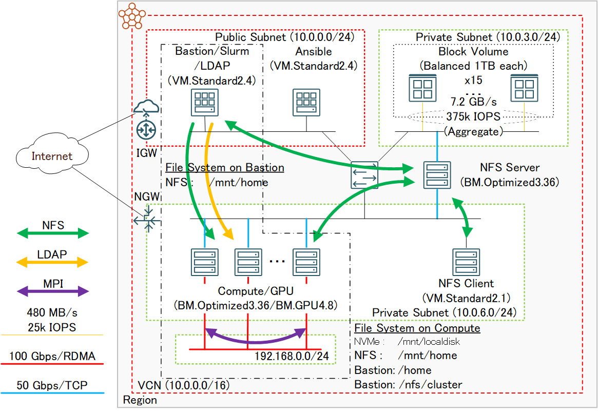
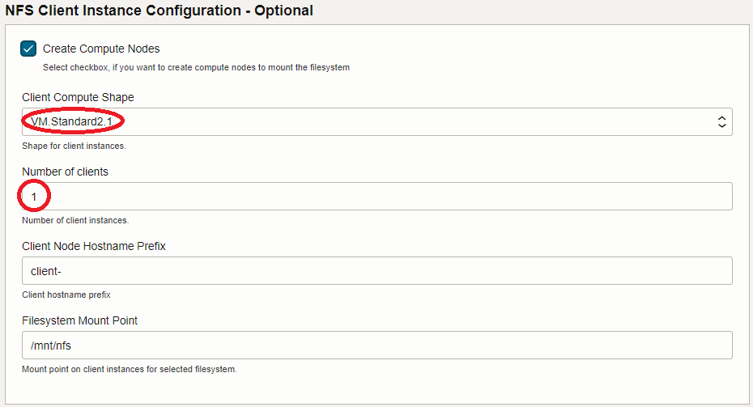
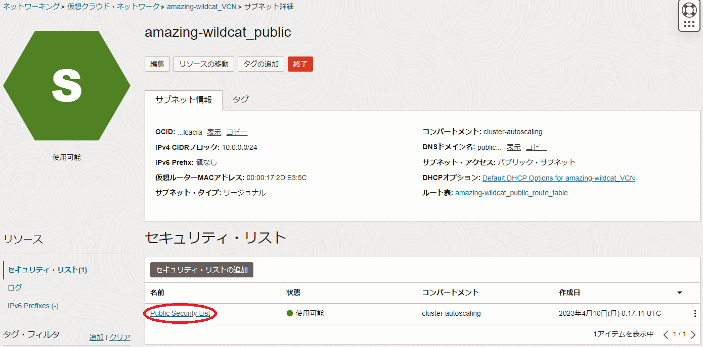
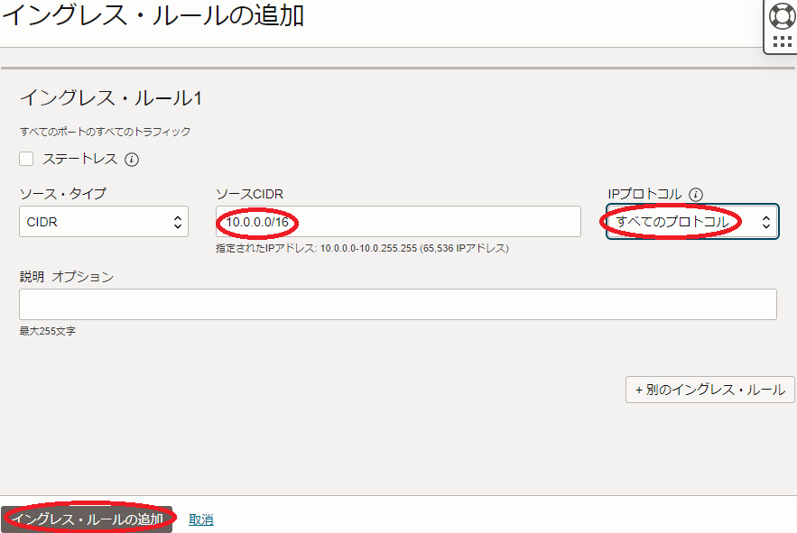
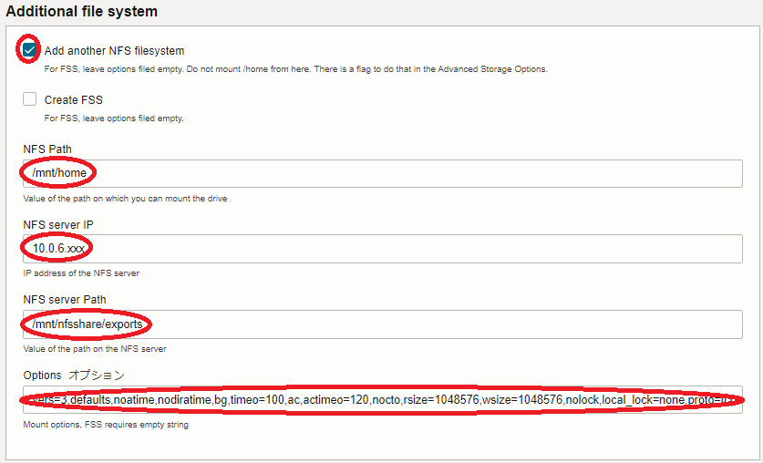
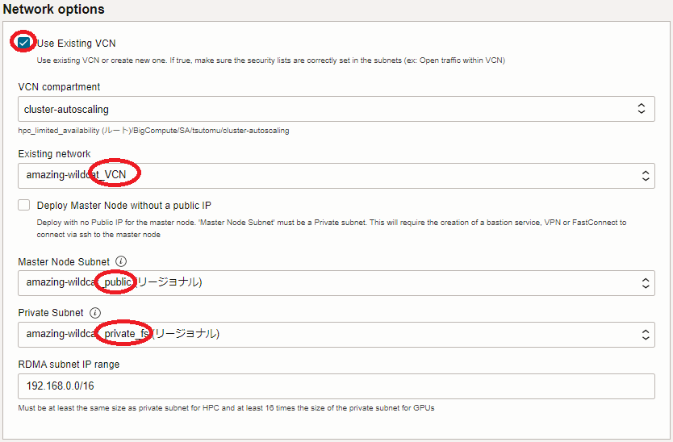

<style>
table, th, td {
    font-size: 80%;
}
</style>

HPCクラスタやGPUクラスタは、そのフロントエンドとなるBastionノードを含む全てのノードで利用できるファイル共有ストレージが運用上必須です。  
代表的なファイル共有ストレージの用途は、ユーザホームディレクトリですが、この領域は通常高いパフォーマンスより安定したサービスの提供が重視されるため、NFSがその有力な候補です。

OCIは、NFSのマネージドサービスとしてファイル・ストレージを提供しており、ファイルサーバ構築の必要無く簡単に利用できるため、HPC/GPUクラスタ用ユーザホームディレクトリの有力な候補です。  
**[HPCクラスタスタック](/ocitutorials/hpc/#5-10-hpcクラスタスタック)** は、ファイル・ストレージの構築・セットアップを行う機能を持っており、ファイル・ストレージをユーザホームディレクトリに利用するHPC/GPUクラスタを自動構築することが出来ます。

これに対し、OCIのブロックストレージサービスであるブロック・ボリュームを使用してNFSサーバを構築し、この領域をユーザホームディレクトリとして使用することも可能です。  
この手法は、ファイル・ストレージを使用する場合と比較して構築の手間がかかりますが、価格性能比の圧倒的に高いブロック・ボリュームの特徴を利用して、コストパフォーマンスを大幅に高めることが可能です。  
ファイル・ストレージとブロック・ボリュームを使用したNFSサーバの価格と性能の比較は、チュートリアル **[ブロック・ボリュームでNFSサーバを構築する](/ocitutorials/hpc/spinup-nfs-server/)** 前段の比較表を参照ください。

このチュートリアルは、チュートリアル **[ブロック・ボリュームでNFSサーバを構築する](/ocitutorials/hpc/spinup-nfs-server/)** でブロック・ボリュームをアタッチしたベアメタルインスタンス **[BM.Optimized3.36](https://docs.oracle.com/ja-jp/iaas/Content/Compute/References/computeshapes.htm#bm-hpc-optimized)** をNFSサーバとするファイル共有ストレージを構築し、以下のように組み合わせたチュートリアルで構築するHPC/GPUクラスタのファイル共有ストレージとして利用します。

| ファイル共有ストレージ<br>構築チュートリアル                                                  | HPC/GPUクラスタ<br>構築チュートリアル                                                                       | 構築するシステム概要                                                          |
| -------------------------------------------------------------------------- | ---------------------------------------------------------------------------------------------- | ------------------------------------------------------------------- |
| **[ブロック・ボリュームで<br>NFSサーバを構築する](/ocitutorials/hpc/spinup-nfs-server/)** | **[HPCクラスタを構築する<br>(スタティッククラスタ自動構築編)](/ocitutorials/hpc/spinup-hpc-cluster)**                  | BM.Optimized3.36を計算ノードとするスタティックHPCクラスタ<br>ブロック・ボリュームファイル共有ストレージ<br>LDAPユーザ統合管理<br>Slurmジョブスケジュール・計算リソース管理     |
| 同上 | **[GPUクラスタを構築する<br>(スタティッククラスタ自動構築編)](/ocitutorials/hpc/spinup-gpu-cluster-withstack/)**       | BM.GPU4.8/BM.GPU.GM4.8をGPUノードとするスタティックGPUクラスタ<br>ブロック・ボリュームファイル共有ストレージ<br>LDAPユーザ統合管理<br>Slurmジョブスケジュール・計算リソース管理  |
| 同上 | **[GPUクラスタを構築する<br>(オンデマンドクラスタ自動構築編)](/ocitutorials/hpc/spinup-gpu-cluster-withautoscaling/)** |BM.GPU4.8/BM.GPU.GM4.8をGPUノードとするオンデマンドGPUクラスタ<br>ブロック・ボリュームファイル共有ストレージ<br>LDAPユーザ統合管理<br>Slurmジョブスケジュール・計算リソース管理                                                                     |

**所要時間 :** 約2時間

***
# 0. 概要

本チュートリアルは、チュートリアル **[ブロック・ボリュームでNFSサーバを構築する](/ocitutorials/hpc/spinup-nfs-server/)** とHPC/GPUクラスタを構築するチュートリアルを組み合わせて、以下のシステムを構築します。  
この図中、左側の一点鎖線で囲まれたリソースを **HPC/GPUクラスタを構築する(スタティック/オンデマンドクラスタ自動構築編)** で構築し、それ以外のリソースを **ブロック・ボリュームでNFSサーバを構築する** で構築します。



[**ブロック・ボリュームでNFSサーバを構築する** がデプロイするリソース]
- VCNと関連するネットワークリソース
- ブロック・ボリューム
- NFSサーバ用インスタンス
- ファイル共有ストレージ用Ansible管理ノード
- NFSクライアント用インスタンス

[**HPC/GPUクラスタを構築する(スタティック/オンデマンドクラスタ自動構築編)** がデプロイするリソース]
- Bastionノード
- クラスタ・ネットワーク
- 計算/GPUノード

本チュートリアルは、以上2個のチュートリアルを活用し、以下の手順でシステムを構築します。

- NFSサーバ構築（**ブロック・ボリュームでNFSサーバを構築する** を実施）
- パブリックサブネット用セキュリティリスト修正
- NFSサーバ環境確認
- HPC/GPUクラスタ構築（**HPC/GPUクラスタを構築する(スタティック/オンデマンドクラスタ自動構築編)** 実施）
- HPC/GPUクラスタ環境確認

***
# 1. NFSサーバ構築

本章は、チュートリアル **[ブロック・ボリュームでNFSサーバを構築する](/ocitutorials/hpc/spinup-nfs-server/)** の0章から4章までを実施し、NFSサーバを構築します。

この際、 **[1. スタックの作成](/ocitutorials/hpc/spinup-nfs-server/#1-スタックの作成)** のステップ **5.4 NFS Client Instance Configuration - Optional** フィールドで指定するNFSクライアント用インスタンスのシェイプとノード数は、このインスタンスが環境確認用途で最小限のリソースで十分であることから、以下に変更します。

- **Client Compute Shape :** VM.Standard2.1
- **Number of clients :** 1

   

***
# 2. パブリックサブネット用セキュリティリスト修正

本章は、先のスタック適用で作成されたサブネットのうち、Bastionノードを接続するパブリックサブネットのセキュリティーリストを修正します。  
これは、計算/GPUノードがBastionノードの領域をNFSマウントするために必要です。

この修正は、先に作成されたパブリックサブネットの以下詳細画面でパブリックサブネット用のセキュリティリストを選択し、



表示される画面の **イングレス・ルールの追加** ボタンをクリックして表示される以下 **イングレス・ルールの追加** サイドバーで、各フィールドを以下のように設定して **イングレス・ルールの追加** ボタンをクリックします。

- **ソースCIDR :** 10.0.0.0/16
- **IPプロトコル :** すべてのプロトコル



***
# 3. NFSサーバ環境確認

本章は、先に構築したNFSサーバ環境を確認し、後のHPC/GPUクラスタ構築時に必要な情報を収集します。

1. NFSサーバIPアドレス確認

   NFSクライアントのopcユーザで以下コマンドを実行し、NFSサーバのIPアドレスを確認します。

   ```sh
   > grep vers=3 /etc/fstab | awk -F: '{print $1}'
   10.0.6.xxx
   ```

2. NFSマウントオプション確認

   NFSクライアントのopcユーザで以下コマンドを実行し、NFSマウントオプションを確認します。

   ```sh
   > grep vers=3 /etc/fstab | awk '{print $4}'
   vers=3,defaults,noatime,nodiratime,bg,timeo=100,ac,actimeo=120,nocto,rsize=1048576,wsize=1048576,nolock,local_lock=none,proto=tcp,sec=sys,_netdev
   ```

***
# 4. HPC/GPUクラスタ構築

本章は、HPCクラスタの場合はチュートリアル **[HPCクラスタを構築する(スタティッククラスタ自動構築編)](/ocitutorials/hpc/spinup-hpc-cluster)** の0章から6章、スタティックGPUクラスタの場合はチュートリアル **[GPUクラスタを構築する(スタティッククラスタ自動構築編)](/ocitutorials/hpc/spinup-gpu-cluster-withstack/)** の0章から7章、オンデマンドGPUクラスタの場合はチュートリアル **[GPUクラスタを構築する(オンデマンドクラスタ自動構築編)](/ocitutorials/hpc/spinup-gpu-cluster-withautoscaling/)** の1章から4章を実施し、HPC/GPUクラスタを構築します。

この際、以下2点をチュートリアルの手順から変更します。

1. ファイル共有ストレージをNFSサーバ領域に修正

   **1. スタックの作成** のステップ **5.4 Additional file system** フィールドで指定するファイル共有ストレージ設定を、構築したNFSサーバに合わせて以下に変更します。

   - **Add another NFS filesystem :** チェック
   - **NFS Path :** /mnt/home
   - **NFS server IP :** 先に確認したNFSサーバのIPアドレス
   - **NFS server Path :** /mnt/nfsshare/exports
   - **Options :** 先に確認したNFSマウントオプションの出力

   

2. 計算/GPUノード接続サブネット修正

   **1. スタックの作成** の **Network options** フィールドで、先に作成したネットワークリソースを使用するよう以下に変更します。

   - **Use Existing VCN :** チェック
   - **Existing network :** 先に作成したVCN
   - **Master Node Subnet :** 先に作成したパブリックサブネット
   - **Private Subnet :** 先に作成したプライベートサブネットのうち **_private_fs** で終わる名称のサブネット

   

***
# 5. HPC/GPUクラスタ環境確認

本章は、デプロイされた計算/GPUノードにログインし、環境を確認します。

Bastionノードと計算/GPUノードは、以下のようにNFSサーバの領域が/mnt/homeにマウントされています。

```sh
> df -h /mnt/home
Filesystem                       Size  Used Avail Use% Mounted on
10.0.6.xxx:/mnt/nfsshare/exports   15T   33M   15T   1% /mnt/home
```

これで、このチュートリアルは終了です。
