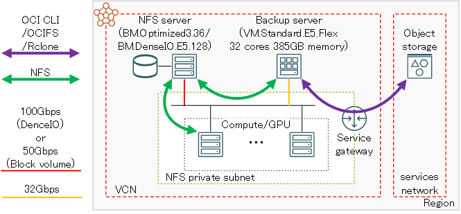
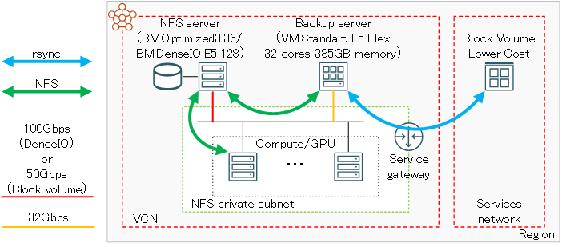

***
# 0. 概要

HPC/GPUクラスタを運用する際必須となるファイル共有ストレージは、NFSでこれをサービスすることが一般的ですが、このファイル共有ストレージをコストパフォーマンス優先で選定する場合、 **ベア・メタル・インスタンス** とストレージサービスで構築する方法（以降"ベア・メタル・インスタンスNFSサーバ"と呼称）を採用することになり、ストレージに **ブロック・ボリューム** を使用しこれをベア・メタル・インスタンスにアタッチする方法（以降"ブロック・ボリュームNFSサーバ”と呼称）と、 **ベア・メタル・インスタンス** にNVMe SSDドライブを搭載するDenceIOシェイプを使用する方法（以降”DenceIO NFSサーバ”と呼称）があります。（※1）

※1）ベア・メタル・インスタンスNFSサーバの詳細は、 **[OCI HPCテクニカルTips集](/ocitutorials/hpc/#3-oci-hpcテクニカルtips集)** の **[HPC/GPUクラスタ向けファイル共有ストレージの最適な構築手法](/ocitutorials/hpc/tech-knowhow/howto-configure-sharedstorage/)** を参照してください。

このベア・メタル・インスタンスNFSサーバは、NFSのマネージドサービスである **ファイル・ストレージ** の場合は備え付けのバックアップ機能を利用できるのに対し、自身でバックアップ環境を用意する必要があります。（※2）

※2）バックアップの観点でのベア・メタル・インスタンスNFSサーバと **ファイル・ストレージ** の比較は、 **[OCI HPCテクニカルTips集](/ocitutorials/hpc/#3-oci-hpcテクニカルtips集)** の **[HPC/GPUクラスタ向けファイル共有ストレージの最適な構築手法](/ocitutorials/hpc/tech-knowhow/howto-configure-sharedstorage/)** の **[2-2 可用性による比較](/ocitutorials/hpc/tech-knowhow/howto-configure-sharedstorage/#2-2-可用性による比較)** を参照してください。

以上を踏まえて本チュートリアルは、ベア・メタル・インスタンスNFSサーバで構築するファイル共有ストレージに格納されるファイルをバックアップする、バックアップサーバの構築方法を解説します。

ここで構築するバックアップ環境は、 **[OCI HPCテクニカルTips集](/ocitutorials/hpc/#3-oci-hpcテクニカルtips集)** の **[ファイル共有ストレージ向けバックアップ環境の最適な構築手法](/ocitutorials/hpc/tech-knowhow/howto-choose-osbackuptool/)** の **[0. 概要](/ocitutorials/hpc/tech-knowhow/howto-choose-osbackuptool/#0-概要)** に記載のバックアップ環境 **No. 3** と **No. 4** から選択して構築することとし、採用したいバックアップ格納ストレージが **オブジェクト・ストレージ** （**No.3**）と **ブロック・ボリューム** の **より低いコスト** （**No.4**）（**ブロック・ボリューム** の **パフォーマンス・レベル** が最低のサービスで、 **ブロック・ボリューム** の中では最も容量単価が安価です。関連する **OCI** 公式ドキュメントは、 **[ここ](https://docs.oracle.com/ja-jp/iaas/Content/Block/Concepts/blockvolumeperformance.htm)** を参照してください。以降" **BVLC** "と呼称します。）のどちらを採用するかにより決定します。

バックアップサーバは、ファイル共有ストレージ領域をNFSマウントし、バックアップ環境 **No.3** の場合は **[Rclone](https://rclone.org/)** を使用して **オブジェクト・ストレージ** に、バックアップ環境 **No.4** の場合は **rsync** を使用して **BVLC** 上に作成したPOSIXファイルシステムに、それぞれ差分バックアップします。  
バックアップ環境 **No.3** で、 **Rclone** の **オブジェクト・ストレージ** へのアクセスは、バックアップサーバを **[インスタンス・プリンシパル](/ocitutorials/hpc/#5-15-インスタンスプリンシパル)** 認証に組み込むことでIAM認証・認可を付与します。  
またバックアップサーバに使用するシェイプは、メタデータ性能が要求される小さなファイルのバックアップやサイズの大きなファイルを **マルチパート・アップロード** する際に **Rclone** がマルチスレッドを活用してデータ転送を行う事を考慮し、コア数の十分な **[VM.Standard.E5.Flex](https://docs.oracle.com/ja-jp/iaas/Content/Compute/References/computeshapes.htm#vm-standard)** の32コア・384GBメモリを使用します。  
また、本チュートリアルで使用する各ソフトウェアのバージョンを以下に示します。

- バックアップサーバOS： **Oracle Linux** 9.4（Oracle-Linux-9.4-2024.08.29-0 UEK）
- **Rclone** ： v1.68.1
- **rsync** ： 3.2.3（OSに予め含まれているものを使用）


<center><u>バックアップ環境<strong> No.3</strong></u></center><br>


<center><u>バックアップ環境<strong> No.4</strong></u></center><br>

バックアップ環境 **No.3** でバックアップツールに使用する **Rclone** は、このツールが持つ以下の機能を活用することで、POSIXファイルシステムを **オブジェクト・ストレージ** にバックアップする際、バックアップの信頼性と性能を向上することが可能です。

- 差分バックアップ
- マルチパート・アップロード
- チェックサムによるファイル転送結果の確認

バックアップ環境 **No.4** でバックアップ格納ストレージに使用する **ブロック・ボリューム** は、 **パフォーマンス・レベル** に容量単価が最も安価な **より低いコスト** を使用し、1 TB以上のボリュームを基本単位として15ボリュームをLinuxの論理ボリューム機能で各ボリュームにストライピングを掛けつつ1ファイルシステムに構成します。  


総容量が15 TBより大きなバックアップ格納ストレージが必要な場合は、単一 **ブロック・ボリューム** サイズを1 TBより大きくすることで、性能を維持したままその総容量を増やすことが可能です。  
例えば100 TBの総容量が必要な場合は、ボリューム・サイズを7 TBとすることで、7 TB x 15 = 105 TBの総容量を実現することが出来ます。

また本チュートリアルは、構築したバックアップ環境でバックアップとリストアの性能をスループットとメタデータ性能の観点で検証します。  
この結果は、 **[OCI HPCテクニカルTips集](/ocitutorials/hpc/#3-oci-hpcテクニカルtips集)** の **[ファイル共有ストレージ向けバックアップ環境の最適な構築手法](/ocitutorials/hpc/tech-knowhow/howto-choose-osbackuptool/)** の **[3. バックアップ・リストア性能](/ocitutorials/hpc/tech-knowhow/howto-choose-osbackuptool/#3-バックアップリストア性能)** を参照してください。

**所要時間 :** 約2時間

**前提条件 :** バックアップ環境を収容するコンパートメント(ルート・コンパートメントでもOKです)の作成と、このコンパートメントに対する必要なリソース管理権限がユーザーに付与されていること。

**注意 :**
- 本チュートリアルに従って取得するバックアップ環境 **No.3** のバックアップは、 **[OCI HPCテクニカルTips集](/ocitutorials/hpc/#3-oci-hpcテクニカルtips集)** の **[ファイル共有ストレージ向けバックアップ環境の最適な構築手法](/ocitutorials/hpc/tech-knowhow/howto-choose-osbackuptool/)** の **[2. バックアップ・リストア時の制約事項](/ocitutorials/hpc/tech-knowhow/howto-choose-osbackuptool/#2-バックアップリストア時の制約事項)** に記載の制限を受けます。

***
# 1. バックアップ環境構築

## 1-0. 概要

本章は、バックアップサーバを中心とするバックアップ環境の構築手順を、バックアップ環境 **No.3** とバックアップ環境 **No.4** の場合に分けて解説します。

なお、バックアップ対象領域をNFSでサービスするベア・メタル・インスタンスNFSサーバは、 **[OCI HPCチュートリアル集](/ocitutorials/hpc/#1-oci-hpcチュートリアル集)** の **[ブロック・ボリュームでファイル共有ストレージを構築する](/ocitutorials/hpc/spinup-nfs-server/)** や **[短期保存データ用高速ファイル共有ストレージを構築する](/ocitutorials/hpc/spinup-nfs-server-nvme/)** の手順に従い予め構築されているものとします。

## 1-1. バックアップ環境No.3構築手順

### 1-1-0. 概要

バックアップ環境 **No.3** は、バックアップ格納ストレージに **オブジェクト・ストレージ** を使用し、 **Rclone** でこの領域にアクセスするため、以下のステップを経て構築を行います。

- **[インスタンス・プリンシパル](/ocitutorials/hpc/#5-15-インスタンスプリンシパル)** 認証関連設定
- **バケット** 作成
- バックアップサーバ用インスタンス作成
- NFSクライアント設定
- **Rclone** インストール・セットアップ

### 1-1-1. インスタンス・プリンシパル認証関連設定

**[OCI HPCテクニカルTips集](/ocitutorials/hpc/#3-oci-hpcテクニカルtips集)** の **[オンデマンドクラスタ実現のためのインスタンス・プリンシパル認証設定方法](/ocitutorials/hpc/tech-knowhow/instance-principal-auth/)** の **[1. インスタンス・プリンシパル認証設定](/ocitutorials/hpc/tech-knowhow/instance-principal-auth/#1-インスタンスプリンシパル認証設定)** の手順に従い、**[インスタンス・プリンシパル](/ocitutorials/hpc/#5-15-インスタンスプリンシパル)** 認証関連設定を実施します。  
この際、このテクニカルTips中でクラスタ管理ノードと呼称している箇所は、バックアップサーバと読みかえて下さい。  
また、このテクニカルTipsで設定しているIAMポリシーは、本チュートリアルでは以下のみが必要です。

```sh
allow dynamic-group dynamicgroup_name to manage all-resources in compartment compartment_name
```

### 1-1-2. バケット作成

**[OCIチュートリアル](https://oracle-japan.github.io/ocitutorials/)** の  **[その7 - オブジェクト・ストレージを使う](https://oracle-japan.github.io/ocitutorials/beginners/object-storage/)** の **[1. コンソール画面の確認とバケットの作成](https://oracle-japan.github.io/ocitutorials/beginners/object-storage/#1-%E3%82%B3%E3%83%B3%E3%82%BD%E3%83%BC%E3%83%AB%E7%94%BB%E9%9D%A2%E3%81%AE%E7%A2%BA%E8%AA%8D%E3%81%A8%E3%83%90%E3%82%B1%E3%83%83%E3%83%88%E3%81%AE%E4%BD%9C%E6%88%90)** の手順に従い、 **Rclone** がバックアップを格納する **バケット** を **rclone** で作成します。

### 1-1-3. バックアップサーバ用インスタンス作成

**[OCIチュートリアル](https://oracle-japan.github.io/ocitutorials/)** の **[その3 - インスタンスを作成する](https://oracle-japan.github.io/ocitutorials/beginners/creating-compute-instance)** の手順に従い、以下のインスタンスをNFSクライアント用のプライベートサブネットを指定して作成します。

- **イメージ** ： **Oracle Linux** 9.4（Oracle-Linux-9.4-2024.08.29-0 UEK）
- **シェイプ** ： **VM.Standard.E5.Flex** （32コア・384GBメモリ）

### 1-1-4. NFSクライアント設定

ファイル共有ストレージがブロック・ボリュームNFSサーバかDenceIO NFSサーバのどちらかに合わせて、 **[OCI HPCチュートリアル集](/ocitutorials/hpc/#1-oci-hpcチュートリアル集)** の以下の手順に従い、ベア・メタル・インスタンスNFSサーバのエクスポートしている領域をバックアップサーバの **/mnt/nfs** にマウントします。

- ブロック・ボリュームNFSサーバ： **[ブロック・ボリュームでファイル共有ストレージを構築する](/ocitutorials/hpc/spinup-nfs-server/)** の **[4. NFSクライアント設定](https://oracle-japan.github.io/ocitutorials/hpc/spinup-nfs-server/#4-nfs%E3%82%AF%E3%83%A9%E3%82%A4%E3%82%A2%E3%83%B3%E3%83%88%E8%A8%AD%E5%AE%9A)**
- DenceIO NFSサーバ： **[短期保存データ用高速ファイル共有ストレージを構築する](/ocitutorials/hpc/spinup-nfs-server-nvme/)** の **[3-4. NFSクライアントでのファイルシステムマウント](https://oracle-japan.github.io/ocitutorials/hpc/spinup-nfs-server-nvme/#3-4-nfs%E3%82%AF%E3%83%A9%E3%82%A4%E3%82%A2%E3%83%B3%E3%83%88%E3%81%A7%E3%81%AE%E3%83%95%E3%82%A1%E3%82%A4%E3%83%AB%E3%82%B7%E3%82%B9%E3%83%86%E3%83%A0%E3%83%9E%E3%82%A6%E3%83%B3%E3%83%88)**

### 1-1-5. Rcloneインストール・セットアップ

以下コマンドをバックアップサーバのopcユーザで実行し、 **Rclone** をインストールします。

```sh
$ curl https://rclone.org/install.sh | sudo bash
```

次に、以下コマンドをバックアップサーバのopcユーザで実行し、 **Rclone** のセットアップツールを起動します。

```sh
$ sudo rclone config
```

次に、以下のプロンプトが表示されたら **n** を入力し、 **Rclone** 接続設定の新規作成を指示します。

```sh
2024/10/17 14:33:47 NOTICE: Config file "/root/.config/rclone/rclone.conf" not found - using defaults
No remotes found, make a new one?
n) New remote
s) Set configuration password
q) Quit config
n/s/q> n
```

次に、以下のプロンプトが表示されたら **nfs-backup** を入力し、 **Rclone** 接続設定の名称を指示します。

```sh
Enter name for new remote.
name> nfs-backup
```

次に、以下のプロンプトが表示されたら **38** を入力し、接続先にOCIの **オブジェクト・ストレージ** を指定します。

```sh
Option Storage.
Type of storage to configure.
Choose a number from below, or type in your own value.
 1 / 1Fichier
   \ (fichier)
:
:
:
37 / OpenStack Swift (Rackspace Cloud Files, Blomp Cloud Storage, Memset Memstore, OVH)
   \ (swift)
38 / Oracle Cloud Infrastructure Object Storage
   \ (oracleobjectstorage)
39 / Pcloud
:
:
:
59 / seafile
   \ (seafile)
Storage> 38
```

次に、以下のプロンプトが表示されたら **3** を入力し、認証方法に **[インスタンス・プリンシパル](/ocitutorials/hpc/#5-15-インスタンスプリンシパル)** 認証を指定します。

```sh
Option provider.
Choose your Auth Provider
Choose a number from below, or type in your own value of type string.
Press Enter for the default (env_auth).
 1 / automatically pickup the credentials from runtime(env), first one to provide auth wins
   \ (env_auth)
   / use an OCI user and an API key for authentication.
 2 | you’ll need to put in a config file your tenancy OCID, user OCID, region, the path, fingerprint to an API key.
   | https://docs.oracle.com/en-us/iaas/Content/API/Concepts/sdkconfig.htm
   \ (user_principal_auth)
   / use instance principals to authorize an instance to make API calls. 
 3 | each instance has its own identity, and authenticates using the certificates that are read from instance metadata. 
   | https://docs.oracle.com/en-us/iaas/Content/Identity/Tasks/callingservicesfrominstances.htm
   \ (instance_principal_auth)
   / use workload identity to grant OCI Container Engine for Kubernetes workloads policy-driven access to OCI resources using OCI Identity and Access Management (IAM).
 4 | https://docs.oracle.com/en-us/iaas/Content/ContEng/Tasks/contenggrantingworkloadaccesstoresources.htm
   \ (workload_identity_auth)
 5 / use resource principals to make API calls
   \ (resource_principal_auth)
 6 / no credentials needed, this is typically for reading public buckets
   \ (no_auth)
provider> 3
```

次に、以下のプロンプトが表示されたら、 **オブジェクト・ストレージ** のネームスペース（通常テナント名）を入力します。

```sh
Option namespace.
Object storage namespace
Enter a value.
namespace> object_storage_namespace
```

次に、以下のプロンプトが表示されたら、 **[1-1-2. バケット作成](#1-1-2-バケット作成)** で作成した **オブジェクト・ストレージ** バケットが存在する **コンパートメント** のOCIDを入力します。

```sh
Option compartment.
Object storage compartment OCID
Enter a value.
compartment> ocid1.compartment.oc1..xxxx
```

次に、以下のプロンプトが表示されたら、 **[1-1-2. バケット作成](#1-1-2-バケット作成)** で作成した **オブジェクト・ストレージ** バケットが存在する **リージョン** 識別子を入力します。

```sh
Option region.
Object storage Region
Enter a value.
region> ap-tokyo-1
```

次に、以下のプロンプトが表示されたらエンターキーを入力し、 **オブジェクト・ストレージ** にAPIでアクセスする際に使用するエンドポイントにデフォルトを使用することを指示します。

```sh
Option endpoint.
Endpoint for Object storage API.
Leave blank to use the default endpoint for the region.
Enter a value. Press Enter to leave empty.
endpoint> 
```

次に、以下のプロンプトが表示されたら **n** を入力します。

```sh
Edit advanced config?
y) Yes
n) No (default)
y/n> n
```

次に、表示されるこれまでの設定が正しいことを確認し、 **y** を入力します。

```sh
Configuration complete.
Options:
- type: oracleobjectstorage
- provider: instance_principal_auth
- namespace: object_storage_namespace
- compartment: ocid1.compartment.oc1..xxxx
- region: ap-tokyo-1
Keep this "nfs-backup" remote?
y) Yes this is OK (default)
e) Edit this remote
d) Delete this remote
y/e/d> y
```

次に、以下のプロンプトが表示されたら **q** を入力し、 **Rclone** のセットアップツールを終了します。

```sh
Current remotes:

Name                 Type
====                 ====
nfs-backup           oracleobjectstorage

e) Edit existing remote
n) New remote
d) Delete remote
r) Rename remote
c) Copy remote
s) Set configuration password
q) Quit config
e/n/d/r/c/s/q> q
$
```

## 1-2. バックアップ環境No.4構築手順

### 1-2-0. 概要

バックアップ環境 **No.4** は、バックアップ格納ストレージに **BVLC** を使用し、 **rsync** でこの領域にアクセスするため、以下のステップを経て構築を行います。

- バックアップサーバ用インスタンス作成
- **BVLC** 作成・アタッチ
- バックアップ格納ファイルシステム作成
- NFSクライアント設定

### 1-2-1. バックアップサーバ用インスタンス作成

**[OCIチュートリアル](https://oracle-japan.github.io/ocitutorials/)** の **[その3 - インスタンスを作成する](https://oracle-japan.github.io/ocitutorials/beginners/creating-compute-instance)** の手順に従い、以下のインスタンスをNFSクライアント用のプライベートサブネットを指定して作成します。

- **イメージ** ： **Oracle Linux** 9.4（Oracle-Linux-9.4-2024.08.29-0 UEK）
- **シェイプ** ： **VM.Standard.E5.Flex** （32コア・384GBメモリ）

### 1-2-2. BVLC作成・アタッチ

**[OCIチュートリアル](https://oracle-japan.github.io/ocitutorials/)** の **[その4 - ブロック・ボリュームをインスタンスにアタッチする](https://oracle-japan.github.io/ocitutorials/beginners/attaching-block-volume/)** の手順に従い、以下の **ブロック・ボリューム** を15個作成し、バックアップサーバにアタッチします。

- **ボリューム・サイズ(GB)** ： 1000以上（総容量に合わせて調整）
- **デフォルトVPU/GB** ： 0

### 1-2-3. バックアップ格納ファイルシステム作成

以下コマンドをバックアップサーバのopcユーザで実行し、15個の **ブロック・ボリューム** が **sdb** から **sdp** でアタッチされていることを確認します。

```sh
$ lsblk | grep ^sd | grep -v ^sda
sdb                  8:16   0 1000G  0 disk 
sdc                  8:32   0 1000G  0 disk 
sdd                  8:16   0 1000G  0 disk 
sde                  8:32   0 1000G  0 disk 
sdf                  8:16   0 1000G  0 disk 
sdg                  8:32   0 1000G  0 disk 
sdh                  8:16   0 1000G  0 disk 
sdi                  8:32   0 1000G  0 disk 
sdj                  8:16   0 1000G  0 disk 
sdk                  8:32   0 1000G  0 disk 
sdl                  8:16   0 1000G  0 disk 
sdm                  8:32   0 1000G  0 disk 
sdn                  8:16   0 1000G  0 disk 
sdo                  8:16   0 1000G  0 disk 
sdp                  8:32   0 1000G  0 disk 
$
```

次に、以下コマンドをバックアップサーバのopcユーザで実行し、アタッチした15個の **ブロック・ボリューム** にファイルシステムを作成し、これを **/mnt/bv** にマウントします。

```sh
$ sudo vgcreate bv /dev/sdb /dev/sdc /dev/sdd /dev/sde /dev/sdf /dev/sdg /dev/sdh /dev/sdi /dev/sdj /dev/sdk /dev/sdl /dev/sdm /dev/sdn /dev/sdo /dev/sdp
$ sudo lvcreate -y -l 100%FREE --stripes 15 --stripesize "64K" -n bv bv
$ sudo mkfs.xfs -L blockvolume /dev/bv/bv
$ echo "LABEL=blockvolume /mnt/bv/ xfs defaults,_netdev,noatime 0 0" | sudo tee -a /etc/fstab
$ sudo systemctl daemon-reload
$ sudo mkdir -p /mnt/bv
$ sudo mount /mnt/bv
```

### 1-2-4. NFSクライアント設定

ファイル共有ストレージがブロック・ボリュームNFSサーバかDenceIO NFSサーバのどちらかに合わせて、 **[OCI HPCチュートリアル集](/ocitutorials/hpc/#1-oci-hpcチュートリアル集)** の以下の手順に従い、ベア・メタル・インスタンスNFSサーバのエクスポートしている領域をバックアップサーバの **/mnt/nfs** にマウントします。

- ブロック・ボリュームNFSサーバ： **[ブロック・ボリュームでファイル共有ストレージを構築する](/ocitutorials/hpc/spinup-nfs-server/)** の **[4. NFSクライアント設定](https://oracle-japan.github.io/ocitutorials/hpc/spinup-nfs-server/#4-nfs%E3%82%AF%E3%83%A9%E3%82%A4%E3%82%A2%E3%83%B3%E3%83%88%E8%A8%AD%E5%AE%9A)**
- DenceIO NFSサーバ： **[短期保存データ用高速ファイル共有ストレージを構築する](/ocitutorials/hpc/spinup-nfs-server-nvme/)** の **[3-4. NFSクライアントでのファイルシステムマウント](https://oracle-japan.github.io/ocitutorials/hpc/spinup-nfs-server-nvme/#3-4-nfs%E3%82%AF%E3%83%A9%E3%82%A4%E3%82%A2%E3%83%B3%E3%83%88%E3%81%A7%E3%81%AE%E3%83%95%E3%82%A1%E3%82%A4%E3%83%AB%E3%82%B7%E3%82%B9%E3%83%86%E3%83%A0%E3%83%9E%E3%82%A6%E3%83%B3%E3%83%88)**

***
# 2. バックアップ・リストア実行

## 2-0. 概要

本章は、構築したバックアップサーバ上でバックアップとリストアを実行する方法を、バックアップ環境 **No.3** とバックアップ環境 **No.4** の場合に分けて解説します。

以降では、性能検証を兼ねてバックアップとリストアを実行することを念頭に、スループットとメタデータ性能を計測するためのテストファイルを予め作成し、このファイルを対象にバックアップとリストアを実行します。  
この際、以下のコマンドをバックアップサーバのopcユーザで実行し、ファイルシステムキャッシュをフラッシュした後にバックアップ・リストアを実行します。

```sh
$ sync && echo 3 | sudo tee /proc/sys/vm/drop_caches
```

## 2-1. テストファイル作成

以下コマンドをバックアップサーバのopcユーザで実行し、テストファイルを格納するディレクトリと、リストアするファイルを格納するディレクトリを作成します。

```sh
$ sudo mkdir /mnt/nfs/large
$ sudo mkdir /mnt/nfs/small
$ sudo chown opc:opc /mnt/nfs/*
$ sudo mkdir /mnt/nfs/restore
```

次に、以下コマンドをバックアップサーバのopcユーザで実行し、 **10 GiB** のスループット検証用ファイル1個と、 **0 B** のメタデータ性能検証用ファイル **1,000,000** 個を作成します。

```sh
$ cd /mnt/nfs/large && dd if=/dev/urandom of=./10G.bin bs=1048576 count=$((1024*10))
$ cd /mnt/nfs/small && count=1000; for i in `seq -w 1 $count`; do echo $i; mkdir $i; cd $i;for j in `seq -w 1 $count`; do fname=$j".out"; touch $fname; done; cd ..; done
```

## 2-2. バックアップ環境No.3バックアップ実行

以下コマンドをバックアップサーバのopcユーザで実行します。  
このコマンドは、バックアップサーバの **/mnt/nfs/source_dir** ディレクトリ以下を **[1-1-2. バケット作成](#1-1-2-バケット作成)** で作成したバケット **rclone** の **dest_dir** に差分バックアップします。初回実行時は、フルバックアップになります。  
ここで **source_dir** と **dest_dir** は、スループット検証の場合は何れも **large** 、メタデータ性能検証の場合は何れも **small** とします。

```sh
$ time sudo rclone --oos-upload-cutoff 16Mi --transfers 100 --oos-chunk-size 16Mi --oos-upload-concurrency 128 --oos-attempt-resume-upload --oos-leave-parts-on-error --copy-links --metadata --checksum sync /mnt/nfs/source_dir nfs-backup:rclone/dest_dir
```

出力されたtimeコマンドの時間情報から、スループットとメタデータ性能を計算し確認します。

## 2-3. バックアップ環境No.3リストア実行

以下コマンドをバックアップサーバのopcユーザで実行します。  
このコマンドは、 **[1-1-2. バケット作成](#1-1-2-バケット作成)** で作成したバケット **rclone** の **dest_dir** をバックアップサーバの **/mnt/nfs/restore/source_dir** ディレクトリ以下にリストアします。  
ここで **dest_dir** と **source_dir** は、スループット検証の場合は何れも **large** 、メタデータ性能検証の場合は何れも **small** とします。

```sh
$ time sudo rclone --oos-upload-cutoff 16Mi --transfers 100 --oos-chunk-size 16Mi --oos-upload-concurrency 128 --oos-attempt-resume-upload --oos-leave-parts-on-error --copy-links --metadata --checksum sync nfs-backup:rclone/dest_dir /mnt/nfs/restore/source_dir
```

出力されたtimeコマンドの時間情報から、スループットとメタデータ性能を計算し確認します。

## 2-4. バックアップ環境No.4バックアップ実行

以下コマンドをバックアップサーバのopcユーザで実行します。  
ここで **source_dir** と **dest_dir** は、スループット検証の場合は何れも **large** 、メタデータ性能検証の場合は何れも **small** とします。

```sh
$ time sudo rsync -auH /mnt/nfs/source_dir /mnt/bv/dest_dir
```

出力されたtimeコマンドの時間情報から、スループットとメタデータ性能を計算し確認します。

## 2-5. バックアップ環境No.4リストア実行

以下コマンドをバックアップサーバのopcユーザで実行します。  
ここで **dest_dir** と **source_dir** は、スループット検証の場合は何れも **large** 、メタデータ性能検証の場合は何れも **small** とします。

```sh
$ time sudo rsync /mnt/bv/dest_dir /mnt/nfs/restore/source_dir
```

出力されたtimeコマンドの時間情報から、スループットとメタデータ性能を計算し確認します。

これで、このチュートリアルは終了です。