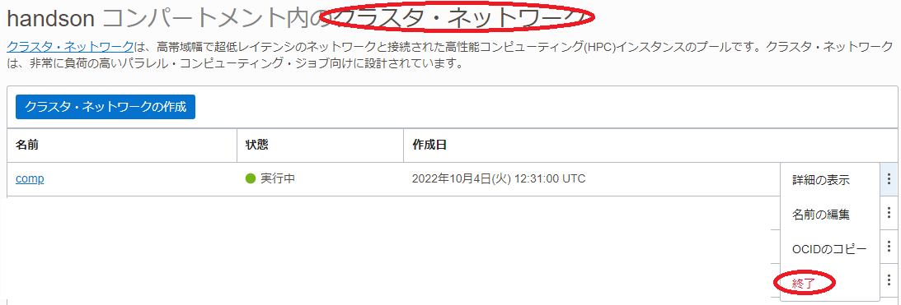

本チュートリアルは、AIや機械学習ワークロードに最適なNVIDIA A100 40/80 GB 8枚と100 GbpsのRDMA対応ネットワークインタフェースを16ポート搭載するUbuntuをOSとするGPUノード（ **[BM.GPU4.8/BM.GPU.A100-v2.8](https://docs.oracle.com/ja-jp/iaas/Content/Compute/References/computeshapes.htm#bm-gpu)** ）を **[クラスタ・ネットワーク](/ocitutorials/hpc/#5-1-クラスタネットワーク)** を使用してノード間接続し、1ノードでは搭載しきれないGPUを必要とする大規模な分散機械学習ワークロードを実行するためのGPUクラスタを構築、複数ノードに跨るGPU間の通信性能を **[NCCL（NVIDIA Collective Communication Library）](https://developer.nvidia.com/nccl)** テストプログラム（ **[NCCL Tests](https://github.com/nvidia/nccl-tests)** ）で検証します。

本チュートリアルは、 **[OCI HPCテクニカルTips集](/ocitutorials/hpc/#3-oci-hpcテクニカルtips集)** の以下2本のコンテンツを組合せ、 **クラスタ・ネットワーク** とGPUを使用するためのソフトウェアをインストール・セットアップし、GPUクラスタを構築します。

- **[クラスタ・ネットワーク非対応OSイメージを使ったクラスタ・ネットワーク接続方法](/ocitutorials/hpc/tech-knowhow/howto-create-cnenabled-osimage/)**
- **[UbuntuをOSとする機械学習ワークロード向けGPUノード構築方法](/ocitutorials/hpc/tech-knowhow/gpu-with-ubuntu/)**

これらソフトウェアのインストールは、手順が多く相応の所要時間が必要なため、予め最小ノード（2ノード）のクラスタを構築してこのGPUノードにソフトウェアをインストール、このGPUノードの **[カスタム・イメージ](/ocitutorials/hpc/#5-6-カスタムイメージ)** を使用して、実際に使用するGPUクラスタを構築します。

以上より、UbuntuをOSとするGPUクラスタの構築は、以下の手順を経て行います。

- **カスタム・イメージ** 取得用2ノードGPUクラスタ構築
- **クラスタ・ネットワーク** 接続用ソフトウェアインストール
- **クラスタ・ネットワーク** 接続・確認
- GPU関連ソフトウェアインストール
- **CUDA Samples** によるGPU動作確認
- **NCCL** 通信性能検証
- **カスタム・イメージ** 取得
- **[cloud-init](/ocitutorials/hpc/#5-11-cloud-init)**  設定ファイル（cloud-config）作成
- **[インスタンス構成](/ocitutorials/hpc/#5-7-インスタンス構成)** 作成
- **クラスタ・ネットワーク** 作成

以降は、機械学習ワークロード向けベアメタルシェイプ **BM.GPU4.8** とUbuntu 20.04の組合せを取り上げ、具体的な手順を解説します。  
本テクニカルTipsでは **BM.GPU4.8** を使用しますが、 **BM.GPU.A100-v2.8** の場合も同様の手順を適用することが可能です。


**所要時間 :** 約4時間

**前提条件 :** GPUクラスタを収容するコンパートメント(ルート・コンパートメントでもOKです)の作成と、このコンパートメントに対する必要なリソース管理権限がユーザーに付与されていること。

**注意 :** チュートリアル内の画面ショットについては、OCIの現在のコンソール画面と異なっている場合があります。

***
# 1. カスタム・イメージ取得用2ノードGPUクラスタ構築

本章は、 **[クラスタ・ネットワーク](/ocitutorials/hpc/#5-1-クラスタネットワーク)** に接続するためのソフトウェアとGPUを利用するためのソフトウェアをインストールした **[カスタム・イメージ](/ocitutorials/hpc/#5-6-カスタムイメージ)** を取得するため、2ノードのGPUクラスタを構築します。

具体的には、 **[OCI HPCテクニカルTips集](/ocitutorials/hpc/#3-oci-hpcテクニカルtips集)** の **[クラスタ・ネットワーク非対応OSイメージを使ったクラスタ・ネットワーク接続方法](/ocitutorials/hpc/tech-knowhow/howto-create-cnenabled-osimage/)** の **[1. カスタム・イメージ取得用2ノードHPC/GPUクラスタ構築](/ocitutorials/hpc/tech-knowhow/howto-create-cnenabled-osimage/#1-カスタムイメージ取得用2ノードhpcgpuクラスタ構築)** の手順を **BM.GPU4.8** とUbuntuの組合せで実施します。

この手順を完了すると、以下のリソースがデプロイされた状態になります。

- **仮想クラウド・ネットワーク**
- Bastionノード
- **クラスタ・ネットワーク**
- **BM.GPU4.8** x 2（OS：Ubuntu 20.04）

***
# 2. クラスタ・ネットワーク接続用ソフトウェアインストール

本章は、 **[クラスタ・ネットワーク](/ocitutorials/hpc/#5-1-クラスタネットワーク)** に接続するための以下ソフトウェアをインストールします。

- Mellanox OFED
- wpa_supplicant
- oci-cn-auth

具体的には、 **[OCI HPCテクニカルTips集](/ocitutorials/hpc/#3-oci-hpcテクニカルtips集)** の **[クラスタ・ネットワーク非対応OSイメージを使ったクラスタ・ネットワーク接続方法](/ocitutorials/hpc/tech-knowhow/howto-create-cnenabled-osimage/)** の **[2. クラスタ・ネットワーク接続用ソフトウェアインストール](/ocitutorials/hpc/tech-knowhow/howto-create-cnenabled-osimage/#2-クラスタネットワーク接続用ソフトウェアインストール)** の **[2-3. Ubuntu 20.04の場合](/ocitutorials/hpc/tech-knowhow/howto-create-cnenabled-osimage/#2-3-ubuntu-2004の場合)** を実施します。

***
# 3. クラスタ・ネットワーク接続・確認

本章は、GPUノードの **[クラスタ・ネットワーク](/ocitutorials/hpc/#5-1-クラスタネットワーク)** への接続に必要な設定とその接続確認のため、以下の手順を実施します。

- **クラスタ・ネットワーク** 接続用ネットワークインターフェース作成
- **[Intel MPI Benchmark](https://www.intel.com/content/www/us/en/developer/articles/technical/intel-mpi-benchmarks.html)** 実行

具体的には、 **[OCI HPCテクニカルTips集](/ocitutorials/hpc/#3-oci-hpcテクニカルtips集)** の **[クラスタ・ネットワーク非対応OSイメージを使ったクラスタ・ネットワーク接続方法](/ocitutorials/hpc/tech-knowhow/howto-create-cnenabled-osimage/)** の **[3. クラスタ・ネットワーク接続・確認](/ocitutorials/hpc/tech-knowhow/howto-create-cnenabled-osimage/#3-クラスタネットワーク接続確認)** を **BM.GPU4.8** とUbuntu 20.04の組合わせで実施します。

***
# 4. GPU関連ソフトウェアインストール

本章は、GPU関連ソフトウェアをインストールします。

具体的には、 **[OCI HPCテクニカルTips集](/ocitutorials/hpc/#3-oci-hpcテクニカルtips集)** の **[UbuntuをOSとする機械学習ワークロード向けGPUノード構築方法](/ocitutorials/hpc/tech-knowhow/gpu-with-ubuntu/)** の **[2. GPU関連ソフトウェアインストール](/ocitutorials/hpc/tech-knowhow/gpu-with-ubuntu/#2-gpu関連ソフトウェアインストール)** を実施し、以下のソフトウェアをインストールします。

- NVIDIA Driver
- NVIDIA CUDA
- NVIDIA Fabric Manager

その後、以下コマンドをGPUノードのubuntuユーザで実行し、 **NCCL** をインストールします。

```sh
$ wget https://developer.download.nvidia.com/compute/cuda/repos/ubuntu2004/x86_64/cuda-keyring_1.0-1_all.deb
$ sudo dpkg -i cuda-keyring_1.0-1_all.deb
$ sudo apt install libnccl2=2.15.5-1+cuda11.8 libnccl-dev=2.15.5-1+cuda11.8
```

なお本章の作業は、2ノードに跨る **NCCL** 通信性能検証を行う必要から、2台のGPUノードの何れにも実施します。

***
# 5. CUDA SamplesによるGPU動作確認

本章は、 **CUDA Samples** で先のGPU関連ソフトウェアのインストールが正しく行われたかを確認します。

具体的には、 **[OCI HPCテクニカルTips集](/ocitutorials/hpc/#3-oci-hpcテクニカルtips集)** の **[UbuntuをOSとする機械学習ワークロード向けGPUノード構築方法](/ocitutorials/hpc/tech-knowhow/gpu-with-ubuntu/)** の **[3. CUDA Samplesによる動作確認](/ocitutorials/hpc/tech-knowhow/gpu-with-ubuntu/#3-cuda-samplesによるgpu動作確認)** を実施します。

なお本章の作業は、2ノードに跨る **NCCL** 通信性能検証を行う必要から、2台のGPUノードの何れにも実施します。

***
# 6. NCCL通信性能検証

## 6-0. 概要

本章は、 **NCCL Tests** を使用し、GPUクラスタ内の **NCCL** によるGPU間通信性能を確認します。  
ここで使用する **NCCL Tests** は、ソースコードからビルドします。

以上より、本章で実施する **NCCL** 通信性能検証は、以下の手順を経て行います。

- **NCCL Tests** ビルド
- **NCCL Tests** 実行

## 6-1. NCCL Testsビルド

本章は、 **NCCL Tests** を **GitHub** からダウンロード、ビルドします。

以下コマンドを2台のGPUノードのubuntuユーザで実行し、 **NCCL Tests** をビルドします。

```sh
$ cd ~; git clone https://github.com/NVIDIA/nccl-tests.git
$ cd nccl-tests; make MPI=1 MPI_HOME=/usr/mpi/gcc/openmpi-4.1.7a1 CUDA_HOME=/usr/local/cuda NCCL_HOME=/usr/lib/x86_64-linux-gnu
```

## 6-2. NCCL Tests実行

本章は、 **NCCL Tests** プログラムを実行します。

2ノードのGPUノードのうち1ノードのubuntuユーザで以下のコマンドを実行し、16枚のGPUと16個のRDMAネットワークポートを使用した、2ノードに跨る **NCCL** のAll-Reduce通信性能を計測します。

```sh
$ mpirun -n 16 -N 8 -hostfile ~/hostlist.txt --bind-to numa -x NCCL_IB_QPS_PER_CONNECTION=4 -x NCCL_IB_GID_INDEX=3 -x UCX_NET_DEVICES=enp45s0f0np0 -x NCCL_IB_HCA="mlx5_0,mlx5_1,mlx5_2,mlx5_3,mlx5_6,mlx5_7,mlx5_8,mlx5_9,mlx5_10,mlx5_11,mlx5_12,mlx5_13,mlx5_14,mlx5_15,mlx5_16,mlx5_17" ./build/all_reduce_perf -b 10G -e 10G -t 1 -g 1
```

***
# 7. カスタム・イメージ取得

本章は、 **[カスタム・イメージ](/ocitutorials/hpc/#5-6-カスタムイメージ)** 取得用2ノードGPUクラスタのGPUノードのうちどちらか一台で、 **カスタム・イメージ** を取得します。

具体的には、 **[OCI HPCテクニカルTips集](/ocitutorials/hpc/#3-oci-hpcテクニカルtips集)** の **[クラスタ・ネットワーク非対応OSイメージを使ったクラスタ・ネットワーク接続方法](/ocitutorials/hpc/tech-knowhow/howto-create-cnenabled-osimage/)** の **[4. カスタム・イメージ取得](/ocitutorials/hpc/tech-knowhow/howto-create-cnenabled-osimage/#4-カスタムイメージ取得)** を **BM.GPU4.8** とUbuntu 20.04の組合わせで実施します。

***
# 8. cloud-config作成

本章は、実際に利用するGPUクラスタ構築のための **[cloud-init](/ocitutorials/hpc/#5-11-cloud-init)** 設定ファイル（cloud-config）を作成します。  

具体的には、 **[OCI HPCテクニカルTips集](/ocitutorials/hpc/#3-oci-hpcテクニカルtips集)** の **[クラスタ・ネットワーク非対応OSイメージを使ったクラスタ・ネットワーク接続方法](/ocitutorials/hpc/tech-knowhow/howto-create-cnenabled-osimage/)** の **[5. cloud-config作成](/ocitutorials/hpc/tech-knowhow/howto-create-cnenabled-osimage/#5-cloud-config作成)** を **BM.GPU4.8** とUbuntu 20.04の組合わせで実施します。

***
# 9. インスタンス構成作成

本章は、実際に利用するGPUクラスタ構築のための **[インスタンス構成](/ocitutorials/hpc/#5-7-インスタンス構成)** を作成します。

具体的には、 **[OCI HPCテクニカルTips集](/ocitutorials/hpc/#3-oci-hpcテクニカルtips集)** の **[クラスタ・ネットワーク非対応OSイメージを使ったクラスタ・ネットワーク接続方法](/ocitutorials/hpc/tech-knowhow/howto-create-cnenabled-osimage/)** の **[6. インスタンス構成作成](/ocitutorials/hpc/tech-knowhow/howto-create-cnenabled-osimage/#6-インスタンス構成作成)** を **BM.GPU4.8** で実施します。

***
# 10. クラスタ・ネットワーク作成

本章は、実際に利用するGPUクラスタ構築のための **[クラスタ・ネットワーク](/ocitutorials/hpc/#5-1-クラスタネットワーク)** を作成します。

具体的には、 **[OCI HPCテクニカルTips集](/ocitutorials/hpc/#3-oci-hpcテクニカルtips集)** の **[クラスタ・ネットワーク非対応OSイメージを使ったクラスタ・ネットワーク接続方法](/ocitutorials/hpc/tech-knowhow/howto-create-cnenabled-osimage/)** の **[7. クラスタ・ネットワーク作成](/ocitutorials/hpc/tech-knowhow/howto-create-cnenabled-osimage/#7-クラスタネットワーク作成)** を **BM.GPU4.8** とUbuntu 20.04の組合わせで実施します。

本章の手順を完了すると、実際に利用するGPUクラスタが構築されています。

***
# 11. GPUクラスタの削除

本章は、 **[クラスタ・ネットワーク](/ocitutorials/hpc/#5-1-クラスタネットワーク)** を終了することで、作成した **クラスタ・ネットワーク** とGPUノードを削除します。

1. OCIコンソールメニューから **コンピュート** → **クラスタ・ネットワーク** を選択し、表示される以下画面で作成した **クラスタ・ネットワーク** の **終了** メニューをクリックします。



**クラスタ・ネットワーク** の **状態** が **終了済** となれば、削除が完了しています。

以上で、本チュートリアルは終了です。