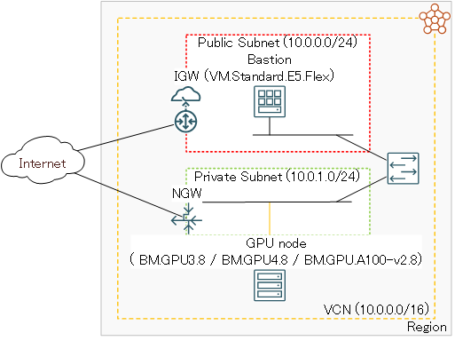
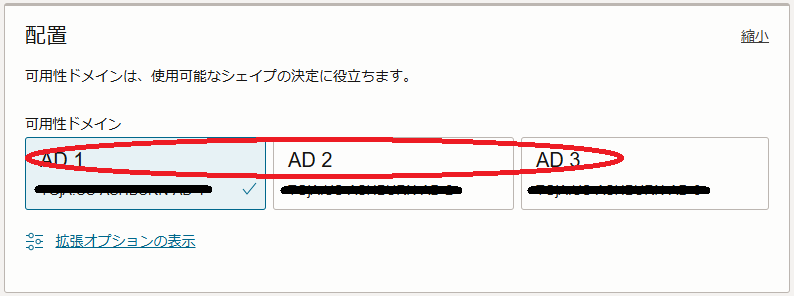
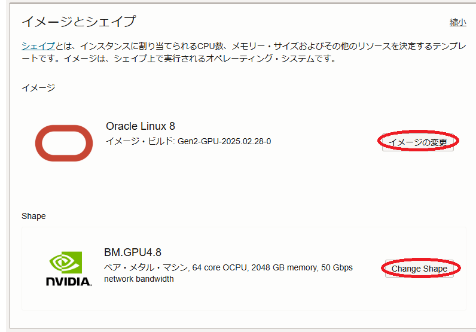
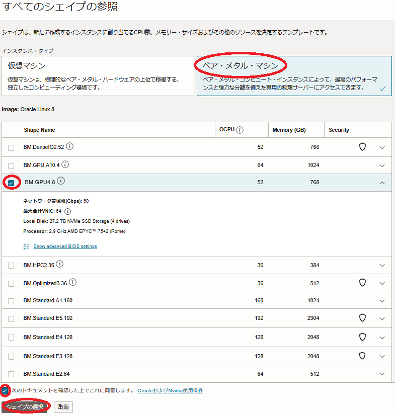
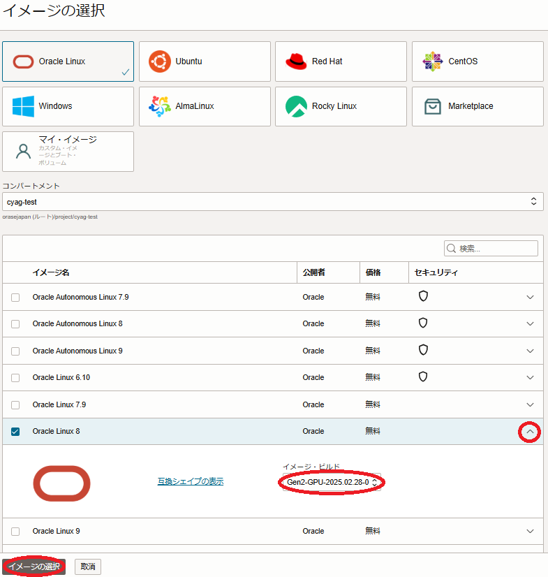
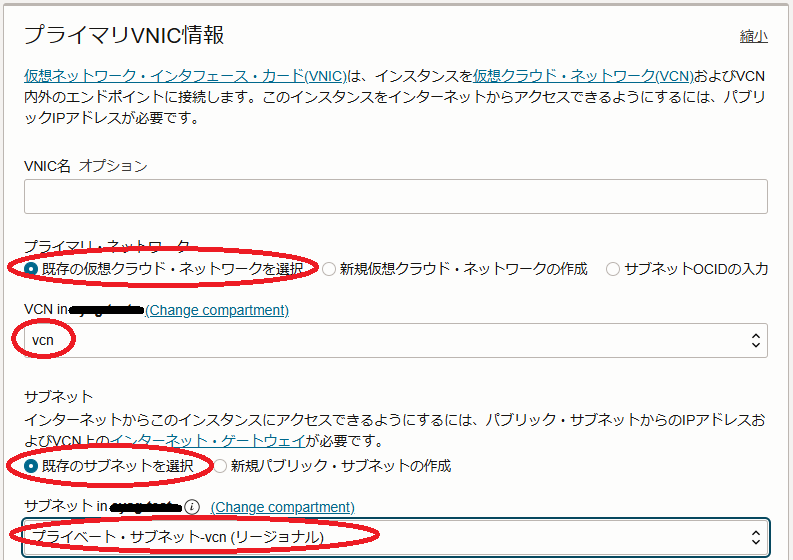
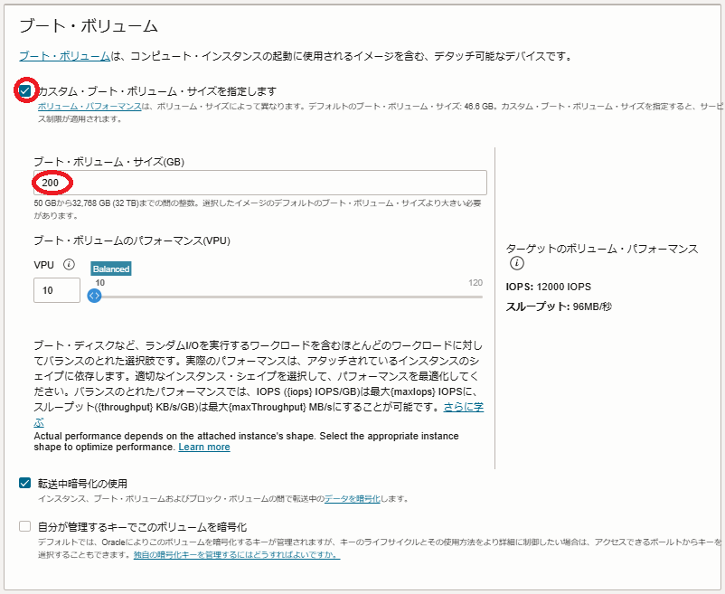
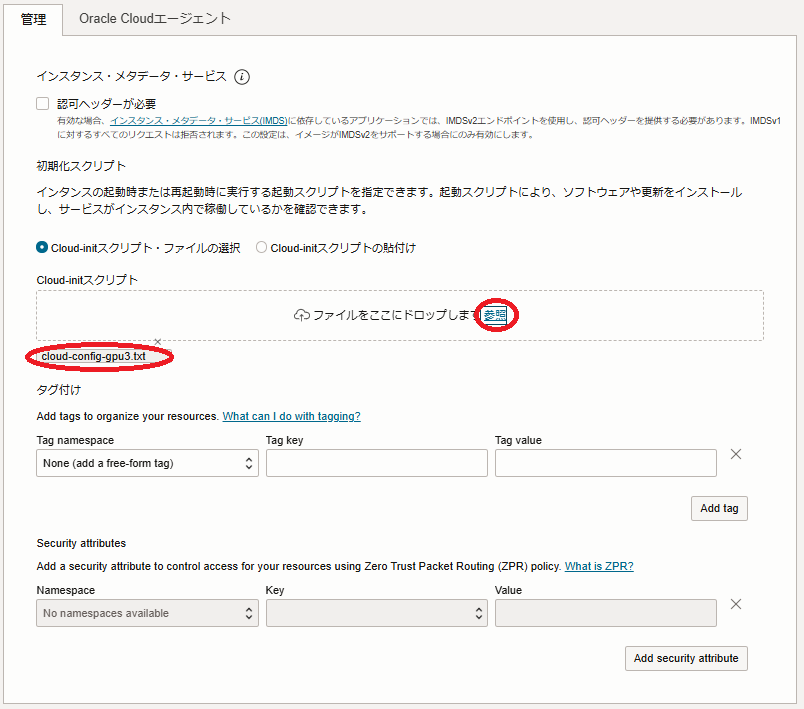

<style>
table, th, td {
    font-size: 80%;
}
</style>

***
# 0. 概要

本チュートリアルは、OCIコンソールから必要なリソースを順次デプロイしてソフトウェア環境を手動で構築する方法で、 **[containerd](https://github.com/containerd/containerd/tree/main)** と **[NVIDIA Container Toolkit](https://docs.nvidia.com/datacenter/cloud-native/container-toolkit/latest/index.html)** を使用する分散機械学習に対応するコンテナ実行環境を複数のNVIDIA GPUを搭載するGPUインスタンス（以降"GPUノード"と呼称します。）上に構築、複数GPUに跨るGPU間の通信性能を **[NCCL（NVIDIA Collective Communication Library）](https://developer.nvidia.com/nccl)** の通信性能計測プログラム **[NCCL Tests](https://github.com/nvidia/nccl-tests)** で検証します。

本チュートリアルで構築する分散機械学習環境の構成を以下に示します。

[GPUノード]

- シェイプ： **[BM.GPU3.8 / BM.GPU4.8 / BM.GPU.A100-v2.8](https://docs.oracle.com/ja-jp/iaas/Content/Compute/References/computeshapes.htm#bm-gpu)**
- OS： **プラットフォーム・イメージ** **[Oracle-Linux-8.10-Gen2-GPU-2025.02.28-0](https://docs.oracle.com/en-us/iaas/images/oracle-linux-8x/oracle-linux-8-10-gen2-gpu-2025-02-28-0.htm)**

[Bastionノード]

- シェイプ ： **[VM.Standard.E5.Flex](https://docs.oracle.com/ja-jp/iaas/Content/Compute/References/computeshapes.htm#flexible)**
- OS ： **プラットフォーム・イメージ** **[Oracle-Linux-8.10-2025.02.28-0](https://docs.oracle.com/en-us/iaas/images/oracle-linux-8x/oracle-linux-8-10-2025-02-28-0.htm)**

[機械学習環境ソフトウェア]

- コンテナランタイム ： **containerd** 2.0.3
- **NVIDIA Container Toolkit** ： 1.17.5



**所要時間 :** 約2時間

**前提条件 :** 分散機械学習環境を収容する **コンパートメント** ( **ルート・コンパートメント** でもOKです)の作成と、このコンパートメントに対する必要なリソース管理権限がユーザーに付与されていること。

**注意 :** 本コンテンツ内の画面ショットは、現在のOCIコンソール画面と異なっている場合があります。

***
# 1. GPUノード作成事前作業

## 1-0. 概要

本章は、GPUノードをTCP接続する **仮想クラウド・ネットワーク** と、インターネットから直接アクセス出来ないプライベートサブネットに接続するGPUノードにログインする際の踏み台となるBastionノードを、GPUノード作成前に予め用意します。

## 1-1. 仮想クラウド・ネットワーク作成

本章は、GPUノードをTCP接続する **仮想クラウド・ネットワーク** を作成します。  
**仮想クラウド・ネットワーク** の作成は、 **[OCIチュートリアル](https://oracle-japan.github.io/ocitutorials/)** の **[その2 - クラウドに仮想ネットワーク(VCN)を作る](https://oracle-japan.github.io/ocitutorials/beginners/creating-vcn)** の手順に従い、以下のリソースを作成します。

- **仮想クラウド・ネットワーク**
	- **VCN名** ： vcn
	- **VCN IPv4 CIDRブロック** ： 10.0.0.0/16
- パブリックサブネット
	- **IPv4 CIDRブロック** ： 10.0.0.0/24
- プライベートサブネット
	- **IPv4 CIDRブロック** ： 10.0.1.0/24
- **インターネット・ゲートウェイ** （パブリックサブネットにアタッチ）
- **NATゲートウェイ** （プライベートサブネットにアタッチ）
- **サービス・ゲートウェイ** （プライベートサブネットにアタッチ）
- **ルート表** x 2（パブリックサブネットとプライベートサブネットにアタッチ）
- **セキュリティリスト** x 2（パブリックサブネットとプライベートサブネットにアタッチ）

作成後、 **セキュリティリスト** が以下となるように修正します。

| サブネット  | 通信方向  | ステートレス | ソース         | IPプロトコル  | ソース・ポート範囲 | 宛先ポート範囲 |
| :----: | :---: | :----: | :---------: | :------: | :-------: | :-----: |
| パブリック  | イングレス | いいえ    | 0.0.0.0/0<br>（※2）   | TCP      | All       | 22      |
|        |       | いいえ    | 10.0.0.0/16 | 全てのプロトコル | -         | -       |
|        | イグレス  | いいえ    | 0.0.0.0/0   | 全てのプロトコル | -         | -       |
| プライベート | イングレス | いいえ    | 10.0.0.0/16 | 全てのプロトコル | -         | -       |
|        | イグレス  | いいえ    | 0.0.0.0/0   | 全てのプロトコル | -         | -       |

※2）この設定により、BastionノードへのSSHアクセスをインターネット上の全てのIPアドレスに許可していますが、これを自身のサイトのアクセス元IPアドレスに限定することで、不正アクセスを防ぐことが可能です。

## 1-2. Bastionノード作成

本章は、GPUノードにログインする際の踏み台となるBastinノードを作成し、必要なセットアップ作業を実施します。

Bastionノードの作成は、 **[OCIチュートリアル](https://oracle-japan.github.io/ocitutorials/)** の  **[その3 - インスタンスを作成する](https://oracle-japan.github.io/ocitutorials/beginners/creating-compute-instance)** の手順を参考に、ご自身の要件に沿ったインスタンスを先の手順で **仮想クラウド・ネットワーク** を作成した **コンパートメント** とパブリックサブネットを指定して作成します。  
本チュートリアルは、以下属性のインスタンスをBastionノードとして作成します。

- **名前** ： bastion
- **イメージ** ： **Oracle Linux** 8.10（Oracle-Linux-8.10-2025.02.28-0）
- **シェイプ** ： **VM.Standard.E5.Flex** （任意のコア数・メモリ容量）
- **サブネット** ： 先に作成したパブリックサブネット
- **SSHキーの追加** ： Bastionノードにログインする際使用するSSH秘密鍵に対応する公開鍵

次に、作成したBastionノードにopcユーザでSSHログインして以下コマンドを実行してSSH鍵ペアを作成し、その公開鍵を控えます。  
このSSH鍵は、BastionノードからGPUノードにログインする際に使用します。

```sh
$ ssh-keygen -t rsa -N "" -f ~/.ssh/id_rsa
Generating public/private rsa key pair.
Your identification has been saved in /home/opc/.ssh/id_rsa.
Your public key has been saved in /home/opc/.ssh/id_rsa.pub.
The key fingerprint is:
SHA256:gROjFmmm2yf3Frsg2P2T7cBzSCCEiml9BRGDnhi5qBs opc@bastion
The keys randomart image is:
+---[RSA 3072]----+
|  ..+**          |
| o.o+o.=         |
|oo*+= = .        |
|=+.= o o .       |
|o  o.   S        |
|E .oo.oo..       |
| o. o+o.==.      |
|.    . o*+.      |
|       .o+.      |
+----[SHA256]-----+
$ cat .ssh/id_rsa.pub 
ssh-rsa AAAAB3NzaC1yc2EAAAADAQABAAABgQDTkw2diccQ4mnxea/qUcClehcYfZIQhB94d2aiWUrLpD1kDQQzsc6Q8ndyOu6h7X3E0FGY2SDjDyhJRdntbOZKPkYkQrGHbhnBllFPMV4NlObkf/YX6a9bc4vrGgnayRgfj0vOZ0RKlJmkfjAR/7Cw48LzQnaDDq2HHZAo+c71WBSjLt1SsX7tXHqkzjGUv44qqEiC6qlEiZd9yevA7kR0IoN9dIWXaKnMbOVGr8DezyLsruoQxhj6bHNwXhEjlGPg8E6R35AdjGeGZOCYT2clfMu9iavuzR5dilysARq1Lxow2/MEija3/twxmzhxVbwoGTXE0sCz3SGMnHTwLGEE7Tok+i7zZMB2ySbCM42Icz3Ja2qxNxqdx9YUKZ48SgkNPrMMouZGm+lZrZf0dypQqDbUrA0uZkkTUR+RTY+V/0MmuH6eDgHQLjxzo07/+gw2BG9CMcor0fMYhEJiKUVRy2LXBIK2Zj2+Ow7zs552f7SRGWnAktU7sTU801frAjE= opc@bastion
$
```

***
# 2. GPUノード作成

## 2-0. 概要

本章は、GPUノードを作成します。

本チュートリアルは、GPUノードに **BM.GPU4.8** を使用しますが、 **BM.GPU3.8 / BM.GPU.A100-v2.8** の場合で手順が異なる箇所は、その旨明記します。

GPUノードの作成は、デプロイ後のカスタマイズ作業を軽減する目的で **[cloud-init](/ocitutorials/hpc/#5-11-cloud-init)** を使用するため、以下の手順を経て行います。

1. **cloud-init** 設定ファイル（ **cloud-config** ）作成
2. GPUノード作成

## 2-1. cloud-init設定ファイル作成

本章は、 **[cloud-init](/ocitutorials/hpc/#5-11-cloud-init)** 設定ファイル（ **cloud-config** ）を作成します。

本チュートリアルは、 **cloud-init** を以下の目的で使用します。

- タイムゾーンをJSTに変更
- NVMe SSDローカルディスク領域ファイルシステム作成（ **BM.GPU4.8 / BM.GPU.A100-v2.8** の場合のみ）
- firewalld停止
- ルートファイルシステム拡張

以下は、本チュートリアルで使用する **cloud-config** で、OCIコンソールを実行している端末上にテキストファイルで保存します。

[ **BM.GPU3.8** ]

```sh
#cloud-config
#
# Change time zone to JST
timezone: Asia/Tokyo

runcmd:
#
# Stop firewalld
  - systemctl disable --now firewalld
#
# Expand root file system to those set by instance configuration
  - /usr/libexec/oci-growfs -y
```

[ **BM.GPU4.8 / BM.GPU.A100-v2.8** ]

```sh
#cloud-config
#
# Change time zone to JST
timezone: Asia/Tokyo

runcmd:
#
# NVMe local storage setting
  - vgcreate nvme /dev/nvme0n1 /dev/nvme1n1 /dev/nvme2n1 /dev/nvme3n1
  - lvcreate -l 100%FREE nvme
  - mkfs.xfs -L localscratch /dev/nvme/lvol0
  - mkdir -p /mnt/localdisk
  - echo "LABEL=localscratch /mnt/localdisk/ xfs defaults,noatime 0 0" >> /etc/fstab
  - systemctl daemon-reload
  - mount /mnt/localdisk
#
# Stop firewalld
  - systemctl disable --now firewalld
#
# Expand root file system to those set by instance configuration
  - /usr/libexec/oci-growfs -y
```

## 2-2. GPUノード作成

本章は、GPUノードを作成します。

OCIコンソールにログインし、GPUノードをデプロイするリージョンを選択後、 **コンピュート** → **インスタンス** とメニューを辿り、表示される以下画面で **インスタンスの作成** ボタンをクリックします。


次に、表示される **コンピュート・インスタンスの作成** 画面で、以下の情報を入力し **作成** ボタンをクリックします。なお、ここに記載のないフィールドは、デフォルトのままとします。

1. 概要フィールド　

    - **名前** ： GPUノードに付与する名前
    - **コンパートメントに作成** ： GPUノードを作成する **コンパートメント**

	

2. **配置** フィールド

	- **可用性ドメイン** ：インスタンスをデプロイする **可用性ドメイン**

	

3. **イメージとシェイプ** フィールド

	

	- **Shape** ：**BM.GPU3.8 / BM.GPU4.8 / BM.GPU.A100-v2.8** （ **Change Shape** ボタンをクリックして表示される以下 **すべてのシェイプの参照** サイドバーで **ベア・メタル・マシン** をクリックして表示される **BM.GPU3.8 / BM.GPU4.8 / BM.GPU.A100-v2.8** を選択し **次のドキュメントを確認した上でこれに同意します** チェックボックスをチェックし **シェイプの選択** ボタンをクリック）

    

	- **イメージ** ：Oracle-Linux-8.10-Gen2-GPU-2025.02.28-0（ **イメージの変更** ボタンをクリックして表示される以下 **イメージの選択** サイドバーで **イメージ名**  **Oracle Linux 8** の右端のアイコンをクリックして表示される **イメージ・ビルド** フィールドで **Oracle-Linux-8.10-Gen2-GPU-2025.02.28-0** を選択し **イメージの選択** ボタンをクリック）

    

4. **ネットワーキング** フィールド

	- **プライマリ・ネットワーク** ： **既存の仮想クラウド・ネットワークを選択**
    - **VCN in xxxx** ： 先に作成したVCNを選択
	- **サブネット** ： **既存のサブネットを選択**
    - **サブネット in xxxx** ： 先に作成したプライベートサブネットを選択

	

5. **SSHキーの追加** フィールド

	- **SSHキー** ：先にBastionノードで作成したSSH鍵の公開鍵（ 以下 **公開キーの貼付け** ラジオボタンを選択することで入力フィールドを表示）  

	

6. **ブート・ボリューム** フィールド

	- **ブート・ボリューム・サイズ(GB)** ： 200（※2）（ **カスタム・ブート・ボリューム・サイズを指定します** チェックボックスをチェックすると指定可能）

	

	※2）通常GPUノードは、様々な機械学習用ソフトウェアやコンテナイメージを格納する必要があるため、少なくとも200 GBの **ブート・ボリューム** サイズとします。

7. **管理** フィールド（以下 **拡張オプションの表示** ボタンを選択して表示）

	

	- **cloud-initスクリプト** ：先に作成した **[cloud-init](/ocitutorials/hpc/#5-11-cloud-init)** 設定ファイル（ **cloud-config** ）を選択（ **参照** ボタンでファイルを選択）  

	

***
# 3. GPUノード確認

## 3.0. 概要

本章は、デプロイされたGPUノードにログインし、環境を確認します。

## 3.1. GPUノードログイン

GPUノードは、プライベートサブネットに接続されており、インターネットからログインすることが出来ないため、Bastionノードを経由してSSHログインします。  
BastionノードからGPUノードへのログインは、GPUノードのIPアドレスを使用します。

GPUノードのIPアドレスは、OCIコンソールでGPUノードをデプロイしたリージョンを選択後、 **コンピュート** → **インスタンス** とメニューを辿り、以下のインスタンス一覧からそのIPアドレスを確認します。


GPUノードへのログインは、以下のようにBastionノードからopcユーザでSSHログインします。

```sh
$ ssh -oStrictHostKeyChecking=accept-new 10.0.1.76
```

## 3.2. cloud-init完了確認

**[cloud-init](/ocitutorials/hpc/#5-11-cloud-init)** は、GPUノードが起動してSSHログインできる状態であってもその処理が継続している可能性があるため、以下コマンドでそのステータスを表示し、 **done** となっていることで **cloud-init** の処理完了を確認します。  
ステータスが **running** の場合は、 **cloud-init** の処理が継続中のため、処理が完了するまで待ちます。

```sh
$ cloud-init status
status: done
$
```

## 3-3. タイムゾーン確認

以下コマンドをGPUノードのopcユーザで実行し、タイムゾーンがJSTになっていることを確認します。

```sh
$ date
Mon Jan 29 12:08:00 JST 2024
$
```

## 3-4. ファイルシステム確認

以下コマンドをGPUノードのopcユーザで実行し、ルートファイルシステムが指定のサイズとなっていること、 **BM.GPU4.8 / BM.GPU.A100-v2.8** の場合はNVMe SSDローカルディスク領域ファイルシステムがマウントされていることを確認します。

[ **BM.GPU3.8** ]

```sh
$ df -h /
Filesystem                  Size  Used Avail Use% Mounted on
/dev/mapper/ocivolume-root  189G   39G  151G  21% /
$
```

[ **BM.GPU4.8 / BM.GPU.A100-v2.8** ]

```sh
$ df -h / /mnt/localdisk
Filesystem                  Size  Used Avail Use% Mounted on
/dev/mapper/ocivolume-root  189G   39G  151G  21% /
/dev/mapper/nvme-lvol0       25T  177G   25T   1% /mnt/localdisk
$
```

## 3-5. ファイアーウォール停止確認

以下コマンドをGPUノードのopcユーザで実行し、ファイアーウォールが停止されていることを確認します。

```sh
$ sudo systemctl status firewalld | grep -e Active -e disabled
   Loaded: loaded (/usr/lib/systemd/system/firewalld.service; disabled; vendor preset: enabled)
   Active: inactive (dead)
$
```

***
# 4. コンテナ環境構築

本章は、 **containerd** と **NVIDIA Container Toolkit** を使用し、GPU利用可能なコンテナ環境を構築・確認します。

以下コマンドをGPUノードのopcユーザで実行し、 **containerd** と **NVIDIA Container Toolkit** をインストールします。

```sh
$ cd ~ && wget https://github.com/containerd/containerd/releases/download/v2.0.3/containerd-2.0.3-linux-amd64.tar.gz
$ sudo tar -C /usr/local -xvf ./containerd-2.0.3-linux-amd64.tar.gz
$ sudo wget -P /usr/lib/systemd/system/ https://raw.githubusercontent.com/containerd/containerd/main/containerd.service
$ sudo systemctl daemon-reload
$ wget https://github.com/opencontainers/runc/releases/download/v1.2.5/runc.amd64
$ sudo install -m 755 ./runc.amd64 /usr/local/sbin/runc
$ wget https://github.com/containernetworking/plugins/releases/download/v1.6.2/cni-plugins-linux-amd64-v1.6.2.tgz
$ sudo mkdir -p /opt/cni/bin && sudo tar -C /opt/cni/bin -xvf ./cni-plugins-linux-amd64-v1.6.2.tgz
$ wget https://github.com/containerd/nerdctl/releases/download/v2.0.3/nerdctl-2.0.3-linux-amd64.tar.gz
$ sudo tar -C /usr/local/bin/ -xvf ./nerdctl-2.0.3-linux-amd64.tar.gz 
$ sudo sed -i '/^Defaults    secure_path/s/$/:\/usr\/local\/bin/g' /etc/sudoers
$ sudo dnf install -y nvidia-container-toolkit
```

次に、以下コマンドをGPUノードのopcユーザで実行し、一般ユーザ権限で **containerd** 上にコンテナを起動するために必要なソフトウェアをインストールします。

```sh
$ wget https://go.dev/dl/go1.24.1.linux-amd64.tar.gz
$ sudo tar -C /usr/local/ -xvf ./go1.24.1.linux-amd64.tar.gz
$ export PATH=$PATH:/usr/local/go/bin
$ sudo dnf install -y git slirp4netns libseccomp libseccomp-devel
$ git clone https://github.com/rootless-containers/rootlesskit
$ cd rootlesskit && make && sudo make install
$ cd ~ && git clone https://github.com/rootless-containers/bypass4netns
$ cd bypass4netns && make && sudo make install
```

次に、以下コマンドをGPUノードのopcユーザで実行し、コンテナを起動するユーザ **usera** を作成、BastionノードのopcユーザからSSHログインするための公開鍵の登録を行います。

```sh
$ sudo useradd -d /home/usera -s /bin/bash -u 10000 usera
$ sudo mkdir ~usera/.ssh && sudo chmod 700 ~usera/.ssh && sudo chown usera:usera ~usera/.ssh
$ sudo cp -p ~/.ssh/authorized_keys ~usera/.ssh/ && sudo chown usera:usera ~usera/.ssh/authorized_keys
```

次に、BastionノードのopcユーザからGPUノードの **usera** ユーザにSSHでログインして以下コマンドを実行し、 **containerd** を起動・確認します。  
なお、GPUノードのopcユーザから **usera** ユーザにスイッチした場合は、以下のコマンドがエラーする点に注意します。

```sh
$ containerd-rootless-setuptool.sh install
[INFO] Checking RootlessKit functionality
:
:
:
[INFO] You do NOT need to specify $CONTAINERD_ADDRESS explicitly.
$ systemctl --user status containerd | grep -e Active -e enabled
   Loaded: loaded (/home/usera/.config/systemd/user/containerd.service; enabled; vendor preset: enabled)
   Active: active (running) since Wed 2025-03-19 10:38:54 JST; 1min 39s ago
$ containerd-rootless-setuptool.sh install-bypass4netnsd
[INFO] Creating "/home/usera/.config/systemd/user/bypass4netnsd.service"
:
:
:
[INFO] To use bypass4netnsd, set the "nerdctl/bypass4netns=true" annotation on containers, e.g., `nerdctl run --annotation nerdctl/bypass4netns=true`
$ systemctl --user status bypass4netnsd | grep -e Active -e enabled
   Loaded: loaded (/home/usera/.config/systemd/user/bypass4netnsd.service; enabled; vendor preset: enabled)
   Active: active (running) since Wed 2025-03-19 11:11:25 JST; 1min 2s ago
$
```

次に、以下コマンドをGPUノードの **usera** ユーザで実行し、コンテナ上でGPUノードが搭載するGPUにアクセスできることを確認します。

```sh
$ nerdctl run --rm --gpus all --annotation nerdctl/bypass4netns=true nvcr.io/nvidia/base/ubuntu:22.04_20240212 nvidia-smi
nvcr.io/nvidia/base/ubuntu:22.04_20240212:                                        resolved       |++++++++++++++++++++++++++++++++++++++| 

We trust you have received the usual lecture from the local System
Administrator. It usually boils down to these three things:

    #1) Respect the privacy of others.
nvcr.io/nvidia/base/ubuntu:22.04_20240212:                                        resolved       |++++++++++++++++++++++++++++++++++++++| 
index-sha256:2a9f71d82aa4daac444c1b4b74d5d7b01f93eb23662c1236f89d817f083abecd:    done           |++++++++++++++++++++++++++++++++++++++| 
manifest-sha256:9bb542ce92bf6f772be19cb12acaeb7477869a05aa099b23506e8d2d264c7d30: done           |++++++++++++++++++++++++++++++++++++++| 
config-sha256:a42a5aed2c5c677cd56f364aa16b4575ad99e88daf9130dd7bfa348c63d0c6b6:   done           |++++++++++++++++++++++++++++++++++++++| 
layer-sha256:d66d6a6a368713979f9d00fad193991ae1af18b8efd3abf4d70ade192807c1bd:    done           |++++++++++++++++++++++++++++++++++++++| 
layer-sha256:24c2d4f7ea407e096d657abd42bbeeb9d009bb6a80061ed3da05a5b97aa1cc60:    done           |++++++++++++++++++++++++++++++++++++++| 
layer-sha256:feb1277c15aaf19e9f1f1f9c5d7589e8500a4d09ea00828c24d88bf20d980a97:    done           |++++++++++++++++++++++++++++++++++++++| 
layer-sha256:a8f7f8dfd4e2e72ec795a2ff2b30820324a9ba17d1da0f60231109bc233b5229:    done           |++++++++++++++++++++++++++++++++++++++| 
layer-sha256:3cf0dbeda93aa8b1ca78ab293ce1157996edf2334c73319cb847a52daff4078d:    done           |++++++++++++++++++++++++++++++++++++++| 
layer-sha256:9d30336abbd75810bebd155677f0c1839efc7b3aba3d01f6317cf180c348294b:    done           |++++++++++++++++++++++++++++++++++++++| 
layer-sha256:99fc1e9ef2061bdda5435d1aff0b2bd59eaa648c010ac561745f45f0bab44a0b:    done           |++++++++++++++++++++++++++++++++++++++| 
elapsed: 15.5s                                                                    total:  29.0 M (1.9 MiB/s)                                       
Wed Mar 19 01:42:33 2025       
+-----------------------------------------------------------------------------------------+
| NVIDIA-SMI 570.86.15              Driver Version: 570.86.15      CUDA Version: 12.8     |
|-----------------------------------------+------------------------+----------------------+
| GPU  Name                 Persistence-M | Bus-Id          Disp.A | Volatile Uncorr. ECC |
| Fan  Temp   Perf          Pwr:Usage/Cap |           Memory-Usage | GPU-Util  Compute M. |
|                                         |                        |               MIG M. |
|=========================================+========================+======================|
|   0  NVIDIA A100-SXM4-40GB          Off |   00000000:0F:00.0 Off |                    0 |
| N/A   31C    P0             56W /  400W |       1MiB /  40960MiB |      0%      Default |
|                                         |                        |             Disabled |
+-----------------------------------------+------------------------+----------------------+
|   1  NVIDIA A100-SXM4-40GB          Off |   00000000:15:00.0 Off |                    0 |
| N/A   30C    P0             55W /  400W |       1MiB /  40960MiB |      0%      Default |
|                                         |                        |             Disabled |
+-----------------------------------------+------------------------+----------------------+
|   2  NVIDIA A100-SXM4-40GB          Off |   00000000:51:00.0 Off |                    0 |
| N/A   31C    P0             56W /  400W |       1MiB /  40960MiB |      0%      Default |
|                                         |                        |             Disabled |
+-----------------------------------------+------------------------+----------------------+
|   3  NVIDIA A100-SXM4-40GB          Off |   00000000:54:00.0 Off |                    0 |
| N/A   30C    P0             52W /  400W |       1MiB /  40960MiB |      0%      Default |
|                                         |                        |             Disabled |
+-----------------------------------------+------------------------+----------------------+
|   4  NVIDIA A100-SXM4-40GB          Off |   00000000:8D:00.0 Off |                    0 |
| N/A   30C    P0             53W /  400W |       1MiB /  40960MiB |      0%      Default |
|                                         |                        |             Disabled |
+-----------------------------------------+------------------------+----------------------+
|   5  NVIDIA A100-SXM4-40GB          Off |   00000000:92:00.0 Off |                    0 |
| N/A   30C    P0             52W /  400W |       1MiB /  40960MiB |      0%      Default |
|                                         |                        |             Disabled |
+-----------------------------------------+------------------------+----------------------+
|   6  NVIDIA A100-SXM4-40GB          Off |   00000000:D6:00.0 Off |                    0 |
| N/A   32C    P0             56W /  400W |       1MiB /  40960MiB |      0%      Default |
|                                         |                        |             Disabled |
+-----------------------------------------+------------------------+----------------------+
|   7  NVIDIA A100-SXM4-40GB          Off |   00000000:DA:00.0 Off |                    0 |
| N/A   32C    P0             54W /  400W |       1MiB /  40960MiB |      0%      Default |
|                                         |                        |             Disabled |
+-----------------------------------------+------------------------+----------------------+
                                                                                         
+-----------------------------------------------------------------------------------------+
| Processes:                                                                              |
|  GPU   GI   CI              PID   Type   Process name                        GPU Memory |
|        ID   ID                                                               Usage      |
|=========================================================================================|
|  No running processes found                                                             |
+-----------------------------------------------------------------------------------------+

$
```

***
# 5. NCCL Tests実行

本章は、 **[NGC Catalog](https://catalog.ngc.nvidia.com/)** から提供される **[TensorFlow NGC Container](https://catalog.ngc.nvidia.com/orgs/nvidia/containers/tensorflow)** を起動し、このコンテナに含まれる **NCCL** とコンテナ上でビルドする **NCCL Tests** を使用し、コンテナ上で **NCCL** のGPU間通信性能を **NCCL Tests** で検証します。

以下コマンドをGPUノードの **usera** ユーザで実行し、 **TensorFlow NGC Container** を起動します。  
本コンテナのサイズは、約14 GBです。

```sh
$ nerdctl run -it --rm --gpus all --ipc=host --ulimit stack=67108864 --annotation nerdctl/bypass4netns=true nvcr.io/nvidia/tensorflow:24.06-tf2-py3
```

次に、以下コマンドを起動したコンテナ上のrootユーザで実行し、 **NCCL Tests** を **GitHub** からダウンロードしてビルドします。

```sh
$ apt update
$ git clone https://github.com/NVIDIA/nccl-tests.git
$ cd nccl-tests && make MPI=1 MPI_HOME=/usr/local/mpi CUDA_HOME=/usr/local/cuda NCCL_HOME=/usr/lib/x86_64-linux-gnu
```

次に、以下コマンドを起動したコンテナ上のrootユーザで実行し、 **NCCL Tests** を実行します。  
以下では、 **BM.GPU4.8** の8枚の **NVIDIA A100 40 GB** を使用し、busbwで **232 GB/s** の性能が確認できます。

[ **BM.GPU3.8** ]

```sh
$ ./build/all_reduce_perf -b 1G -e 1G -f 2 -t 1 -g 8
# nThread 1 nGpus 8 minBytes 1073741824 maxBytes 1073741824 step: 2(factor) warmup iters: 5 iters: 20 agg iters: 1 validation: 1 graph: 0
#
# Using devices
#  Rank  0 Group  0 Pid   1711 on 4c3719b595b1 device  0 [0000:61:00] Tesla V100-SXM2-16GB
#  Rank  1 Group  0 Pid   1711 on 4c3719b595b1 device  1 [0000:62:00] Tesla V100-SXM2-16GB
#  Rank  2 Group  0 Pid   1711 on 4c3719b595b1 device  2 [0000:67:00] Tesla V100-SXM2-16GB
#  Rank  3 Group  0 Pid   1711 on 4c3719b595b1 device  3 [0000:69:00] Tesla V100-SXM2-16GB
#  Rank  4 Group  0 Pid   1711 on 4c3719b595b1 device  4 [0000:89:00] Tesla V100-SXM2-16GB
#  Rank  5 Group  0 Pid   1711 on 4c3719b595b1 device  5 [0000:8a:00] Tesla V100-SXM2-16GB
#  Rank  6 Group  0 Pid   1711 on 4c3719b595b1 device  6 [0000:8f:00] Tesla V100-SXM2-16GB
#  Rank  7 Group  0 Pid   1711 on 4c3719b595b1 device  7 [0000:91:00] Tesla V100-SXM2-16GB
#
#                                                              out-of-place                       in-place          
#       size         count      type   redop    root     time   algbw   busbw #wrong     time   algbw   busbw #wrong
#        (B)    (elements)                               (us)  (GB/s)  (GB/s)            (us)  (GB/s)  (GB/s)       
  1073741824     268435456     float     sum      -1    13867   77.43  135.50      0    13877   77.38  135.41      0
# Out of bounds values : 0 OK
# Avg bus bandwidth    : 135.455 
#

$
```

[ **BM.GPU4.8 / BM.GPU.A100-v2.8** ]

```sh
$ ./build/all_reduce_perf -b 10G -e 10G -f 2 -t 1 -g 8
# nThread 1 nGpus 8 minBytes 10737418240 maxBytes 10737418240 step: 2(factor) warmup iters: 5 iters: 20 agg iters: 1 validation: 1 graph: 0
#
# Using devices
#  Rank  0 Group  0 Pid   1728 on a4bae1424041 device  0 [0000:0f:00] NVIDIA A100-SXM4-40GB
#  Rank  1 Group  0 Pid   1728 on a4bae1424041 device  1 [0000:15:00] NVIDIA A100-SXM4-40GB
#  Rank  2 Group  0 Pid   1728 on a4bae1424041 device  2 [0000:51:00] NVIDIA A100-SXM4-40GB
#  Rank  3 Group  0 Pid   1728 on a4bae1424041 device  3 [0000:54:00] NVIDIA A100-SXM4-40GB
#  Rank  4 Group  0 Pid   1728 on a4bae1424041 device  4 [0000:8d:00] NVIDIA A100-SXM4-40GB
#  Rank  5 Group  0 Pid   1728 on a4bae1424041 device  5 [0000:92:00] NVIDIA A100-SXM4-40GB
#  Rank  6 Group  0 Pid   1728 on a4bae1424041 device  6 [0000:d6:00] NVIDIA A100-SXM4-40GB
#  Rank  7 Group  0 Pid   1728 on a4bae1424041 device  7 [0000:da:00] NVIDIA A100-SXM4-40GB
#
#                                                              out-of-place                       in-place          
#       size         count      type   redop    root     time   algbw   busbw #wrong     time   algbw   busbw #wrong
#        (B)    (elements)                               (us)  (GB/s)  (GB/s)            (us)  (GB/s)  (GB/s)       
 10737418240    2684354560     float     sum      -1    80978  132.60  232.04      0    81154  132.31  231.54      0
# Out of bounds values : 0 OK
# Avg bus bandwidth    : 231.793 
#

$
```

***
# 6. GPUノード削除

本章は、GPUノードを削除します。

OCIコンソールメニューから **コンピュート** → **インスタンス** を選択し、表示される以下画面で作成したGPUノードの **終了** メニューをクリックします。


次に、表示される以下 **インスタンスの終了** 画面で、 **アタッチされたブート・ボリュームを完全に削除** チェックボックスをチェックし、 **インスタンスの終了** ボタンをクリックします。


GPUノードの **状態** が **終了済** となれば、削除が完了しています。

以上で、本チュートリアルは終了です。