**チュートリアル概要 :**  
このチュートリアルでは、OCI Database ManagementのSQLチューニング・アドバイザでSQLのパフォーマンス・チューニングをする手順をご紹介します。

**所要時間 :** 約60分

**前提条件1 :** テナンシ上で以下のリソースが作成済であること
+ コンパートメント
+ ユーザー
+ ユーザーグループ
+ VCN
+ BaseDB

**前提条件2 :** Database Management が有効化済みであること<br>
[こちら](https://oracle-japan.github.io/ocitutorials/management/dbcs-database-management/)を参考にDatabase Managementを有効化できます。

**注意**<br>
監視対象のBaseDBがStandard Editionの場合、SQLチューニング・アドバイザを含むパフォーマンスに関連する機能をご利用いただけませんのでご注意ください。
{: .notice--info}

# 1.データの作成
Oracle Databaseにはトレーニングやデモに使用できる[サンプル・スキーマ](https://docs.oracle.com/cd/G11854_01/comsc/introduction-to-sample-schemas.html#GUID-844E92D8-A4C8-4522-8AF5-761D4BE99200)が提供されています。
今回はサンプル・スキーマとして提供されているSHスキーマに対してSQL文を実行し、チューニング・アドバイザでパフォーマンスを改善する手順をご紹介します。

# 1.1 サンプル・スキーマのダウンロード
[こちら](https://github.com/oracle-samples/db-sample-schemas/releases
)からデータベースのバージョンに合わせたスクリプトをダウンロードし、oracleディレクトリに配置します。（今回はBaseDBのバージョンが19.2なのでOracle Database Sample Schemas 19.2をダウンロード）

# 1.2 PDBの接続先情報を追加
tnsnames.oraにPDBの接続情報がない場合は、PDBの接続情報を追加します。
Base DBにログインし、oracleユーザに切り替えます。
```
$ sudo su - oracle
```

tnsnames.oraファイルを編集し、以下の内容を追記します。
```
$ vi $ORACLE_HOME/network/admin/tnsnames.ora
```

```
<PDB名>=
  (DESCRIPTION =
    (ADDRESS = (PROTOCOL = TCP)(HOST = <ホスト名>)(PORT = 1521))
    (CONNECT_DATA =
      (SERVER = DEDICATED)
      (SERVICE_NAME = <PDBのサービス名>)
    )
  )
```
# 1.3 スキーマの作成
Base DBにログインし、oracleユーザに切り替えます。
```
$ sudo su - oracle
```
zipファイルを解凍します。
```
$ unzip db-sample-schemas-19.2.zip
```
ディレクトリを変更します。
```
$ cd db-sample-schemas-19.2
```
展開された各スクリプト内には、「__SUB__CWD__」という文字列が埋め込まれているので、展開したディレクトリ名に置換します。
```
$ perl -p -i.bak -e 's#__SUB__CWD__#'$(pwd)'#g' *.sql */*.sql */*.dat
```

# 1.4 表領域の作成
サンプル・スキーマ用の表領域を作成します。<br>
sysdbaユーザなどでCDBにログインします。
```
$ sqlplus / as sysdba
```

サンプル・スキーマを構築するPDBに切り替えます。
```
alter session set container=<PDB名>;
```

作成するスキーマ用の表領域を作成します。
```
create bigfile tablespace <表領域名> datafile '+DATA(DATAFILE)' size 50g ;
```

# 1.5 サンプルスキーマの作成
NOLOG引数を使用して、CDBにログインします。
```
$ sqlplus /nolog
```

SHスキーマをインストールします。
```
@/home/oracle/db-sample-schemas-19.2/mksample.sql systempassword syspassword hrpassword oepassword pmpassword ixpassword shpassword bipassword <表領域名> temp <ログディレクトリ名> <PDB名>;
```

**注意**<br>
systempasswordとsyspasswordは事前に設定したパスワードを指定します。
hr, oe, pm, ix, sh, biユーザのパスワードはそれぞれ上記のコマンドで指定したパスワード（hrpassword、oepassword、pmpassword、ixpassword、shpassword、bipassword）が設定されます。
{: .notice--info}


# 1.6 データの増幅
SALES表のデータを増やします。<br>
SHユーザでPDBにログインします。
```
$ sqlplus sh/<shユーザのパスワード>@<PDB名>
```

元のSALES表を別名に変更します。
```
rename SALES to SALES_ORG;
```

ダミー列を2つ追加した新たなSALES表（非パーティション表）を作成します。
```
CREATE TABLE "SH"."SALES"
   (    "PROD_ID" NUMBER NOT NULL ENABLE,
        "CUST_ID" NUMBER NOT NULL ENABLE,
        "TIME_ID" DATE NOT NULL ENABLE,
        "CHANNEL_ID" NUMBER NOT NULL ENABLE,
        "PROMO_ID" NUMBER NOT NULL ENABLE,
        "QUANTITY_SOLD" NUMBER(10,2) NOT NULL ENABLE,
        "AMOUNT_SOLD" NUMBER(10,2) NOT NULL ENABLE,
        "DUMMY1" CHAR(100),
        "DUMMY2" CHAR(110)
   );
```   

元のSALES表（SALES_ORG）から新規作成したSALES表へレコードをコピーします。
```
insert /*+append */ into SH.SALES
  nologging
    select PROD_ID,
           CUST_ID,
           TIME_ID+15*365+3, 
           CHANNEL_ID,
           PROMO_ID,
           QUANTITY_SOLD,
           AMOUNT_SOLD,
           rpad(to_char(mod(CUST_ID,30)),100,'dummy1'),
           rpad(to_char(mod(CUST_ID,30)),110,'dummy2')
      from SH.SALES_ORG;
```   
     
```
commit;
```

データ容量（レコード数）を256MBから約32GBまで増やします。
```
insert /*+append */ into SH.SALES nologging select * from SH.SALES;
```
```
commit;
```
```
insert /*+append */ into SH.SALES nologging select * from SH.SALES;
```
```
commit;
```
```
insert /*+append */ into SH.SALES nologging select * from SH.SALES;
```
```
commit;
```
```
insert /*+append */ into SH.SALES nologging select * from SH.SALES;
```
```
commit;
```
```
insert /*+append */ into SH.SALES nologging select * from SH.SALES;
```
```
commit;
```
```
insert /*+append */ into SH.SALES nologging select * from SH.SALES;
```
```
commit;
```
```
insert /*+append */ into SH.SALES nologging select * from SH.SALES;
```
```
commit;
```

# 2.SQLチューニング・アドバイザを利用したパフォーマンス・チューニング
# 2.1 バケットの作成
チューニング・アドバイザで出力されたSQLジョブを実行した結果を格納するオブジェクト・ストレージのバケットを作成しておきます。
オブジェクトストレージはOCIコンソールのメニューボタン→ストレージ→バケット→ボールトの作成をクリックします。


バケット名に任意の名前を入力して「作成」をクリックします。


# 2.2 SQL(チューニング対象のSQL)の実行
SHユーザでPDBにログインします。
```
$ sqlplus sh/<shユーザのパスワード>@<PDB名>
```

データを増幅させたSALES表に対してテーブル・フルスキャンが発生する以下のSQL(チューニング対象のSQL)を実行します。
```
select /*+MONITOR */ COUNT(*) from sales where 900<= cust_ID and cust_ID <=1000 order by cust_id;
```

# 2.3 実行したSQLをSQLモニタリングで確認
SQLを実行したPDBの「パフォーマンス・ハブ」をクリックします。
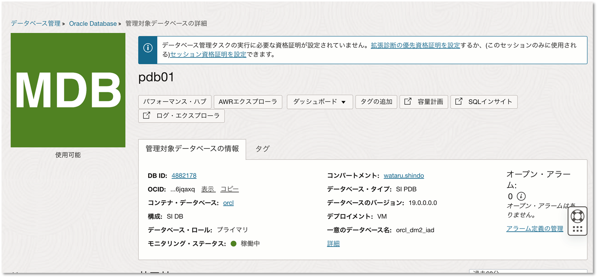

ASH分析の画面で実行したSQLのSQLIDをクリックします。


「SQLモニタリング」をクリックします。
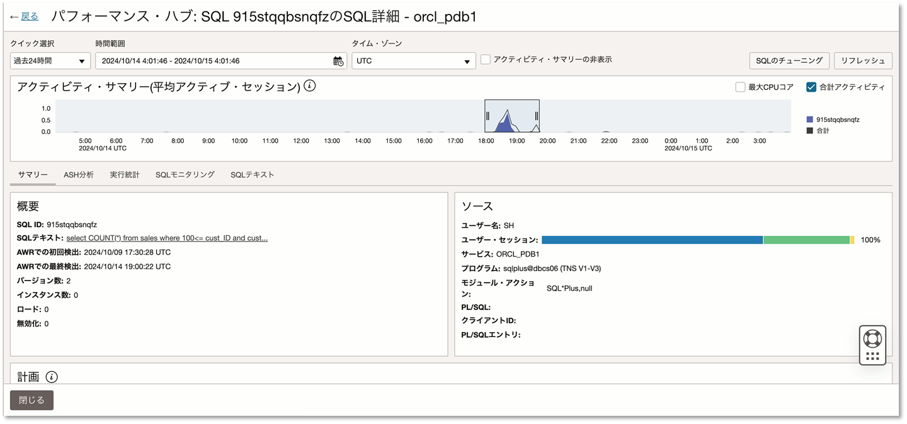

実行時間、I/O負荷、実行計画を確認できます。
実行計画からテーブル・フルアクセスによる実行を確認できます。<br>
※下記画像はSQLモニタリングの画面をHTML形式で保存したキャプチャです。
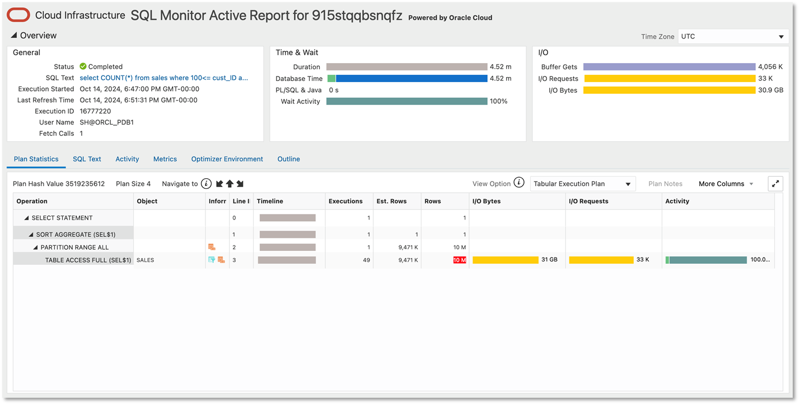

# 2.4 SQLチューニング・アドバイザの実行
ASH分析の画面で実行したSQLを選択し、「SQLのチューニング」をクリックします。
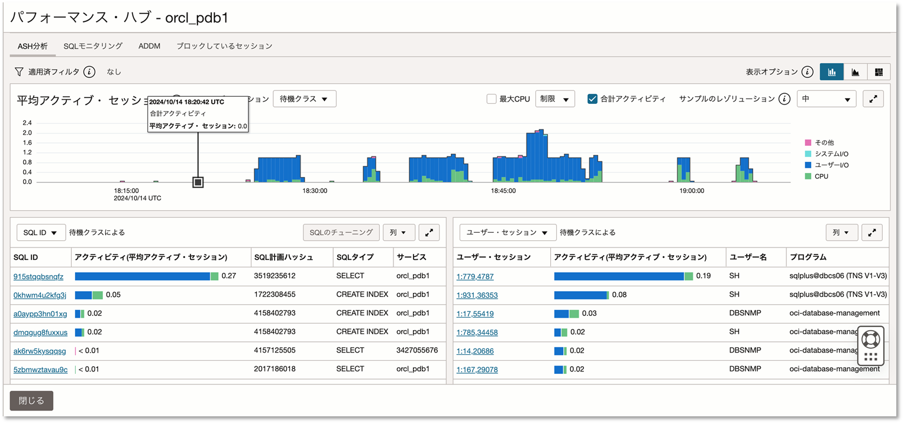

下記の情報を設定し、「実行」をクリックします。
 - 名前：任意の名前
 - ソース：選択したSQL文
 - 合計時間の制限：任意の分数
 - 分析の有効範囲：制限ありまたは包括的（SQLプロファイルの推奨事項を含む場合は包括的）
 - 資格証明：作成した資格証明（作成していない場合は作成）

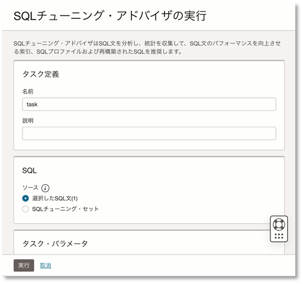
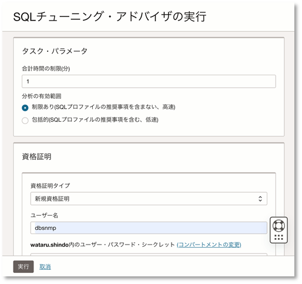

# 2.4 推奨事項の実装
チューニング・アドバイザの実行が完了するとDatabasse ManagementのSQLチューニング・アドバイザのタスクに完了済みと表示されます。
「該当の名前」をクリックします。
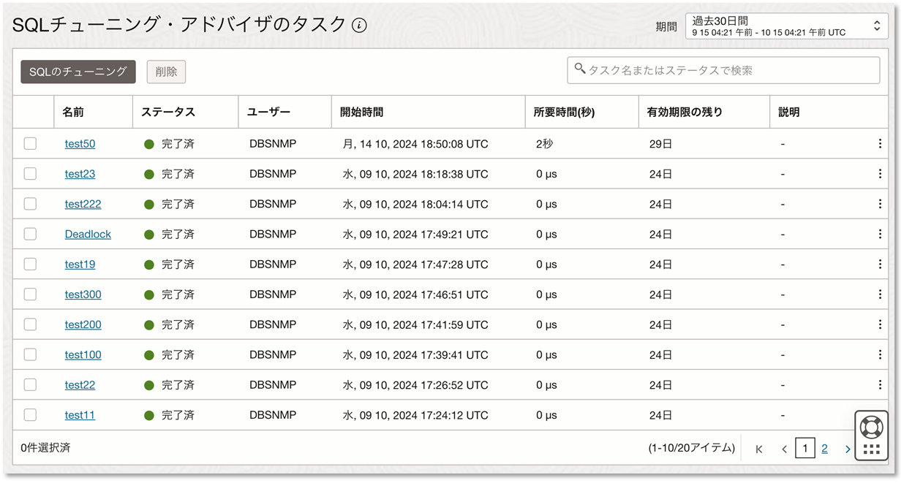

SQL結果に索引の作成が推奨事項として表示されます。
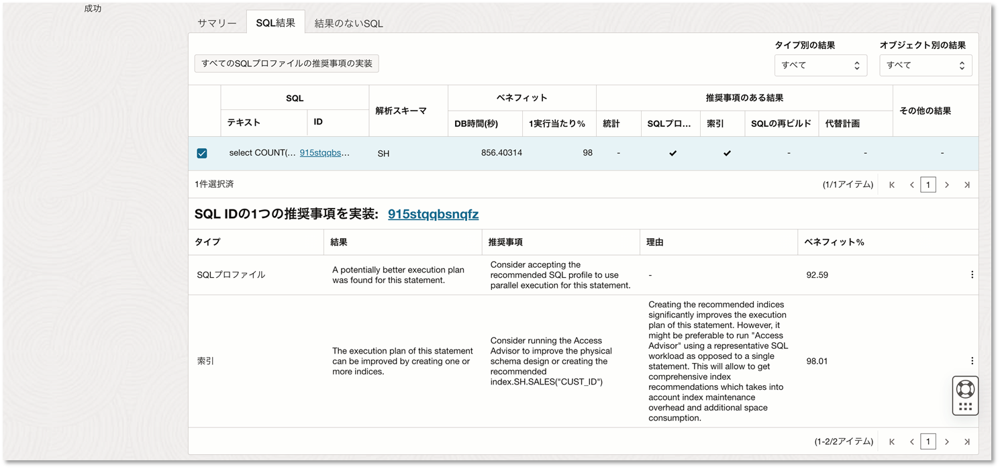

3点リーダーの「推奨事項を実装」をクリックします。
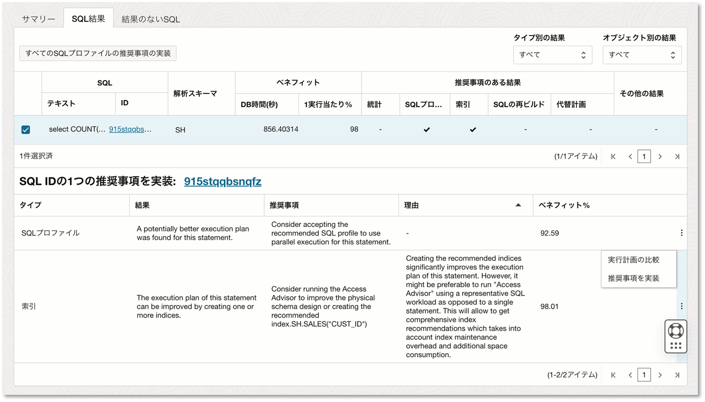

下記の情報を設定し、推奨事項を実装をクリックします。
 - 名前：任意の名前
 - 新規索引表領域：デフォルト
 - 資格証明：作成した資格証明（作成していない場合は作成）
 - ジョブ出力のバケット：作成したバケット


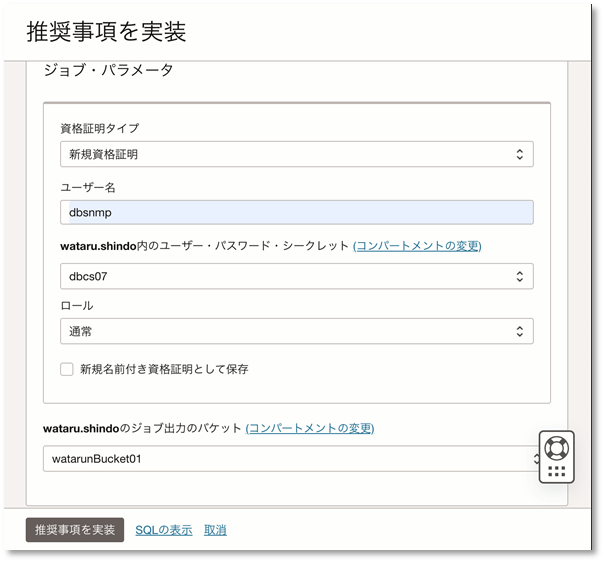

※SQLの表示から実装するSQLを確認することもできます。


推奨事項の実装が完了すると、Databasse Managementのジョブに完了と表示されます。
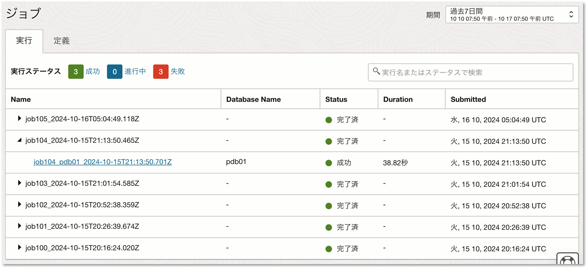

# 2.5　SQLを再実行
Sales表に対してTable Full Scanが発生するSQLを再度実行します。
```
select /*+MONITOR */ COUNT(*) from sales where 900<= cust_ID and cust_ID <=1000 order by cust_id;
```
# 2.6 SQLモニタリングで確認
SQLモニタリングから再実行したSQLのパフォーマンスを確認します。
チューニング前のSQLよりも実行時間の短縮、I/Oバイトの現象を確認できます。
また実行計画からインデックス・レンジ・スキャンで実行されている（推奨実行の実装で作成した索引が使用されている）ことを確認できます。
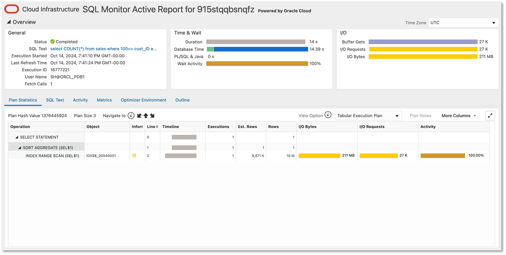

このようにDatabase ManagementのSQLチューニング・アドバイザを活用することで、SQLのパフォーマンスを改善できる可能性がありますので是非試してみてください。