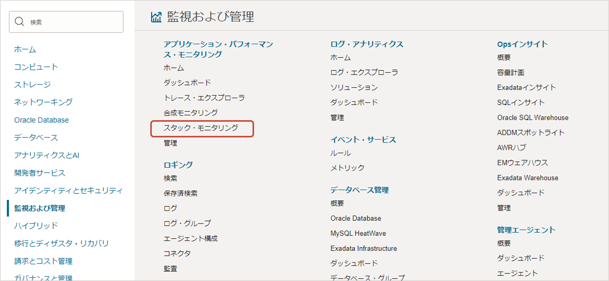
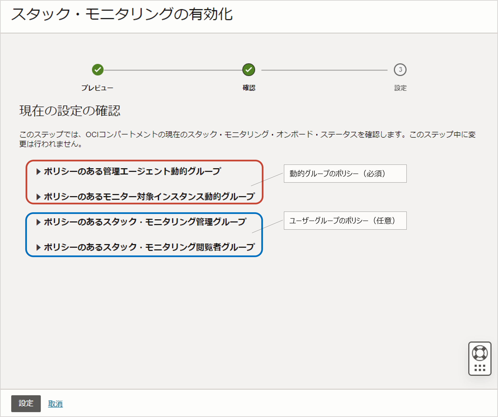
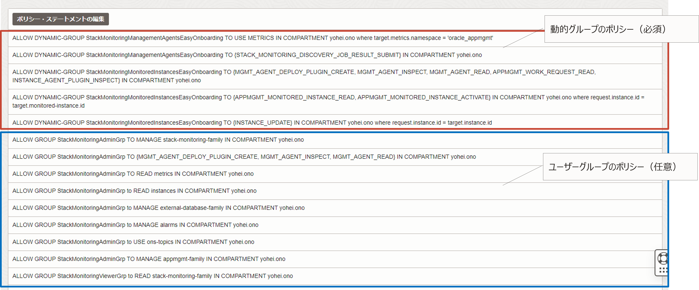

**チュートリアル概要 :**  
このチュートリアルでは、Stack Monitoringのオンボーディングプロセスについて説明します。
この機能を使うことで、ポリシーやグループの作成などを省力化でき、すぐにStack Monitoringを開始できます。

**所要時間 :** 約10分
 
# 1. オンボーディングプロセスの実行

OCIコンソールの画面左上ハンバーガーメニューから「監視および管理」を選択し、以下のように進みます。  
- アプリケーション・パフォーマンス・モニタリング > スタック・モニタリング  

 
Stack Monitoringで監視したいコンパートメントを選択します。（テナント全体であればルートを選択）
「エンタープライズ・サマリー」の画面にある「スタック・モニタリングの有効化」をクリックします。

 
以下の画面が表示されるので「次」へ進んで「設定」をクリックします。

 
以上で、Stack Monitoringを開始するための準備は完了しました。

# 2. 作成されたリソースの確認

OCIコンソールの画面左上ハンバーガーメニューから以下のように進みます。  
- アイデンティティとセキュリティ > ポリシー  

 
オンボーディングを実行したコンパートメントに「StackMonitoringPolicyEasyOnboarding」という名前のポリシーが作成されています。

 
内容を確認すると、オンボーディングで作成されたポリシーが定義されています。

 
OCIコンソールの画面左上ハンバーガーメニューから以下のように進みます。  
- アイデンティティとセキュリティ > ドメイン > Default (現在のドメイン) > 動的グループ  

 
動的グループが2つ作成されています。

 
その他、ユーザーグループも作成されていますが、ユーザーポリシー同様使用については任意のため、必要に応じて利用してください。

